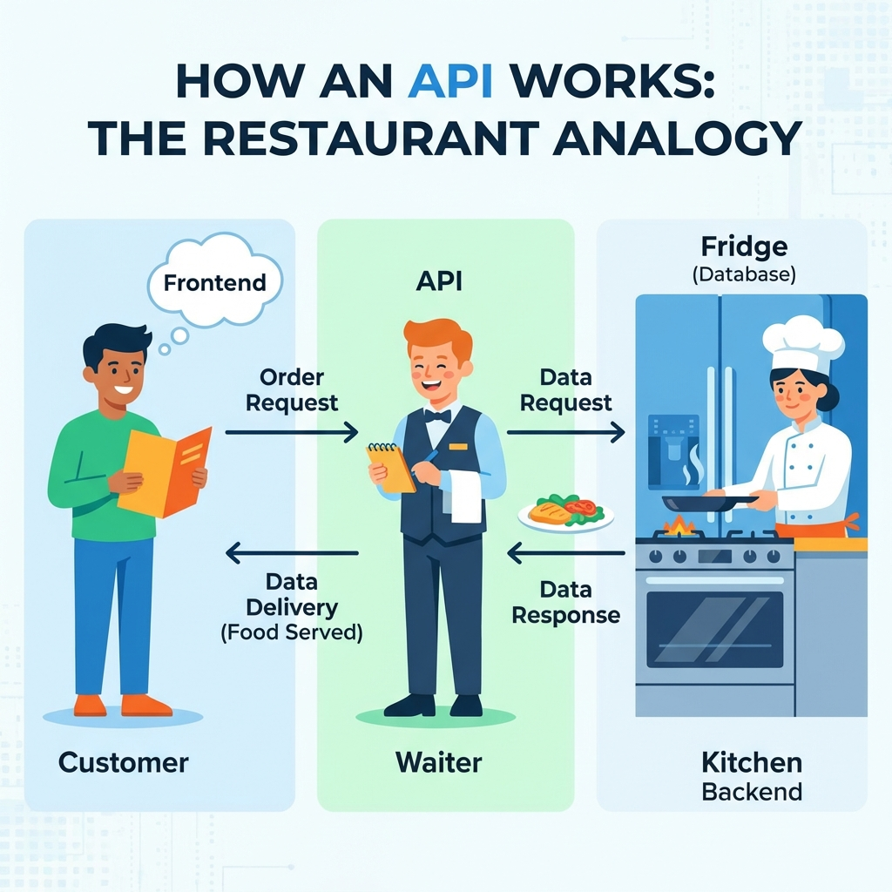
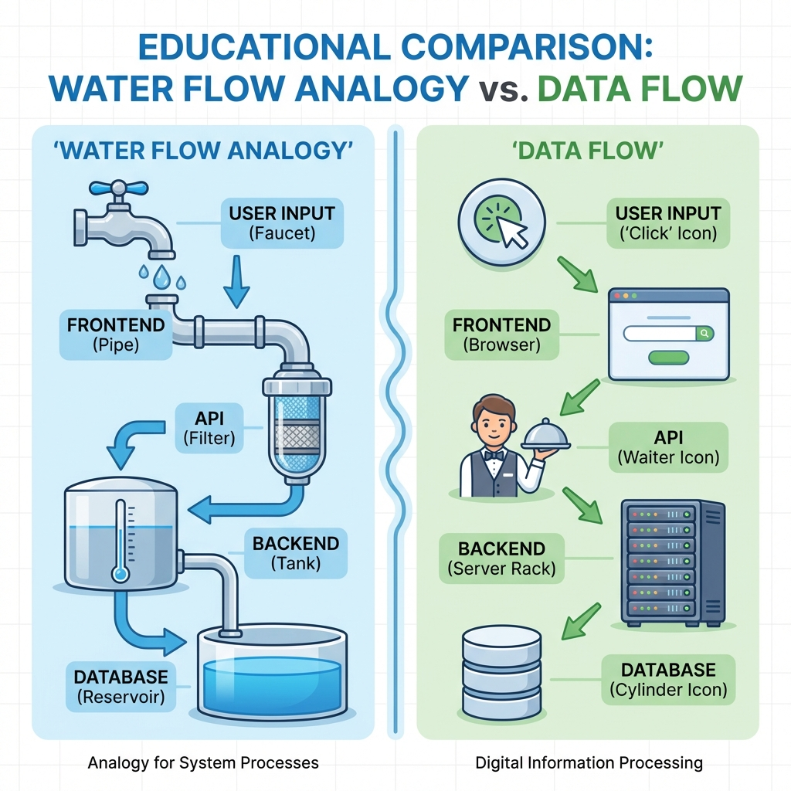

> "버튼 눌렀는데 저장이 안 됐어. 어디서 뭐가 잘못된 건지 모르겠어."

대부분 **데이터 흐름**을 몰라서 그래.

사용자가 버튼 누르면 어떤 순서로 뭐가 일어나는지 알면, "왜 안 돼?"가 **"여기가 문제구나"**로 바뀌어.

오늘은 API가 뭔지, 데이터가 어떻게 흐르는지 배울 거야.

---

## API가 뭐야?

**프로그램끼리 데이터를 주고받는 통로야.**

프론트엔드(브라우저)가 백엔드의 DB에 직접 접근하면 보안상 위험해. 누구나 데이터를 마음대로 바꿀 수 있으니까. 그래서 **API라는 중간 통로**를 거쳐.

```
❌ 프론트엔드 → DB 직접 접근 (위험!)
✅ 프론트엔드 → API → 백엔드 → DB (안전!)
```

식당에 비유하면:
- **프론트엔드 (손님)**: "불고기 정식 하나요!"
- **API (주문 창구)**: 주문 받아서 주방에 전달
- **백엔드 (주방)**: 요리 만들어서 내줌



손님이 주방에 직접 들어가서 냉장고 열어보면 안 되잖아. 창구를 통해서만 소통하지.

---

## API 요청 4가지

API로 요청을 보낼 때는 "뭘 하고 싶은지"를 알려줘야 해.

| 방식 | 용도 | 예시 |
|------|------|------|
| **GET** | 데이터 가져오기 | 게시글 목록 보기 |
| **POST** | 데이터 추가하기 | 게시글 작성하기 |
| **PUT** | 데이터 수정하기 | 게시글 수정하기 |
| **DELETE** | 데이터 삭제하기 | 게시글 삭제하기 |

**엔드포인트는 API의 주소야.**

```
GET    /api/todos          ← 할 일 목록 가져오기
POST   /api/todos          ← 할 일 추가하기
PUT    /api/todos/123      ← 123번 할 일 수정하기
DELETE /api/todos/123      ← 123번 할 일 삭제하기
```

같은 주소(`/api/todos`)인데 방식(GET, POST)이 다르면 하는 일도 달라.

---

## 데이터는 이렇게 흐른다

사용자가 "좋아요" 버튼을 누르면:

```
1. 사용자: 버튼 클릭
2. 프론트엔드: "버튼 눌렸네? API 호출해야지"
3. API: "백엔드야, 이 게시글에 좋아요 +1 해줘"
4. 백엔드: DB에 좋아요 개수 +1 저장
5. 백엔드 → 프론트엔드: "완료. 지금 좋아요 25개야"
6. 프론트엔드: 화면에 25개로 업데이트
```



이 흐름은 3가지 패턴으로 나뉘어:
- **저장(Create)**: 새로 만들기 (POST)
- **조회(Read)**: 가져와서 보기 (GET)
- **변경(Update/Delete)**: 수정하거나 삭제 (PUT/DELETE)

---

## "왜 안 돼?"를 "어디서 끊겼지?"로 바꿔

문제 생겼을 때 이 순서로 확인해봐:

```
□ 1. 버튼 눌렸나?
   → console.log("버튼 클릭됨")으로 확인

□ 2. API 호출 갔나?
   → 브라우저 개발자 도구 > Network 탭 확인

□ 3. 응답 Status는?
   → 200: 성공 / 400: 요청 잘못됨 / 500: 백엔드 에러

□ 4. DB에 저장됐나?
   → Supabase 대시보드에서 직접 확인

□ 5. 화면에 반영됐나?
   → 프론트엔드 상태 업데이트 확인
```

**단계별로 확인하면 어디가 문제인지 찾을 수 있어.**

---

## AI한테 이렇게 요청해봐

❌ **막연하게**
```
"저장이 안 돼"
```

✅ **단계별로 확인 요청**
```
"게시글 저장 버튼 눌렀는데 DB에 안 들어가.
 네트워크 탭 보니까 API 호출은 됐어.
 백엔드에서 DB 저장하는 부분 확인해봐."
```

**API 설계도 구체적으로:**

```
❌ "할 일 추가 기능 만들어줘"

✅ "할 일 추가 기능 만들어줘.
    POST /api/todos 엔드포인트로 요청 보내고,
    body에 title이랑 completed 필드 담아서 보내줘."
```

처음부터 이렇게 디테일하게 말하긴 어려워. 이렇게 단계를 밟아봐:

```
1단계: 일단 시킨다
   나: "할 일 추가 기능 만들어줘"
   AI: "만들었어. POST /api/todos로 보내게 했어."

2단계: 확인한다
   → 버튼 눌러서 실제로 추가되는지 확인

3단계: 이해했으면 다음에 명확히 지시한다
   나: "할 일 완료 처리 추가해줘.
       PUT /api/todos/{id}로 보내고, completed: true로 보내줘."
```

---

## 직접 확인하는 게 왜 중요해?

```
❌ AI만 믿으면:
   AI: "저장 기능 만들었어!"
   나: (확인 안 하고 다음으로) → 나중에 "어? 왜 데이터가 없지?"

✅ 직접 확인하면:
   AI: "저장 기능 만들었어!"
   나: (Network 탭 열고 버튼 클릭) → "500 에러네. 백엔드 문제인 것 같아."
   → 바로 문제 위치 파악
```

**AI가 코드 짜는 건 AI 몫. 제대로 작동하는지 확인하는 건 너 몫.**

---

## 한 줄 정리

```
✅ API = 프론트엔드와 백엔드가 대화하는 통로
   GET(조회), POST(추가), PUT(수정), DELETE(삭제)

✅ 데이터 흐름: 버튼 클릭 → 프론트 → API → 백엔드 → DB → 응답 → 화면

✅ "왜 안 돼?"가 아니라 "어디서 끊겼지?"
   → 단계별로 확인하면 문제를 찾을 수 있어

✅ AI한테 요청할 때:
   "저장이 안 돼" (❌)
   "API 호출은 됐는데 DB 저장 안 되는 것 같아" (✅)
```
