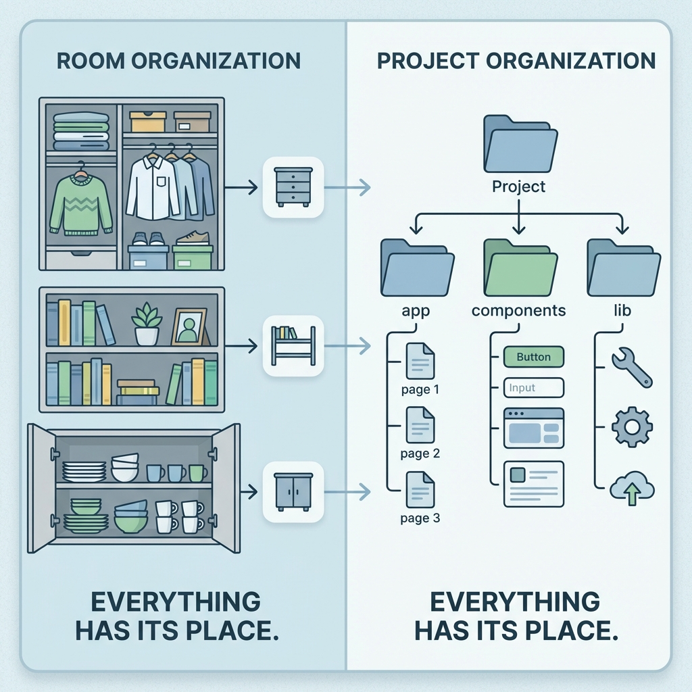

> "버튼 하나 바꾸려는데 파일이 10군데 흩어져 있고, 수정했더니 다른 페이지가 깨져."

처음엔 파일 몇 개라서 괜찮았어. 근데 기능 추가하다 보니 파일이 수십 개가 되고, 어디에 뭐가 있는지 모르게 돼.

프로젝트 구조는 **"어디에 뭘 놓을지 정하는 규칙"**이야.



---

## 기본 구조

Next.js 프로젝트를 만들면 AI가 이런 구조로 만들어줘.

```
my-project/
├── app/              ← 페이지들 (화면)
├── components/       ← 재사용하는 UI 조각들
├── lib/              ← 유틸리티, 헬퍼 함수들
├── public/           ← 이미지, 아이콘 같은 정적 파일들
└── package.json      ← 프로젝트 설정 파일
```

- **app**: 사용자가 보는 **페이지**들. 메인 페이지, 로그인 페이지 등.
- **components**: 여러 페이지에서 **재사용하는 UI 조각**들. 버튼, 카드, 헤더.
- **lib**: **도구 함수**들. 날짜 포맷 바꾸기, API 호출 공통 로직.
- **public**: **이미지, 아이콘** 같은 파일들.

---

## 프로젝트가 커지면

기능이 추가되면서 폴더가 더 세분화돼.

```
my-project/
├── app/
│   ├── login/             ← 로그인 페이지
│   ├── dashboard/         ← 대시보드 페이지
│   └── settings/          ← 설정 페이지
├── components/
│   ├── Button.tsx
│   ├── Card.tsx
│   └── Header.tsx
├── lib/
│   ├── supabase.ts        ← Supabase 연결 설정
│   └── api.ts             ← API 호출 공통 로직
├── types/                  ← 타입 정의
├── hooks/                  ← 커스텀 훅
└── public/
```

**패턴이 보여?** 역할별로 폴더를 나눠. 페이지는 app, 재사용 UI는 components, DB/API 관련은 lib.

---

## AI한테 어떻게 지시하냐

두 가지 접근법이 있어.

**접근법 1: 일단 만들고 → 나중에 정리 (처음일 때)**

```
1단계: "할 일 추가하는 기능 만들어줘" → 일단 돌아감
2단계: "삭제 기능도 만들어줘" → 파일이 좀 지저분해짐
3단계: "지금 파일들 폴더 구조 정리해줘. components, lib 폴더로 나눠줘."
   → AI가 정리해줌
```

**접근법 2: 처음부터 구조 잡고 시작 (익숙해지면)**

```
❌ "버튼 컴포넌트 만들어줘"
   → AI가 이상한 곳에 만들 수도 있어

✅ "components 폴더에 Button.tsx 파일로 버튼 컴포넌트 만들어줘"
   → 정확히 어디에 만들지 알아
```

**추천:** 처음 1~2개 프로젝트는 접근법 1로, 익숙해지면 접근법 2로 넘어가.

---

## 수정할 때도 정확한 경로로

```
나: "components/TodoCard.tsx에서 삭제 버튼 색깔 빨간색으로 바꿔줘."
AI: "수정했어. 삭제 버튼 빨간색으로 했어."

→ 확인해보니 아직 미세하게 안 맞음

💡 AI가 "이 파일의 이 부분을 수정했다"고 알려주면,
   그 숫자를 조금씩 바꿔보면서 원하는 결과를 찾을 수 있어.
   margin-left: 8px → margin-left: 12px
   코드 문법을 몰라도 돼. 숫자만 바꿔보는 거야.
```

---

## 구조의 원칙

헷갈릴 때 이것만 기억해.

```
1️⃣ 역할별로 나눠 → 페이지, 컴포넌트, API 역할이 다르면 폴더를 나눠
2️⃣ 재사용하는 건 따로 모아 → 여러 곳에서 쓰는 건 components 폴더에
3️⃣ 너무 복잡하게 나누지 마 → 파일 몇 개면 폴더 하나로 충분해
4️⃣ 나중에 바꿀 수 있어 → 단순하게 시작하고 커지면 나눠
```

**AI 제안을 무조건 따르지 마.** AI는 일반적인 구조를 제안해. 프로젝트가 작으면 너무 복잡한 구조는 오히려 방해돼. 판단은 너가 해야 해.

---

## 한 줄 정리

```
✅ 프로젝트 구조 = 역할별로 폴더를 나눠서 파일 정리
   app(페이지) / components(재사용 UI) / lib(유틸리티) / public(이미지)

✅ AI한테 요청할 때:
   "components 폴더에 Button.tsx 파일로 만들어줘"
   → 정확한 경로를 알려줘야 AI가 올바른 곳에 만들어
```
