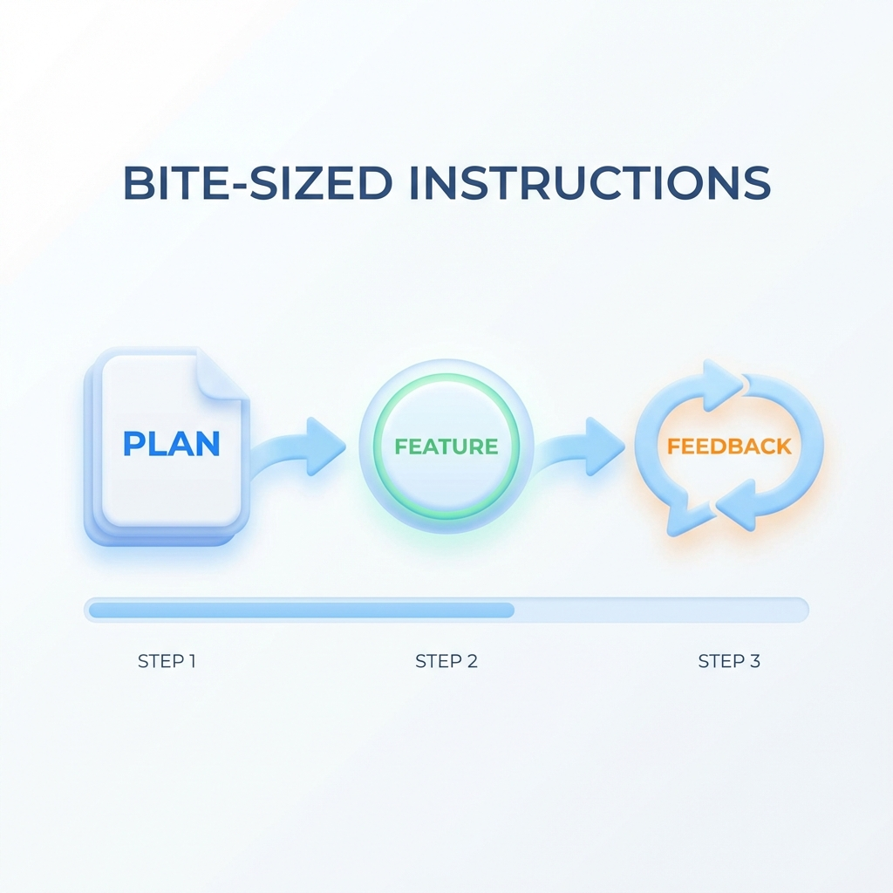

> "분명히 AI가 만들어주긴 했는데... 왜 내가 원하던 게 안 나오지?"

해봤지? AI한테 "앱 만들어줘" 해봤지?
뭔가 나오긴 나와. 처음엔 신기하기도 하고.

**근데 그거 실제로 쓸 수 있던가?**
**기능 추가하려니까 이상하게 꼬이지 않던가?**

문제는 AI가 못해서가 아니야.
**시키는 방법**이 잘못된 거야.

```
📚 이 글을 읽고 나면

✅ AI를 '마법'이 아닌 '유능한 신입'으로 인식할 수 있어
✅ '기술적 지시가 가능한 매니저'가 뭔지 이해해
✅ 막연한 지시 → 구체적 지시 → 기술적 지시의 차이를 알아
```

---

## AI = 유능한 신입사원

AI를 **갓 입사한 신입 개발자**라고 생각해봐.

```
┌─────────────────────────────────────────┐
│           AI = 유능한 신입사원            │
├─────────────────────────────────────────┤
│  - 시키면 열심히 해                       │
│  - 밤새워도 불평 안 해                    │
│  - 코딩 실력은 웬만한 개발자보다 나아       │
├─────────────────────────────────────────┤
│  근데 신입은 신입이야.                     │
│  "알아서 잘 해줘"라고 하면?               │
│  뭔가 나오긴 하는데... 이게 뭐지?          │
└─────────────────────────────────────────┘
```

AI는 유능한 신입사원: 실력은 뛰어나지만 명확한 지시가 필요해.


코딩 실력은 뛰어난데, **뭘 만들어야 하는지**는 몰라.
그건 **네가 알려줘야 해.**

---

## "알아서 해줘"의 함정

많은 사람들이 이렇게 시켜:

```
"할 일 관리 앱이야.
 - 할 일 추가, 삭제, 완료 체크 가능해야 해
 - 완료한 건 아래로 내려가게
 - 스마트폰에서 돌아가게 만들어줘"

→ 이 정도면 구체적인 거 아냐?
```

**아니야. 이것도 "알아서 해줘"야.**

왜냐면, AI는 이런 걸 모르거든:
- "할 일 추가"할 때 버튼이 어디 있어야 하는지
- 완료 체크하면 바로 내려가야 하는지, 애니메이션이 있어야 하는지
- 오늘 할 일 화면에서 뒤로 가기 누르면 어디로 가야 하는지

**기능 목록을 줘도, "사용자 경험"은 AI가 알아서 못 만들어.**

---

## 한 입 크기로 시키기

진짜 구체적 지시는 이런 거야.

```
┌─────────────────────────────────────────────────────────────┐
│              진짜 구체적 지시 = 한 입 크기로                   │
├─────────────────────────────────────────────────────────────┤
│                                                             │
│  1단계: 기획 문서 먼저 만들기                                 │
│        "이 앱이 뭔지, 누가 쓰는지, 핵심 기능이 뭔지"           │
│                                                             │
│  2단계: 기능 하나씩 지시하기                                  │
│        "먼저 할 일 추가 버튼만 만들어줘"                       │
│        → 확인하고, 피드백하고, 다음으로                       │
│                                                             │
│  3단계: 바로바로 피드백                                       │
│        "버튼 위치가 좀 애매한데, 오른쪽 아래로 옮겨줘"          │
│        → 고치고, 확인하고, 다음으로                           │
│                                                             │
└─────────────────────────────────────────────────────────────┘
```

비결은 한 입 크기: 계획 → 기능 → 피드백의 반복


**왜 이렇게 해야 할까?** 기술적인 이유가 있어.

```
💡 AI의 구조적 한계

1. 토큰 제한 — 한 번에 읽고 쓸 수 있는 양에 물리적 한계가 있어.
2. 맥락 소실 — 대화가 길어지면 이전 내용을 압축하면서 중요한 맥락이 빠져.
3. UX는 사람만 판단 — 버튼 위치, 색상, 동작 속도는 써봐야 알아.

그래서 "하나 만들고 → 확인하고 → 다음"이 결국 더 빨라.
```

---

## 그래서 목표: 기술적 지시가 가능한 매니저

"한 입 크기로 시키기"는 기본이야.
근데 거기서 한 단계 더 올라가야 해.

**같은 기능을 만들어도, 지시 수준에 따라 결과가 완전히 달라.**

### 수준 1: 막연한 지시

```
나: "상품 검색 기능 만들어줘"

[AI가 뭔가 만듦]

나: (확인해보니 검색창만 있고 필터가 없음)
   "아니 이게 아니라... 카테고리 필터도 있어야지"

[AI가 필터 추가 → 근데 기존 검색이 망가짐]

→ 복권 긁기. 뭐가 문제인지도 모름
```

### 수준 2: 구체적 지시

```
나: "상품 검색 기능 만들어줘.
    - 검색창에 입력하면 상품명으로 검색
    - 카테고리 필터 (의류, 전자기기, 식품)
    - 가격대 필터 (1만원 이하, 1~5만원, 5만원 이상)"

→ 기능 명세는 명확. 근데 "어떻게 만들지"는 AI가 알아서 결정
→ 성능 문제나 구조적 문제가 터지면 대응이 어려움
```

### 수준 3: 기술적 지시 (목표!)

```
나: "상품 검색/필터 기능 만들 건데, 방식 먼저 정하자.
    상품이 많아질 수 있어서 성능도 고려해야 해."

AI: "두 가지 방식이 있어:
    1. 프론트에서 필터링 - 상품 적으면 빠름, 많으면 느림
    2. 백엔드 API로 필터링 - 상품 많아도 빠름, 설정 복잡"

나: "일단 상품 100개 정도니까 1번으로 가고,
    나중에 2번으로 바꾸기 쉽게 구조 잡아줘."

→ 방식의 장단점을 듣고 내가 판단
→ 구조를 이해하고 있어서, 문제 생기면 어디를 고칠지 앎
```

막연한 바램에서 기술적 지시로 성장하는 단계


일방적 지시가 아닌, 토론하고 결정하고 지시하는 대화


---

## 실제 대화 흐름 예시

좀 더 실감나게, 프로젝트 처음부터 끝까지 대화 흐름을 보여줄게.

```
┌────────────────────────────────────��────────────────────────┐
│  1단계: 아키텍처 결정                                         │
├─────────────────────────────────────────────────────────────┤
│  나: "할일 관리 웹앱 만들 건데,                               │
│      아키텍처 추천해줘. 간단해야 해."                          │
│                                                             │
│  AI: "세 가지 방법이 있어:                                    │
│      1. 프론트만 (localStorage) - 서버 없이 빠름              │
│      2. 프론트+백엔드 분리 - 확장성 좋음                      │
│      3. 풀스택 프레임워크 (Next.js) - 설정 편함"               │
│                                                             │
│  나: "1번으로 가자. 나중에 백엔드 추가하기 쉽게 구조만 잡아둬." │
└─────────────────────────────────────────────────────────────┘

┌───────────────────────────────────────────��─────────────────┐
│  2단계: 구현 및 확인                                          │
├─────────────────────────────────────────────────────────────┤
│  [기능 단위로 직접 확인]                                      │
│  - 할일 추가 버튼 눌러보기 → 잘 됨                            │
│  - 삭제 버튼 눌러보기 → 잘 됨                                 │
│  - 새로고침 후 데이터 남아있는지 확인 → OK                     │
│                                                             │
│  나: "어, 한 파일에 코드가 너무 많은데?                        │
│      화면 그리는 거랑 데이터 처리는 분리해줘."                  │
│                                                             │
│  AI: "네, 데이터 처리 부분을 services 폴더로 분리할게."        │
└─────────────────────────────────────────────────────────────┘
```

**이게 기술적 대화야.**

"만들어줘"가 아니라:
- "아키텍처 추천해봐"
- "폴더 나눠서 역할 분리하는 거지?"
- "한 파일에 너무 많은데, 분리해줘"

---

## 성장 경로

```
┌───────────────────────────────────────────────────────────��───────────┐
│                   바이브 코더 성장 경로                                  │
├───────────────────────────────────────────────────────────────────────┤
│                                                                       │
│  1단계: 기능 요청 (시작점)                                              │
│     "○○ 기능 만들어줘" → 뭔가 나오긴 하는데, 원하는 건지 모름            │
│                                                                       │
│  2단계: 명세 제공                                                      │
│     "이런 기능, 이렇게 동작하게" → 기능은 OK, 구조는 모름                 │
│                                                                       │
│  3단계: 구조 이해                                                      │
│     "프론트/백 분리해줘" → 구조 이해, 설계는 여전히 AI                    │
│                                                                       │
│  4단계: 설계 대화 (★ 목표!)                                            │
│     "아키텍처 추천해봐" → 판단 → "1번으로 가자"                          │
│     → AI랑 설계 대화 가능. 방향은 내가 정함                              │
│                                                                       │
│  5단계: 고도화 (추가 성장)                                              │
│     성능, 보안, 확장성까지 고려한 지시                                   │
│                                                                       │
└───────────────────────────────────────────────────────────────────────┘
```

**이 시리즈의 목표는 4단계야.**

---

## "기술적"이라는 게 어렵게 들리는데...

어렵게 생각하지 않아도 돼.

```
🎯 기술적 ≠ 복잡한

"기술적으로 말한다" = 개념을 정확한 이름으로 부른다

예시:
❌ "이거 눈에 보이는 부분만 만들어줘"
✅ "프론트엔드만 만들어줘"

❌ "데이터 어딘가에 저장해줘"
✅ "localStorage에 저장해줘"

❌ "화면 나누고 싶어"
✅ "컴포넌트로 분리해줘"

→ 정확한 용어를 쓰는 것뿐이야
```

용어를 알면, AI가 정확히 이해해.
그럼 원하는 대로 나올 확률이 훨씬 높아져.

이 용어들은 이 시리즈에서 차근차근 배울 거야.

---

## AI가 틀리면 어떡해?

**AI는 한 번에 완벽한 결과를 주지 않아. 이게 정상이야.**

처음 시키면 70~80% 정도 나와.
"어, 이건 좀 다른데?" 하는 부분이 반드시 있어.

여기서 사람들이 두 가지로 나뉘어:

```
포기하는 사람:
"AI 별로네" → 다른 모델로 교체 → 또 안 됨 → 포기

완성하는 사람:
"이 부분은 좋은데, 여기는 이렇게 바꿔줘" → 수정 → 확인 → 반복
```

**핵심은 "피드백"이야.**

```
1회차: "로그인 기능 만들어줘" → 뭔가 나옴
2회차: "비밀번호 입력란이 없는데, 추가해줘" → 수정됨
3회차: "에러 메시지가 안 뜨는데, 잘못된 비밀번호일 때 알려줘" → 거의 완성
4회차: "에러 메시지 색을 빨간색으로" → 완성!
```

3~4번 반복하면 거의 원하는 결과가 나와.

이걸 "반복 개선(Iteration)"이라고 하는데, 이름은 몰라도 돼.
**"한 번에 안 되면 피드백해서 고치면 된다"**만 기억해.

---

## 한 줄 정리

```
✅ AI = 유능한 신입사원. 코딩 실력은 좋지만, 뭘 만들지는 모름.
✅ "알아서 해줘"가 아니라 "한 입 크기 + 피드백"으로.
✅ 목표: 기술적 지시가 가능한 매니저 (4단계)
✅ 기술적 = 정확한 용어로 말하는 것. 복잡한 게 아님.

다음 편부터 도구를 설치하고, 실제로 시작해볼 거야.
```
