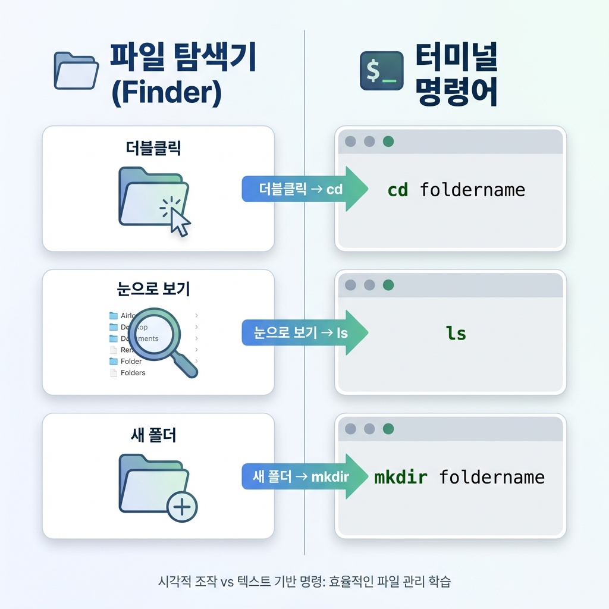
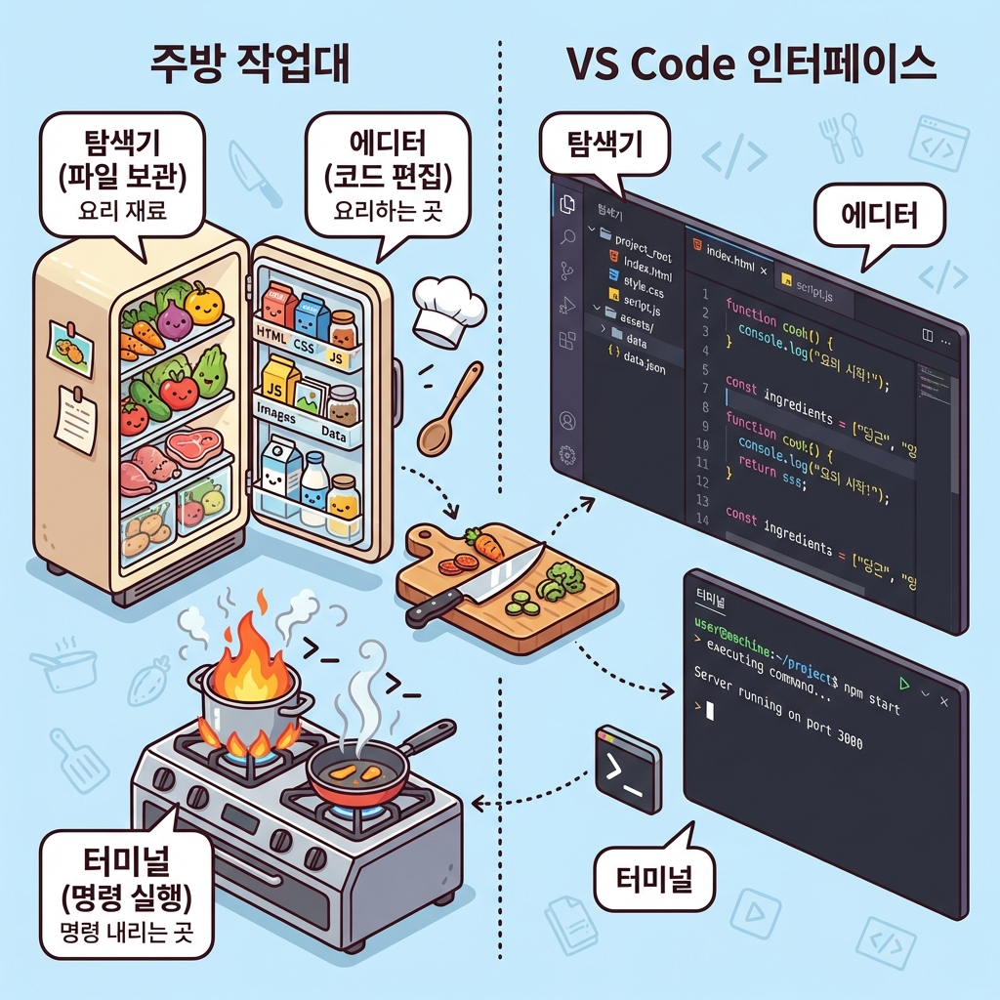
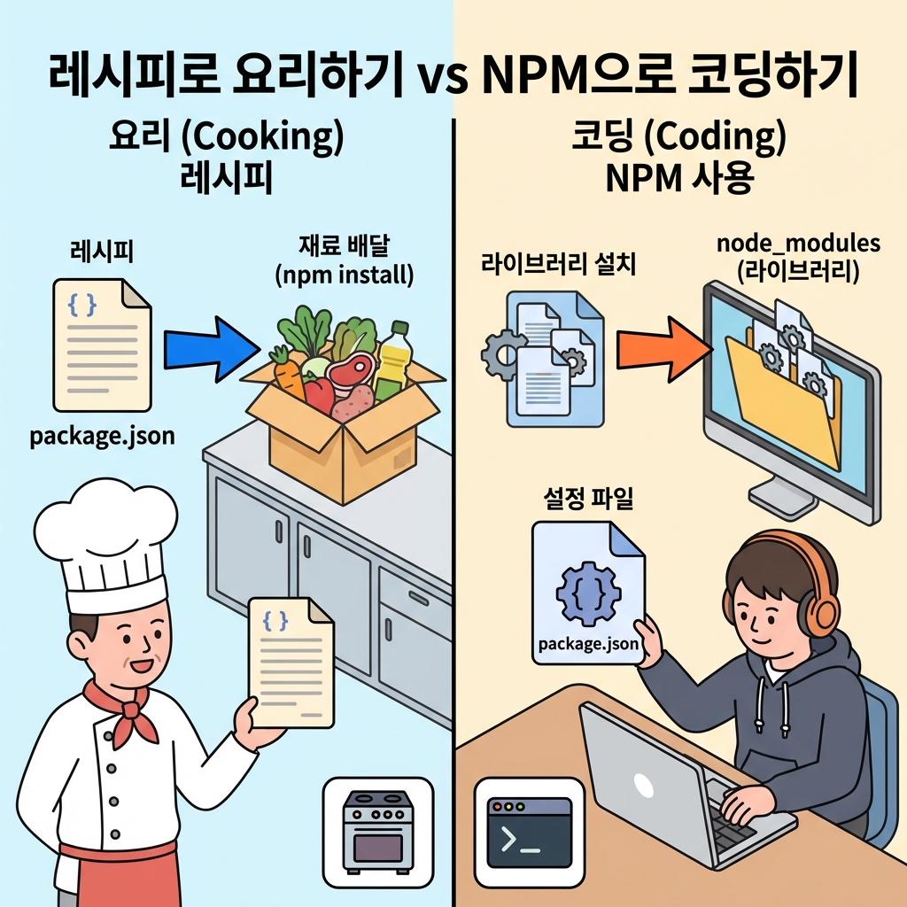

> "터미널에서 ls를 치라는데, 이게 무슨 외계어야?"
> "메모장으로 코드 짜면 안 돼?"
> "npm install이 뭐야?"

도구만 3개 더 세팅하면 진짜 개발 시작할 수 있어.
**터미널 명령어 5개, VS Code, NPM.** 한 편에 다 끝내자.

```
📚 이 글을 읽고 나면

✅ 터미널 필수 명령어 5개를 쓸 수 있어
✅ VS Code를 설치하고 기본 사용법을 알아
✅ npm install로 프로젝트 환경을 세팅할 수 있어
```

---

## 터미널 명령어: 딱 5개만

나머지는 AI가 알아서 해. 이 5개만 알면 돼.



### 1. `cd` — 폴더 이동 (Change Directory)

```bash
cd my-project  # my-project 폴더로 들어가기
cd ..          # 상위 폴더로 나가기 (점 두 개 = 위로)
```

### 2. `ls` — 목록 보기 (List)

```bash
ls             # 현재 폴더에 뭐 있는지 보기
```

### 3. `mkdir` — 폴더 만들기 (Make Directory)

```bash
mkdir new-folder  # new-folder라는 폴더 만들기
```

### 4. `pwd` — 현재 위치 확인 (Print Working Directory)

```bash
pwd
# 결과: /Users/taesupyoon/Desktop/my-project
```

"내가 지금 어느 폴더에 있지?" 헷갈릴 때 쓰는 내비게이션이야.

### 5. `rm` — 삭제 (Remove)

```bash
rm file.txt       # 파일 지우기
rm -rf folder     # 폴더 통째로 지우기 (조심!)
```

> **주의:** 터미널에서 지우면 휴지통 안 거치고 **바로 삭제**돼.

---

## VS Code: 코드 작업대

메모장으로 코딩해도 되긴 해.
근데 요리사가 식칼 대신 커터칼 쓰는 것과 같아.

**VS Code(Visual Studio Code)**는 전 세계 개발자 70% 이상이 쓰는 코드 편집기야.
자동 완성, 에러 표시, 터미널 내장까지 다 돼.

### 설치

1. [VS Code 공식 홈페이지](https://code.visualstudio.com/) 접속
2. 파란색 'Download' 버튼 클릭
3. 설치 파일 실행 → 다음, 다음, 완료

### 3군데만 알면 돼



1. **탐색기 (왼쪽):** 파일 목록 보는 곳
2. **에디터 (가운데):** 코드 짜는 곳
3. **터미널 (아래쪽):** 명령어 치는 곳

> **터미널이 안 보이면?** 단축키 `` Ctrl + ` `` (물결 키)을 눌러봐.

### 꿀팁: 터미널에서 VS Code 열기

```bash
cd my-project
code .
```

`code`는 "VS Code 실행해!", `.`은 "현재 폴더를 열어!"
이게 진짜 개발자 바이브지.

### 한국어 설정

왼쪽 바 네모 4개 아이콘(Extensions) → `Korean` 검색 → Korean Language Pack 설치 → Restart.

---

## NPM: 재료 한 방에 세팅

> "제 컴퓨터에선 안 되는데요?"

서로 다른 도구, 다른 버전을 쓰고 있어서 그래.
**NPM(Node Package Manager)**이 이걸 해결해줘.

### package.json = 레시피

남의 프로젝트를 받으면 `package.json`이라는 파일이 있어.

```json
{
  "name": "vibe-project",
  "dependencies": {
    "react": "^18.2.0",
    "supabase-js": "^2.0.0"
  }
}
```

"이 프로젝트 하려면 react랑 supabase가 필요해"라는 **장보기 목록**이야.



### npm install = 장보기

```bash
npm install
```

이 한 줄이면 필요한 재료가 전부 다운로드돼.
`node_modules` 폴더가 생기면 성공.

> **꿀팁:** `node_modules`는 용량이 크니까 Git에 안 올려. `.gitignore`에 적혀 있어.
> 어차피 `npm install` 하면 언제든 다시 생기니까.

### .env = 비밀 재료

API 키, 비밀번호 같은 건 코드에 직접 적으면 안 돼.
GitHub에 올리는 순간 해커들이 가져가거든.

프로젝트 최상위에 `.env` 파일을 만들어서 비밀 정보를 따로 보관해.

```env
API_KEY=abcdefg12345
DB_PASSWORD=secret1234
```

코드에서는 이렇게 가져다 써.

```javascript
const apiKey = process.env.API_KEY;
```

> **주의:** `.env` 파일도 `.gitignore`에 추가해서 Git에 안 올리게 해야 해.

---

## 한 줄 정리

```
✅ 터미널 명령어 5개: cd, ls, mkdir, pwd, rm
✅ VS Code = 코드 작업대. 탐색기 + 에디터 + 터미널이 한 화면에.
✅ npm install = 프로젝트 재료 한 방에 세팅.
✅ .env = 비밀번호 보관함. 절대 Git에 올리지 마.

이제 도구가 다 갖춰졌어.
근데 코드를 짜다가 망치면 어떡하지?
다음 편에서 시간을 되돌리는 마법, Git을 배워볼게.
```
