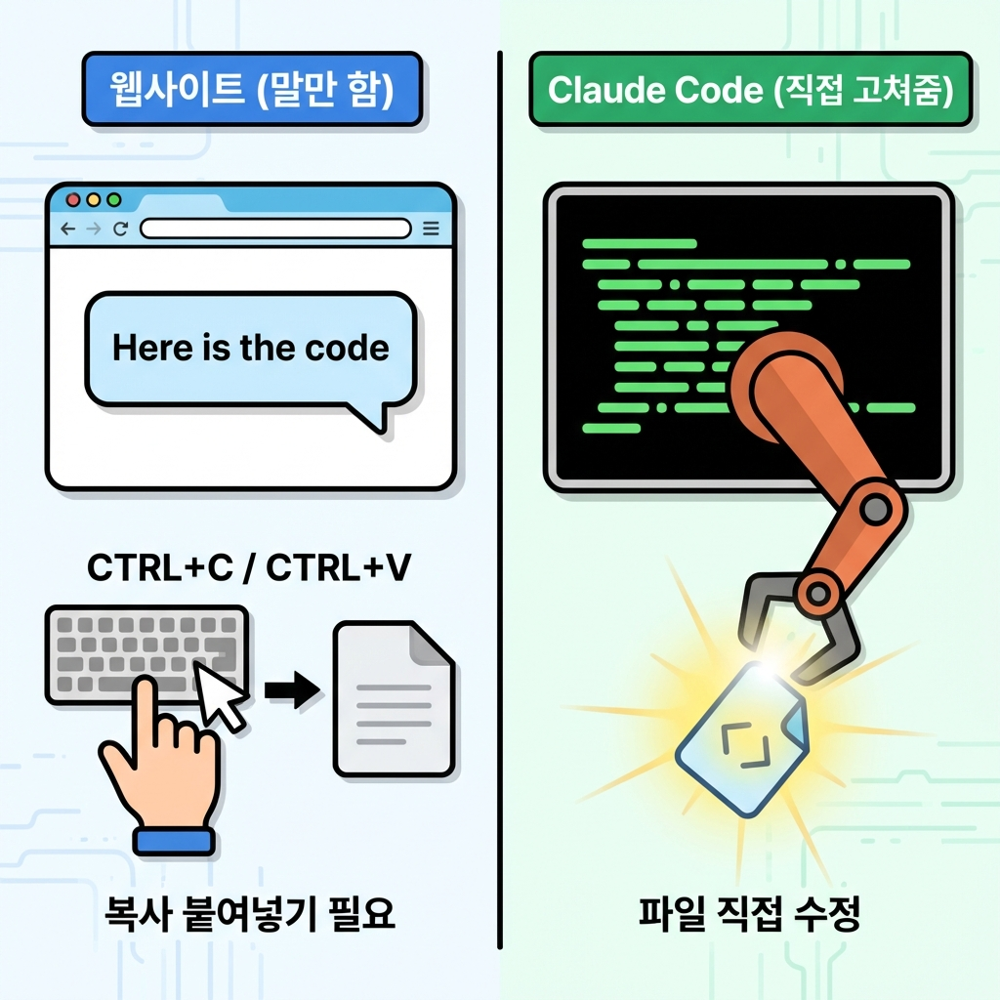

> "AI랑 대화하려면 터미널이란 걸 써야 한다는데... 그거 해킹 영화에 나오는 까만 화면 아닌가요?"
> "Claude Code? 그냥 웹사이트 들어가서 채팅하면 되는 거 아냐?"

많이들 여기서 겁먹어.
웹사이트 채팅이랑 뭐가 다르냐고?

**웹사이트 채팅**은 "말만" 할 수 있어.
"이 코드 짜줘" 하면 코드를 짜주긴 하는데, 그걸 복사해서 파일에 붙여넣고 저장하는 건 **네가 직접** 해야 해.

반면에 **Claude Code(클로드 코드)**는 **"손발이 달린"** AI야.
"이 파일 고쳐줘" 하면 **직접 파일을 열어서 고쳐놔.**
"새 폴더 만들어서 프로젝트 세팅해줘" 하면 **알아서 폴더도 만들어.**

이게 진짜 **유능한 신입사원**이지.
말로만 "네 알겠습니다" 하는 게 아니라, 진짜로 일을 처리해놓는 친구.



오늘은 이 친구를 우리 컴퓨터에 "입사(설치)"시켜볼게.

```
📚 이 글을 읽고 나면

✅ Claude Code를 설치할 수 있다
✅ 검은 화면(터미널)에 대한 두려움이 사라진다
✅ 터미널에서 claude 명령어를 실행할 수 있다
```

---

## 터미널, 사실 별거 아냐

해킹 영화 보면 막 초록색 글씨가 후다닥 올라가는 까만 창, 그게 터미널(Terminal)이야.
근데 이거, 본질적으로는 **카카오톡**이랑 똑같아.

- **카카오톡:** 사람 ↔ 사람 대화창
- **터미널:** 사람 ↔ 컴퓨터 대화창

그동안 우리는 마우스로 아이콘을 '클릭'해서 컴퓨터한테 명령을 내렸잖아?
터미널은 그냥 그걸 **'글자'로 타이핑해서 명령**하는 것뿐이야.

```
🖱️ 마우스 방식 (GUI)
폴더 우클릭 → '새 폴더' 클릭 → 이름 입력

⌨️ 터미널 방식 (CLI)
mkdir my-folder (엔터)
```

CLI(Command Line Interface)라는 건 그냥 **"글자로 명령하는 방식"**이라는 뜻이야.
우리는 이제 AI한테 **글자로** 일을 시킬 거니까, 이 터미널과 친해져야 해.

---

## 1단계: Claude Code 입사시키기 (설치)

이 "손발 달린 AI"를 데려오려면 명령어가 필요해.
지금부터 내가 하는 대로 딱 한 줄만 입력해봐.

### 1. 터미널 열기
- **Mac:** Command + Space 누르고 `Terminal` 검색해서 엔터.
- **Windows:** 윈도우 키 누르고 `PowerShell` 검색해서 엔터.

까만(혹은 파란) 창이 떴어? 거기가 바로 대화방이야.

### 2. 설치 명령어 입력
이 명령어를 복사해서 터미널에 붙여넣고 엔터(Enter)를 쳐봐.

```bash
npm install -g @anthropic-ai/claude-code
```

> **잠깐! 에러가 나?**
> `npm: command not found` 같은 말이 나오면, Node.js가 안 깔려 있는 거야.
> [Node.js 공식 홈페이지](https://nodejs.org/) 가서 'LTS' 버전 다운받아 설치하고 다시 해봐.

설치가 주르륵 진행될 거야.
"added packages" 같은 말이 나오면서 멈추면 성공이야.

---

## 2단계: 인사 나누기 (로그인)

설치했으면 이제 불러봐야지.
터미널에 이렇게 쳐봐.

```bash
claude
```

엔터를 치면?
갑자기 영어로 솰라솰라 하면서 브라우저 창이 뜰 거야.
Claude 계정으로 로그인하라는 뜻이야.

1. 브라우저에서 로그인 승인 버튼을 눌러.
2. 터미널로 돌아와보면?

```
Hello! I'm Claude Code.
I can help you write code, debug issues, and manage your project.
```

축하해!
네 컴퓨터에 **유능한 AI 신입사원이 출근**했어.

---

## 3단계: 첫 업무 지시해보기

이제 이 친구가 진짜 일을 잘하는지 테스트해볼까?
그냥 채팅하듯이 말 걸면 돼.

터미널에 `>>` 표시가 깜빡이고 있을 거야. 여기에 이렇게 쳐봐.

```
/bug
```
또는
```
지금 몇 시야?
```

그럼 AI가 대답할 거야.
신기한 건, 이제 네가 시키면 얘가 **파일도 만들고, 폴더도 뒤지고, 수정도 한다는 거야.**

예를 들어볼까?

```
나: "현재 폴더에 있는 파일 목록 좀 보여줘."
Claude: "현재 폴더에는 이런 파일들이 있어..." (ls 명령어를 자기가 알아서 침)
```

이게 바로 바이브 코딩의 시작이야.
네가 명령어를 몰라도, 얘가 알아서 명령어를 쳐줘.

---

## 정리: 이게 왜 중요하냐

```
💡 핵심 요약

1. 웹사이트 Claude = "말만 하는" 조언자
2. Claude Code = "손발이 달린" 실무자
3. 터미널 = 컴퓨터(AI)와 대화하는 채팅창
```

이제 너는 **"컴퓨터를 조종하는 AI"**를 얻었어.
이 친구와 함께라면, 복잡한 코드도, 지루한 설정도 "이거 해줘" 한 마디로 끝낼 수 있어.

"근데 터미널 명령어(cd, ls 이런 거) 하나도 모르는데?"

괜찮아.
다음 편에서 **딱 5가지** 필수 명령어만 알려줄게.
그것만 알면 나머지는 AI가 다 알아서 하니까.
