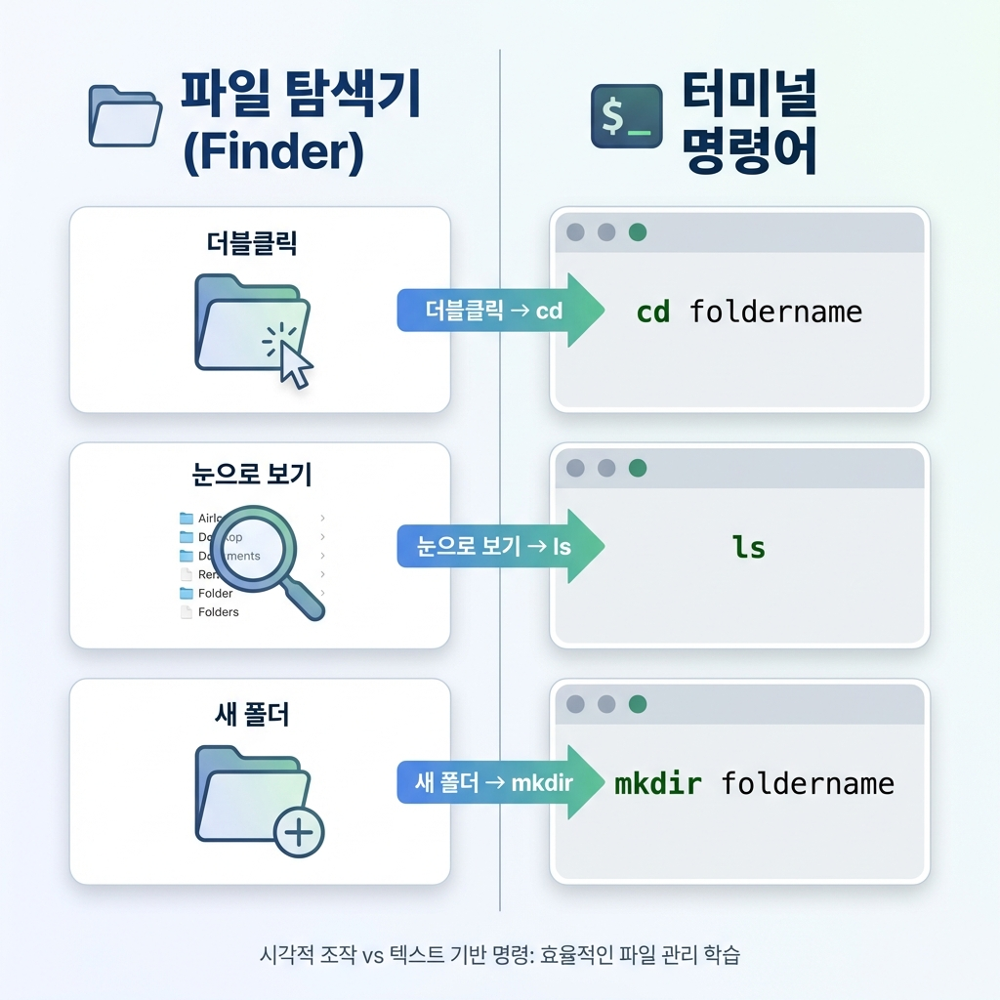

> "AI가 터미널에서 `ls`를 치라는데, 이게 무슨 외계어야?"
> "그냥 마우스로 폴더 열면 안 돼?"

많은 입문자가 터미널 명령어에서 좌절해.
영어 약어(Abbreviation)라서 그래. 뜻을 알면 세상 쉬워.

우리는 딱 **5개**만 알면 돼.
나머지는 AI가 알아서 다 하니까. "나머지는 몰라도 됨"이 핵심이야.

```
📚 이 글을 읽고 나면

✅ cd, ls, mkdir 등 기본 명령어 5개를 사용할 수 있다
✅ 폴더를 이동하고 파일 목록을 볼 수 있다
✅ 마우스로 하던 걸 글자로 하는 것뿐임을 깨닫는다
```

---

## 탐색기(Finder) vs 터미널

평소에 파일 관리할 때 쓰는 '탐색기(윈도우)'나 'Finder(맥)'를 생각해봐.
우리가 하는 행동은 딱 3가지야.

1. **폴더 더블클릭:** 안으로 들어가기
2. **폴더 목록 보기:** 안에 뭐 있나 보기
3. **새 폴더 만들기:** 정리하려고 만들기

이걸 터미널에서는 이렇게 해.



### 1. `cd`: Change Directory (폴더 이동)
"Change Directory"의 줄임말이야. 말 그대로 디렉토리(폴더)를 바꾼다는 뜻이지.

- 마우스: 폴더 더블클릭
- 터미널: `cd 폴더이름`

```bash
cd my-project  # my-project 폴더로 들어가라
cd ..          # 상위 폴더(뒤)로 나가라 (점 두 개는 '상위'를 뜻해)
```

### 2. `ls`: List (목록 보기)
"List"의 줄임말이야. 현재 폴더에 있는 파일들을 나열해줘.

- 마우스: 그냥 눈으로 파일들 보기
- 터미널: `ls`

```bash
ls             # 파일 목록 보여줘
```

### 3. `mkdir`: Make Directory (폴더 만들기)
"Make Directory"의 줄임말이야.

- 마우스: 우클릭 -> 새 폴더 만들기
- 터미널: `mkdir 폴더이름`

```bash
mkdir new-folder  # new-folder라는 방을 만들어라
```

---

## 나머지 2개는 뭐냐

방금 3개 배웠지? `cd, ls, mkdir`.
이제 딱 2개만 더 알면 "바이브 코더" 필수 명령어 끝이야.

### 4. `pwd`: Print Working Directory (여기가 어디야?)
"Print Working Directory"의 줄임말이야.
가끔 터미널이라는 까만 방에 갇혀서 "내가 지금 어느 폴더에 있지?" 헷갈릴 때가 있어.

그때 `pwd`를 치면 주소를 알려줘.

```bash
pwd
# 결과: /Users/taesupyoon/Desktop/my-project (네비게이션!)
```

### 5. `rm`: Remove (지우기)
"Remove"의 줄임말. 파일이나 폴더를 삭제할 때 써.
**주의:** 터미널에서 지우면 휴지통으로 안 가고 **즉시 삭제**돼. 그래서 신중해야 해.

```bash
rm file.txt       # 파일 지우기
rm -rf folder     # 폴더 통째로 지우기 (조심!)
```

---

## 5분 실습: AI 집 지어주기

자, 이제 배운 걸로 실습 한번 해볼까?
터미널을 열고 따라해봐.

1. **방 위치 확인:** `pwd` (내가 어디 있지?)
2. **새 집 짓기:** `mkdir my-house`
3. **집으로 들어가기:** `cd my-house`
4. **거실 만들기:** `mkdir living-room`
5. **확인하기:** `ls` (living-room이 보여?)

성공했으면, 너는 이제 **글자로 컴퓨터를 조종하는 마법사**가 된 거야.

---

## AI한테 이걸 왜 가르치냐

"어차피 AI가 다 한다며?"

맞아. 근데 가끔 AI가 길을 잃어.
"파일을 찾을 수 없어"라고 할 때가 있거든.

그때 네가 `ls`를 쳐보고,
"아, `src` 폴더 안에 있었네. `cd src` 하고 다시 해봐"라고 **훈수**를 둘 수 있어야 해.

유능한 상사는 실무를 직접 안 해도,
**일이 어디서 막혔는지 파악하고 방향을 정해줄 수 있어야 해.**
이 5가지 명령어만 알면 그게 가능해.
