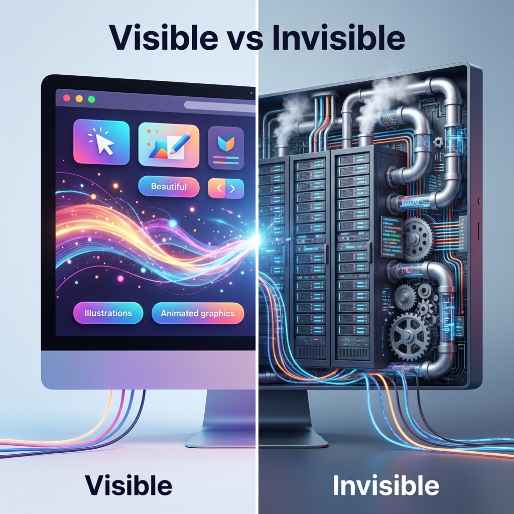
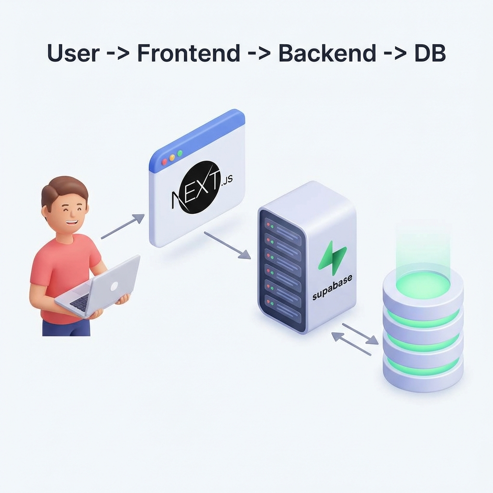
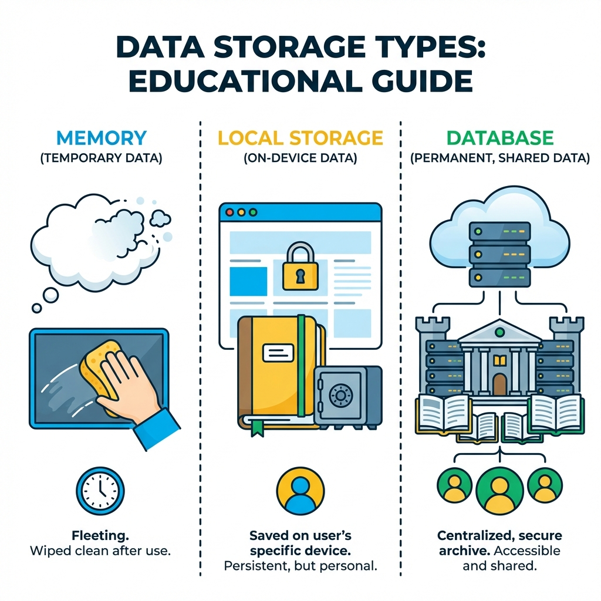

> "좋아요 버튼 만들었는데, 새로고침하면 좋아요가 사라져."

버튼 누르면 하트가 빨갛게 바뀌는 건 **화면에서** 일어나는 일이야.
근데 그 좋아요가 **저장되려면** 서버 어딘가에 기록돼야 해.

웹 서비스는 3가지가 한 팀으로 움직여.
**프론트엔드, 백엔드, DB**. 이 3개를 알면 AI한테 "프론트는 이거, 백엔드는 이거로" 지시할 수 있어.

---

## 웹서비스 3총사

보이는 영역(프론트엔드) vs 처리하는 영역(백엔드)


```
🎨 프론트엔드 (Frontend) — 화면에 보이는 부분
   버튼, 입력창, 이미지, 애니메이션
   브라우저에서 돌아감

⚙️ 백엔드 (Backend) — 뒤에서 처리하는 부분
   데이터 저장, 인증, 계산
   서버에서 돌아감

💾 DB (Database) — 데이터를 저장하는 곳
   엑셀 같은 표(테이블) 형태
   서버에 있어서 어디서든 접근 가능
```

**유튜브로 보면:**

| 프론트엔드 (보이는 것) | 백엔드 (안 보이는 처리) |
|----------------------|----------------------|
| 영상 재생 화면 | 영상 파일 저장/전송 |
| 좋아요 버튼 (하트 색 바뀜) | 좋아요 수 DB에 저장 |
| 댓글 입력창 | 댓글 저장, 불러오기 |

전체 데이터 흐름: 유저 → 프론트엔드 → 백엔드 → DB


---

## 프론트만으로 뭘 만들 수 있어?

**화면에서 끝나는 건 가능해.**

```
✅ 프론트엔드만으로 OK
   계산기, 타이머, 스톱워치
   메모장 (단, 새로고침하면 사라짐)

❌ 백엔드 필요
   회원가입/로그인 → 사용자 정보 저장
   게시글 → 다른 사람도 봐야 함
   좋아요 수 → 모든 사람이 같은 숫자
```

**핵심:** 저장하거나 다른 사람도 봐야 하면 → 백엔드 필요

---

## 데이터는 어디에 저장돼?



```
1️⃣ 메모리 (State) → 새로고침하면 사라짐
   드롭다운 열렸는지, 모달창 떠 있는지 같은 "지금 화면 상태"

2️⃣ localStorage → 내 브라우저에만 남음
   새로고침해도 남아있지만, 다른 기기에서는 안 보여
   예: 다크모드 설정, 로그인 전 장바구니

3️⃣ DB → 영구 저장, 공유 가능
   서버에 저장돼서 어디서든 접근 가능
   예: 게시글, 좋아요 수, 회원정보
```

**판단 기준:**
- 다른 사람/기기에서 봐야 함? → DB
- 나만 보는 설정? → localStorage
- 임시 데이터? → 메모리

---

## BaaS: 백엔드 빌려쓰기

백엔드를 직접 안 만들고, 이미 만들어진 걸 쓸 수 있어.

```
백엔드 직접 만들 때:  프론트 (내가 만듦) ↔ 백엔드 (내가 만듦) ↔ DB
BaaS 쓸 때:          프론트 (내가 만듦) ↔ Supabase (이미 구현됨)
```

**Supabase**는 DB + 로그인 + 파일저장 다 해줘. 바이브 코더한테 추천하는 이유:
- 레퍼런스가 많아서 AI가 잘 만들어줘
- 무료 플랜으로 시작 가능

---

## 이 시리즈의 기술 스택

```
Next.js (프론트) + Supabase (백엔드) + Vercel (배포)
```

왜 이 조합이냐면:
- AI한테 "Next.js로 만들어줘" 하면 잘 알아듣고 잘 만들어줘
- 레퍼런스가 많아서 AI 학습 데이터도 많아
- 배포가 쉬워

**바이브 코더에게 중요한 건:** 이 용어들을 외울 필요 없어. AI한테 "Next.js로 만들어줘"라고 말할 수 있으면 충분해.

---

## AI한테 단계적으로 요청하는 법

이 구조를 알면 한번에 다 시키는 대신 **단계별로** 요청할 수 있어.

```
1단계: "장바구니 페이지 만들어줘" (화면)
→ 확인: 잘 나오나?

2단계: "이제 API로 연동해줘" (백엔드 연결)
→ 확인: 저장되나?

3단계: "다크모드 설정은 localStorage에 저장해줘" (저장 위치 지정)
```

**저장 위치도 구체적으로:**

```
❌ "장바구니 담기 기능 만들어줘"

✅ "장바구니 담기 만들어줘.
    로그인 전이면 localStorage에,
    로그인 후면 cart 테이블에 user_id랑 같이 저장해줘."
```

---

## 한 줄 정리

```
✅ 웹 서비스 = 프론트엔드 + 백엔드 + DB
   프론트: 화면 (브라우저) / 백엔드: 처리/저장 (서버) / DB: 데이터 저장소

✅ 저장소 3가지: 메모리(임시) / localStorage(브라우저) / DB(영구)
   다른 사람/기기에서 봐야 하면 → DB

✅ BaaS(Supabase) 쓰면 백엔드 직접 안 만들어도 돼

✅ AI한테는 단계적으로: 화면 먼저 → 확인 → 백엔드 연결
```
