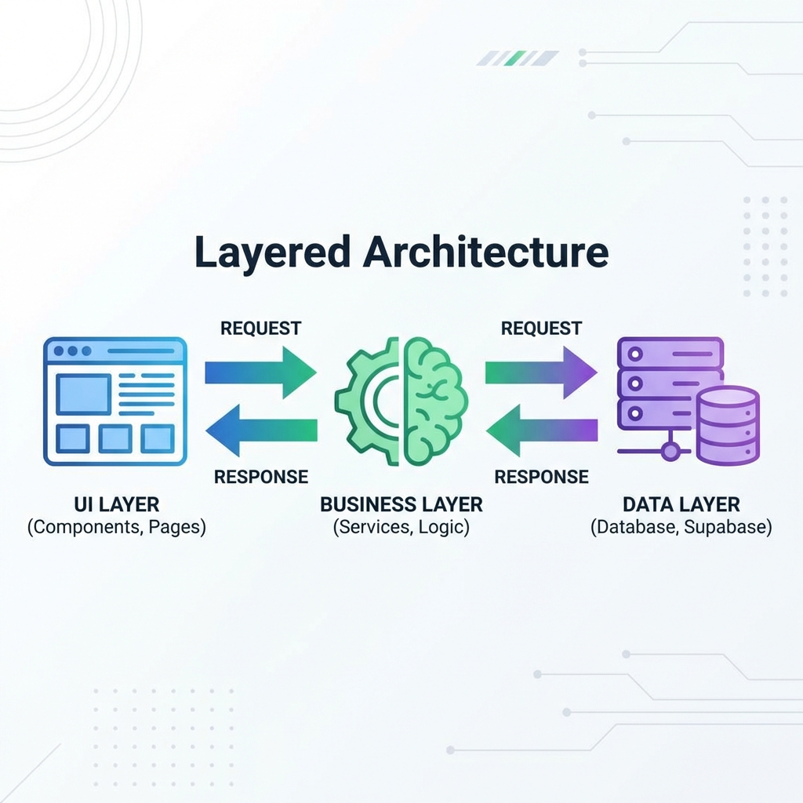

> "개념도 배웠는데, 막상 직접 시작하려니까 첫 마디가 안 나와."

"할 일 관리 앱 만들 거야" — 이것만으로는 부족해.

"어떤 기능이 필요하지?" → "어떤 기술로 만들지?" → "구조는 어떻게?"

이 과정이 **기획**이야. 기획 없이 만들면 나중에 이렇게 돼:
- "기능 추가하려면 처음부터 다시 만들어야 하네"
- "로그인 넣으려니까 지금 구조로는 안 되네"

---

## MVP부터 정해

**MVP = Minimum Viable Product. 핵심 기능만 넣은 첫 버전.**

할 일 관리 앱이라면:

```
✅ 필수 기능 (없으면 서비스가 안 됨)
   - 이메일 로그인/회원가입
   - 할 일 추가
   - 할 일 목록 보기
   - 완료 체크
   - 할 일 삭제

🔜 나중에 추가 (지금은 안 만듦)
   - 할 일 수정
   - 카테고리/태그
   - 마감일, 우선순위
   - 공유 기능
```

**처음부터 다 넣으려고 하지 마.** 필수 기능만 넣고, 나머지는 나중에 추가하는 게 훨씬 쉬워.

---

## 사용자 시나리오 써봐

"누가, 어떻게 쓸지" 상상해보면 어떤 기능이 필요한지 명확해져.

```
📱 사용자 A의 하루

1. 아침에 앱 접속 → 로그인 → 어제 만든 할 일 목록이 그대로 있음
2. 오늘 할 일 추가 → "회의 자료 준비" 입력 → 추가 버튼
3. 할 일 완료 → 체크박스 클릭 → 취소선 표시
4. 완료된 할 일 삭제 → 삭제 버튼
5. 다른 기기에서 접속 → 로그인하면 같은 목록 보임
```

이 시나리오만 봐도 필요한 기능이 다 나와: 로그인, CRUD(추가/조회/수정/삭제), DB 저장.

---

## 기술 스택 정하기

이제 AI와 대화할 차례야.

```
나: "할 일 관리 웹앱 만들 건데, 기술 스택 추천해줘.

    요구사항:
    - 웹 브라우저에서 돌아가야 해
    - 로그인 기능 필요
    - DB에 저장해서 다른 기기에서도 보여야 함
    - 빠르게 개발 가능해야 함 (나는 비개발자)
    - 배포도 쉬워야 함"

AI: "요구사항 고려해서 추천할게:

    프론트엔드: Next.js
    → React 기반, AI가 잘 만들어줌, Vercel로 배포 간편

    백엔드/DB: Supabase
    → 서버 안 만들어도 됨, 로그인 기본 제공, 무료 플랜 가능

    배포: Vercel
    → Git 연결하면 자동 배포"

나: "좋아. Next.js + Supabase + Vercel로 가자."
```

**포인트:** 요구사항을 먼저 말하고, AI 추천의 이유를 듣고, 판단한 거야.



---

## DB 테이블 설계

어떤 데이터를 저장할지도 미리 정해.

```
나: "todos 테이블 설계해줘.

    필드:
    - id: UUID, 자동 생성
    - user_id: users.id 외래키 (누구 것인지)
    - title: TEXT, NOT NULL
    - is_completed: BOOLEAN, 기본값 false
    - created_at: TIMESTAMP, 자동

    RLS 켜서 본인 것만 CRUD 가능하게."
```

SQL 문법 몰라도 돼. **어떤 필드가 필요한지, 누구 데이터인지 연결하는 것, RLS로 보안 거는 것** — 이 개념만 알면 AI가 SQL을 작성해줘.

---

## 지금까지 정한 것들

여기까지 오면 **만들 준비가 된 거야.**

```
✅ 기획: MVP 기능 (로그인, CRUD)
✅ 기술 스택: Next.js + Supabase + Vercel
✅ DB: todos 테이블 (id, user_id, title, is_completed, created_at)
✅ 보안: RLS로 본인 것만 접근
```

---

## AI한테 요청하는 패턴

**기술 스택 추천받을 때:**

```
❌ "웹앱 만들 건데, 기술 스택 추천해줘"
   → 요구사항이 없어서 AI가 뭘 추천해야 할지 몰라

✅ 요구사항(웹, 로그인, DB, 빠른 개발, 쉬운 배포)을 먼저 말하고 추천 받기
```

**DB 설계할 때:**

```
❌ "todos 테이블 만들어줘. id, title, completed, user_id"
   → 타입, 제약조건이 불명확

✅ 타입(UUID, TEXT, BOOLEAN), 제약조건(NOT NULL, DEFAULT), 보안(RLS)까지 명시
```

---

## 한 줄 정리

```
✅ 기획 먼저, 코드는 나중에
   MVP 정의 → 사용자 시나리오 → 기술 스택 → DB 설계 → 코드

✅ AI한테 대안을 듣고 판단하기
   "알아서 해줘" (❌) → "옵션 알려줘" → 듣고 → "2번으로 가자" (✅)

✅ 모르는 용어는 바로 물어봐
   AI: "ON DELETE CASCADE로..." → 나: "CASCADE가 뭐야?"
```
