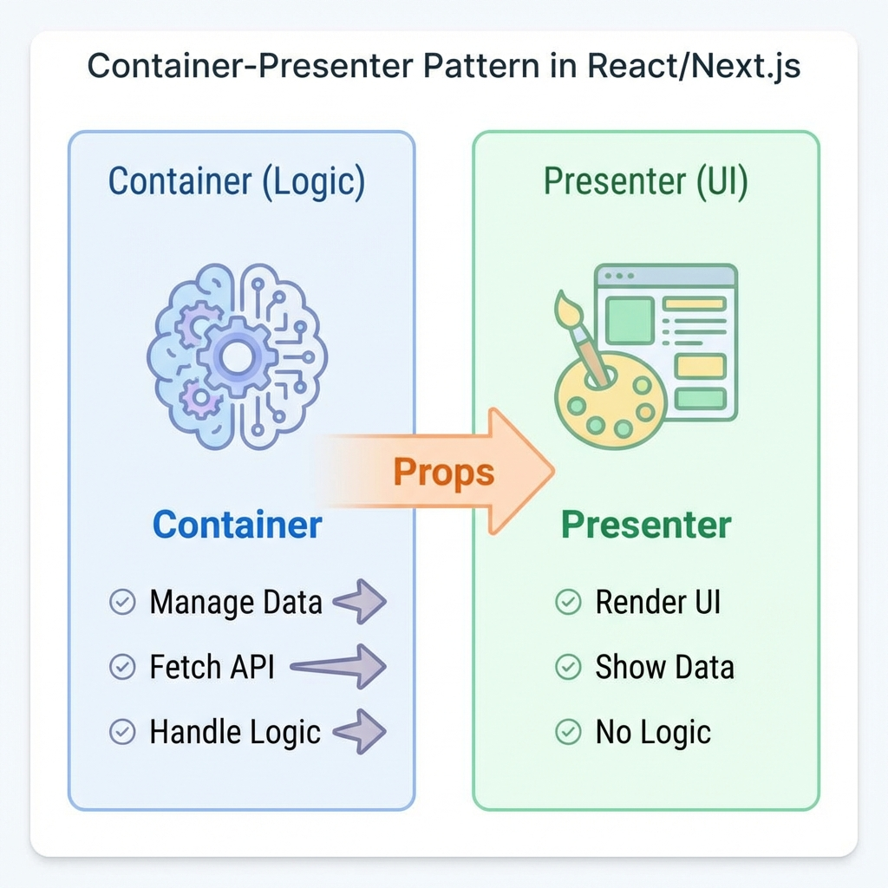

> "AI한테 '앱 만들어줘' 했더니 뚝딱 만들어주긴 했어. 근데 기능 하나 추가하려니까 어디를 고쳐야 할지 모르겠어."

시작은 쉬운데 마무리가 안 돼. 여기서 멈추는 사람이 많아.

AI한테 "만들어줘" 하면 만들어는 줘. 근데 모든 로직이 한 파일에 뒤엉켜 있어서 나중에 손을 댈 수가 없거든.

오늘은 **설계대로 폴더를 나누고 역할을 분리해서** 수정 가능한 프론트엔드를 만드는 과정을 보여줄게.



---

## 프로젝트 생성부터 정확히

AI한테 그냥 "만들어줘" 하면 옛날 방식으로 만들어줄 수 있어. 정확히 알려줘야 해.

```
나: "투두 리스트 웹앱 만들 거야. Next.js 프로젝트 생성해줘.

    옵션:
    - Next.js 14 App Router 사용
    - TypeScript 사용
    - Tailwind CSS 사용
    - src/ 디렉토리는 사용 안 함

    프로젝트 이름은 smart-todo로 해줘."
```

---

## 폴더 구조 잡기

집 지을 때 기둥부터 세우듯이, 폴더 구조부터 잡아.

```
나: "루트 경로에 이 폴더들 만들어줘.
    - components/ (UI 컴포넌트)
    - services/ (비즈니스 로직)
    - lib/ (Supabase 설정 등)
    - store/ (zustand 상태 관리)
    - types/ (TypeScript 타입 정의)"
```

이렇게 자리를 정해놓으면 코드가 섞일 일이 줄어들어.

---

## 핵심: Container-Presenter 패턴

가장 중요한 부분이야. **로직(Container)과 화면(Presenter)을 분리**하는 거야.

```
나: "components/TodoList 폴더를 만들고, 두 파일을 만들어줘.

    1. TodoListContainer.tsx (로직)
       - zustand store에서 todos, toggleTodo, deleteTodo 가져와
       - 가져온 데이터를 Presenter한테 넘겨줘

    2. TodoListPresenter.tsx (UI)
       - props로 받은 todos를 화면에 보여줘
       - 디자인은 Tailwind CSS로 깔끔하게
       - 로직은 전혀 몰라야 해. 보여주기만 해"
```

이렇게 나누면:
- 디자인만 바꾸고 싶을 때 → Presenter만 고치면 돼
- 로직만 바꾸고 싶을 때 → Container만 고치면 돼
- 서로 영향을 안 줘

---

## 상태 관리: zustand

"할 일 목록"을 앱 전체에서 기억하고 있어야 해. 아직 DB는 없으니까 메모리에 저장.

```
나: "zustand 라이브러리 설치해줘.
    store/useTodoStore.ts를 만들어줘.

    기능:
    - todos: 할 일 목록 (배열)
    - addTodo: 할 일 추가
    - toggleTodo: 완료 상태 토글
    - deleteTodo: 삭제

    지금은 DB 연결 없이 배열만 조작하게 해줘."
```

---

## 완성 후 확인 (제일 중요)

코드 다 짜졌으면 브라우저 켜서 (`npm run dev`) 직접 확인해.

```
체크리스트:
□ 입력창에 글자 쓰고 '추가' 눌러봐. 목록에 바로 뜨나?
□ 체크박스 눌러봐. 취소선이 그어지나?
□ 삭제 버튼 눌러봐. 목록에서 사라지나?
□ (중요) 새로고침 해봐. 다 사라지나?
```

**새로고침하면 다 사라지는 게 정상이야!**

아직 DB를 연결 안 했고, 메모리에만 저장했으니까. "아, 지금은 메모리에만 저장되는구나. 영구히 저장하려면 DB가 필요하구나"를 몸소 체험한 거야.

---

## AI한테 이렇게 요청해봐

```
❌ 이렇게 하지 마:
"투두리스트 만들어줘."
→ 모든 코드가 한 파일에 섞여서 수정 불가능한 스파게티 코드가 됨

✅ 이렇게 해봐:
"Next.js App Router로 프로젝트 만들어줘.

 구조 요구사항:
 1. 폴더 구조: components, store, types로 나눠줘.
 2. 컴포넌트: Container-Presenter 패턴으로 로직과 UI 분리해줘.
 3. 상태 관리: zustand 사용해서 전역 상태로 관리해줘.

 우선 UI랑 상태 관리만 먼저 만들고, DB 연결은 나중에 할게."
```

이렇게 구체적으로 시켜야 **수정 가능한** 코드가 나와.

---

## 한 줄 정리

```
✅ 설계 → 구현: 폴더 구조대로 만들어야 나중에 안 꼬여
✅ UI 분리: 로직(Container)과 화면(Presenter)을 나누면 유지보수가 쉬워져
✅ 상태 관리: 화면끼리 데이터 공유하려면 zustand 같은 전역 상태가 편해
✅ 검증: AI가 짠 코드는 반드시 버튼 하나하나 눌러가며 확인해
```
