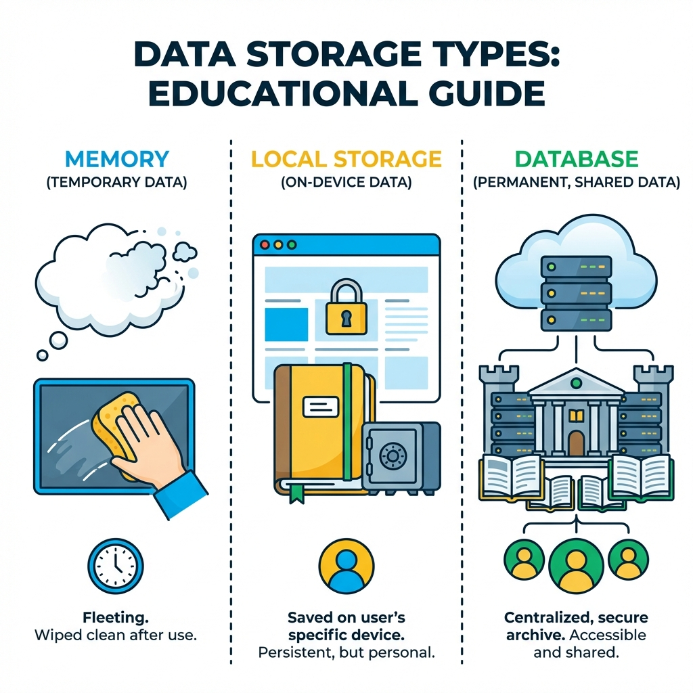

> "할 일 추가했는데, 새로고침하면 사라져."
> "분명히 저장했는데 왜 안 남아있는 거야?"

11편에서 프론트엔드와 백엔드를 배웠으니 이제 만들 수 있을 것 같은데,
막상 만들어보면 "어? 왜 새로고침하면 다 날아가지?"가 되는 거야.

**저장한다는 게, 생각보다 여러 곳에서 일어나.**
어디에 저장하느냐에 따라 "새로고침하면 사라지냐, 남느냐"가 달라져.

```
📚 이 글을 읽고 나면

✅ 저장소 3가지(메모리, localStorage, DB)를 구분할 수 있어
✅ 상황에 따라 어디에 저장할지 판단할 수 있어
✅ AI한테 '어디에 저장해줘'를 정확히 요청할 수 있어
```

---

## 저장소 3가지



**💡 복습:** localStorage는 11편에서 배웠지? "메모장에 혼자 적어둔 것"이야.

---

## 1️⃣ 메모리: 새로고침하면 사라짐

**메모리는 프로그램이 돌아가는 동안만 유지돼.**

```
카카오톡 대화 입력창에 "안녕" 쓰다가
→ 전송 안 하고 앱 종료
→ 다시 켜면? "안녕"은 사라짐
```

드롭다운이 열렸는지, 모달창이 떠 있는지 같은 건 저장할 필요 없잖아.
이런 "지금 화면이 어떤 상태인가"를 프로그래밍에서는 **State**라고 불러.

---

## 2️⃣ localStorage: 내 브라우저에만 남음

11편에서 배웠듯이, localStorage는 "메모장에 혼자 적어둔 것"과 같아.
새로고침해도 남아있지만, 다른 기기에서는 안 보여.

```
💡 참고: 브라우저 저장소 종류

localStorage 외에도 비슷한 게 있어 (지금은 몰라도 돼):
- sessionStorage: 탭 닫으면 사라짐
- Cookie: 서버랑 주고받을 때 사용

이 시리즈에서는 localStorage만 쓸 거야.
```

---

## 3️⃣ DB: 영구 저장, 공유 가능

서버에 있는 데이터베이스(DB)에 저장하면 어디서든 접근 가능해.
다른 기기, 다른 사람도 볼 수 있어.

**DB는 엑셀 같은 표(테이블) 형태야.**

```
💡 todos 테이블 예시

┌────┬─────────┬──────────────────┬───────────┬─────────────────────┐
│ id │ user_id │      title       │  done     │     created_at       │
├────┼─────────┼──────────────────┼───────────┼─────────────────────┤
│ 1  │   1     │ 블로그 글쓰기     │  false    │ 2026-01-10 09:00    │
│ 2  │   1     │ 운동하기         │  true     │ 2026-01-10 09:05    │
│ 3  │   2     │ 회의 준비        │  false    │ 2026-01-10 10:00    │
└────┴─────────┴──────────────────┴───────────┴─────────────────────┘

각 행 = 할 일 하나
user_id로 누구의 할 일인지 연결됨
```

---

## 어디에 저장할지 판단하기

```
🎯 판단 기준

다른 사람도 봐야 함? → DB
다른 기기에서도 봐야 함? → DB
나만 보는 설정? → localStorage
임시 데이터? → 메모리
```

**예시로 보면:**

| 기능 | 저장 위치 | 이유 |
|------|-----------|------|
| 게시글 | DB | 다른 사람도 봐야 함 |
| 좋아요 수 | DB | 모든 사람이 같은 숫자 |
| 다크모드 설정 | localStorage | 내 선호도 |
| 로그인 전 장바구니 | localStorage | 임시 저장 |
| 입력창 내용 | 메모리 | 저장 필요 없음 |

---

## 실제 대화 예시: 할 일 관리 서비스

```
┌───────────────────────────────────────────────────────────────────────┐
│  1단계: 저장 전략 정하기                                                │
├───────────────────────────────────────────────────────────────────────┤
│                                                                       │
│  나: "할 일 관리 서비스 만들 건데,                                       │
│      할 일 데이터는 DB에 저장해야 돼.                                    │
│      Supabase에 todos 테이블 설계해줘."                                 │
│                                                                       │
│  AI: "todos 테이블 설계 제안할게:                                       │
│      - id (고유 번호)                                                  │
│      - user_id (누구의 할 일인지)                                       │
│      - title (할 일 내용)                                              │
│      - done (완료 여부)                                                │
│      - created_at (생성 시간)"                                         │
│                                                                       │
│  나: "좋아. 그렇게 만들어줘."                                            │
│                                                                       │
└───────────────────────────────────────────────────────────────────────┘

┌───────────────────────────────────────────────────────────────────────┐
│  2단계: 기능 만들고 확인하기                                              │
├───────────────────────────────────────────────────────────────────────┤
│                                                                       │
│  나: "할 일 추가하면 todos 테이블에 저장하고,                             │
│      화면 로드할 때 불러와서 보여줘."                                     │
│                                                                       │
│  AI: "할 일 추가/불러오기 기능 만들었어."                                │
│                                                                       │
│  [기능 단위로 직접 확인]                                                │
│  - 할 일 추가 → DB에 저장됨 ✓                                          │
│  - 새로고침 → 그대로 남아있음 ✓                                         │
│  - 다른 브라우저에서 로그인 → 똑같이 보임 ✓                               │
│                                                                       │
└───────────────────────────────────────────────────────────────────────┘

┌───────────────────────────────────────────────────────────────────────┐
│  3단계: 다크모드 추가                                                    │
├───────────────────────────────────────────────────────────────────────┤
│                                                                       │
│  나: "다크모드 토글도 만들어줘."                                          │
│                                                                       │
│  AI: "다크모드 토글 만들었어."                                           │
│                                                                       │
│  [기능 단위로 직접 확인]                                                │
│  - 다크모드 켜기 → 화면 어두워짐 ✓                                       │
│  - 새로고침 → 유지됨 ✓                                                  │
│  - 다른 기기에서 로그인 → 어? 기본 모드네?                                │
│                                                                       │
│  나: "다른 기기에서 다크모드 안 되는데?"                                   │
│                                                                       │
│  AI: "다크모드 설정은 localStorage에 저장했어.                           │
│      localStorage는 브라우저별로 따로 저장돼서 그래.                     │
│      DB에 저장하면 기기 간 동기화 가능해."                               │
│                                                                       │
│  나: "아, 그렇구나. 다크모드는 기기별로 달라도 돼. 그대로 둬."              │
│                                                                       │
│  💡 이렇게 확인하다 보면 자연스럽게 알게 돼:                              │
│     "아, localStorage는 브라우저별이구나"                                │
│     "동기화 필요하면 DB에 저장해야 하는구나"                              │
│                                                                       │
└───────────────────────────────────────────────────────────────────────┘
```

**이게 바이브 코딩이야.**

1. 일단 시킨다
2. 확인한다
3. 문제 있으면 다시 프롬프트
4. 잘 안 풀리면 그때 기술적으로 들어간다

```
❌ 비개발자가 자주 하는 실수
   "왜 안 돼?!" → 화냄 → AI 탓 → 다른 모델로 바꿈 → 또 안 됨
```

이 시리즈는 이걸 바꾸려는 거야.
저장소 3가지를 알면 "다른 기기에서 안 되네?" → "아, localStorage니까 그렇구나" → 논리적으로 이해할 수 있어.

---

## AI한테 요청하는 패턴

```
🎯 패턴: 뭘 + 어디에 + 어떤 필드

❌ 막연하게
   "장바구니 담기 기능 만들어줘"

✅ 구체적으로
   "장바구니 담기 만들어줘.
    로그인 전이면 localStorage에,
    로그인 후면 cart 테이블에 user_id랑 같이 저장해줘."
```

---

## 핵심 정리

```
✅ 저장소는 3가지
   1️⃣ 메모리 → 새로고침하면 사라짐
   2️⃣ localStorage → 내 브라우저에만
   3️⃣ DB → 영구 저장, 공유 가능

✅ 판단 기준
   다른 사람/기기에서 봐야 함? → DB
   나만 보는 설정? → localStorage

✅ AI한테 요청할 때
   "뭘 만들지 + 어디에 저장할지 + 필드는 뭔지"
```
