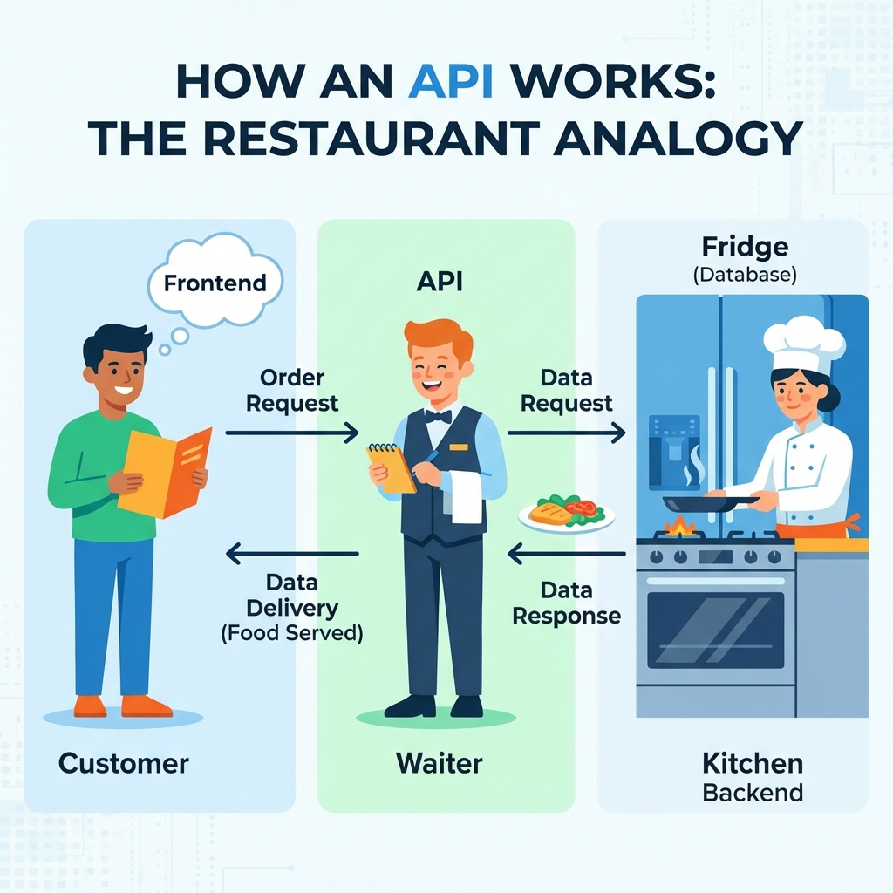

> "기능 추가하려고 보니까 API가 어디에 있는지도 모르겠고, 새로 만들어야 하는지 기존 거 쓰는 건지도 헷갈려."

맞아. 처음에 "연결해줘"라고만 하면 AI가 일단 만들어주긴 해.

근데 기능 추가하려니까 API가 중구난방으로 흩어져 있고, 어디에 뭐가 있는지 찾기도 힘들어. "연결은 됐는데 왜 이렇게 복잡하지?" 하는 순간이 와.

**근데 왜 그럴까?**

API가 뭔지, 어떻게 설계해야 하는지 모르면 AI한테 막연히 "연결해줘"라고만 하게 돼. AI는 일단 만들어주지만, 체계 없이 만들다 보니 나중에 정리가 안 돼.

---

## 지난 시간 복습

11편에서 **프론트엔드**와 **백엔드**를 배웠지?

```
┌─────────────────────────────────────────────────────────────┐
│  프론트엔드                    백엔드                        │
│  (사용자가 보는 화면)           (서버에서 돌아가는 로직)       │
├─────────────────────────────────────────────────────────────┤
│  • 웹 브라우저                 • 서버                        │
│  • 모바일 앱                   • 데이터베이스 (DB)           │
│  • 데스크톱 앱                 • 인증, 결제 처리 등          │
└─────────────────────────────────────────────────────────────┘
```

12편에서는 **데이터 저장소 3가지**를 배웠고:

- **메모리 (State)**: 새로고침하면 사라짐
- **localStorage**: 내 브라우저에만 저장
- **DB**: 서버에 저장, 어디서든 접근 가능

특히 DB는 "다른 기기에서도 봐야 하는 데이터"를 저장한다고 했어. 게시글, 회원정보, 주문내역 같은 거.

**근데 여기서 질문이 생겨.**

> "프론트엔드가 백엔드의 DB에 어떻게 접근하는 거야?"
> "웹 브라우저나 앱이 서버의 DB에 직접 연결해?"

**직접 연결하지 않아.** 웹 브라우저나 앱이 DB에 직접 접근하면 보안상 위험하거든. 누구나 데이터를 마음대로 바꿀 수 있게 되니까.

그래서 **API**라는 중간 통로를 거쳐서 통신해.

이번 편에서는 API가 뭔지, 어떻게 대화하는지 배우고, AI한테 "이 API 엔드포인트로 POST 요청 보내줘"라고 정확히 말할 수 있게 될 거야.

---

## 뭘 배우냐

이 글을 읽고 나면:
- API가 뭔지, 왜 필요한지 알 수 있어
- API 요청의 4가지 방식(GET/POST/PUT/DELETE)을 구분할 수 있어
- AI한테 "이 API 엔드포인트로 POST 요청 보내줘"라고 정확히 요청할 수 있어

---

## API가 뭐야?

**API는 Application Programming Interface의 약자야.** 풀어서 말하면 "프로그램끼리 데이터를 주고받는 통로"야.

카카오톡을 예로 들어볼게.

```
┌─────────────────────────────────────────────────────────────┐
│                    카카오톡 메시지 보내기                     │
├─────────────────────────────────────────────────────────────┤
│                                                             │
│  내 폰의 카카오톡 앱 (프론트엔드)                             │
│  └─ "안녕" 입력 → 전송 버튼 누름                             │
│                                                             │
│              ↓ API 요청 (메시지 전송 API)                   │
│                                                             │
│  카카오 서버 (백엔드)                                        │
│  └─ 메시지 받아서 DB에 저장                                 │
│  └─ 상대방 폰에 푸시 알림 전송                               │
│                                                             │
│              ↓ API 응답 (전송 완료)                         │
│                                                             │
│  내 폰의 카카오톡 앱 (프론트엔드)                             │
│  └─ 채팅창에 "안녕" 표시                                    │
│                                                             │
└─────────────────────────────────────────────────────────────┘
```

여기서 중요한 건, **내 폰의 카카오톡 앱이 카카오 서버의 DB에 직접 연결하지 않는다**는 거야. "메시지 전송 API"라는 통로를 거쳐서 대화해.

**💡 API = 문을 두드리는 방법**

식당에 비유하면:
- **프론트엔드 (손님)**: 웹 브라우저, 모바일 앱 → "불고기 정식 하나요!"
- **API (주문 받는 창구)**: 주문을 받아서 주방에 전달
- **백엔드 (주방 + 식재료 창고)**: 서버 + DB → 요리를 만들어서 내줌

손님이 주방에 직접 들어가서 냉장고 열어보면 안 되잖아. 창구를 통해서만 소통하지.



마찬가지로 **웹 브라우저나 앱(프론트엔드)은 서버의 DB에 직접 접근하지 않아.** 반드시 **API를 통해서만** 접근해. 이게 보안의 기본이야.

```
❌ 프론트엔드 → DB 직접 접근 (위험! 누구나 데이터 조작 가능)
✅ 프론트엔드 → API → 백엔드 → DB (안전! 백엔드가 검증)
```

---

## API 요청의 4가지 방식

API로 요청을 보낼 때는 "뭘 하고 싶은지"를 명확히 알려줘야 해.

```
┌─────────────────────────────────────────────────────────────┐
│                    API 요청 방식 (HTTP Method)                │
├──────────┬──────────────────────┬───────────────────────────┤
│  방식     │  용도                │  예시                     │
├──────────┼──────────────────────┼───────────────────────────┤
│  GET     │  데이터 가져오기      │  게시글 목록 보기          │
│  POST    │  데이터 추가하기      │  게시글 작성하기           │
│  PUT     │  데이터 수정하기      │  게시글 수정하기           │
│  DELETE  │  데이터 삭제하기      │  게시글 삭제하기           │
└──────────┴──────────────────────┴───────────────────────────┘
```

### GET - 데이터 가져오기

```
나: "인스타 피드 열기"
인스타: (GET 요청) "내 팔로잉의 최근 게시물 20개 가져와줘"
서버: (응답) "여기 게시물 20개!"
```

### POST - 데이터 추가하기

```
나: "사진 업로드, 설명: '오늘 점심'"
인스타: (POST 요청) "이 사진이랑 설명을 DB에 저장해줘"
서버: (응답) "저장 완료!"
```

### PUT - 데이터 수정하기

```
나: "게시글 설명 수정: '오늘 점심 맛있음'"
인스타: (PUT 요청) "이 게시글 설명을 바꿔줘"
서버: (응답) "수정 완료!"
```

### DELETE - 데이터 삭제하기

```
나: "이 게시글 삭제"
인스타: (DELETE 요청) "이 게시글 지워줘"
서버: (응답) "삭제 완료!"
```

---

## API 엔드포인트가 뭐야?

**엔드포인트는 API의 주소야.**

식당 비유로 돌아가면:
- `/menu` - 메뉴판 보기
- `/order` - 주문하기
- `/payment` - 결제하기

각 창구마다 주소가 다른 거야.

실제 예시를 보면 이렇게 생겼어:

```
┌─────────────────────────────────────────────────────────────┐
│                    할 일 관리 앱 API 엔드포인트                │
├─────────────────────────────────────────────────────────────┤
│                                                             │
│  GET    /api/todos          ← 할 일 목록 가져오기           │
│  POST   /api/todos          ← 할 일 추가하기                │
│  PUT    /api/todos/123      ← 123번 할 일 수정하기          │
│  DELETE /api/todos/123      ← 123번 할 일 삭제하기          │
│                                                             │
└─────────────────────────────────────────────────────────────┘
```

같은 주소(`/api/todos`)인데 방식(GET, POST)이 다르면 하는 일도 달라.

---

## 실제 API 요청은 어떻게 생겼어?

프론트엔드에서 백엔드로 API 요청을 보낼 때 이렇게 생겼어:

```javascript
// 할 일 목록 가져오기 (GET)
fetch('/api/todos')

// 할 일 추가하기 (POST)
fetch('/api/todos', {
  method: 'POST',
  body: JSON.stringify({
    title: '장보기',
    completed: false
  })
})

// 할 일 수정하기 (PUT)
fetch('/api/todos/123', {
  method: 'PUT',
  body: JSON.stringify({
    completed: true
  })
})

// 할 일 삭제하기 (DELETE)
fetch('/api/todos/123', {
  method: 'DELETE'
})
```

**💡 코드를 직접 짤 필요는 없어**

AI한테 "할 일 목록 가져오는 API 호출해줘"라고 하면 이런 코드를 만들어줘. 근데 어떻게 생겼는지 알면 나중에 확인할 때 "아, 여기서 데이터 가져오는구나" 하고 이해할 수 있어.

---

## AI한테 API 요청하는 법

🎯 **AI한테 요청할 때 이렇게 말해봐**

### ❌ 나쁜 예시 (막연함)

```
"할 일 추가 기능 만들어줘"
→ AI가 알아서 만들긴 하는데, 어떤 API로 만들었는지 모름
```

### ✅ 좋은 예시 (명확함)

```
"할 일 추가 기능 만들어줘.
 POST /api/todos 엔드포인트로 요청 보내고,
 body에 title이랑 completed 필드 담아서 보내줘."

→ API 구조가 명확해서 나중에 수정하기 쉬움
```

### 한 단계 더 나아가면

처음부터 이렇게 디테일하게 말하긴 어려워. 이렇게 해봐:

```
1단계: 일단 시킨다
   나: "할 일 추가 기능 만들어줘"
   AI: "만들었어. POST /api/todos로 보내게 했어."

2단계: 확인한다
   [버튼 눌러서 실제로 추가되는지 확인]
   [개발자 도구 → Network 탭 보면 어떤 API 호출했는지 보임]

3단계: 이해했으면 다음에 명확히 지시한다
   나: "할 일 완료 처리 기능 추가해줘.
       PUT /api/todos/{id}로 보내고, completed: true로 보내줘."
```

---

## 실전 예시: 쇼핑몰 장바구니 API

```
┌─────────────────────────────────────────────────────────────┐
│                    쇼핑몰 장바구니 API 설계                    │
├─────────────────────────────────────────────────────────────┤
│                                                             │
│  GET    /api/cart           ← 장바구니 내역 보기            │
│  POST   /api/cart/add       ← 상품 추가하기                 │
│  PUT    /api/cart/update    ← 수량 변경하기                 │
│  DELETE /api/cart/remove    ← 상품 삭제하기                 │
│                                                             │
└─────────────────────────────────────────────────────────────┘
```

**나:** "장바구니 페이지 만들 건데, API 먼저 정리하자.
장바구니 조회는 GET /api/cart,
상품 추가는 POST /api/cart/add로 만들어줘."

**AI:** "알겠어. 상품 추가할 때 뭘 받을까?
productId랑 quantity 받으면 될까?"

**나:** "응, 그거면 돼. 근데 이미 장바구니에 있는 상품이면 수량만 늘려줘."

**AI:** "알겠어. 중복 체크해서 수량 증가 처리할게."

---

## RESTful API가 뭐야?

API를 설계하는 방식 중에 **REST(Representational State Transfer)** 라는 규칙이 있어.

```
┌─────────────────────────────────────────────────────────────┐
│                    RESTful API 설계 원칙                      │
├─────────────────────────────────────────────────────────────┤
│                                                             │
│  1. URL은 명사로 (자원을 나타냄)                             │
│     ✅ /api/todos                                           │
│     ❌ /api/getTodos                                        │
│                                                             │
│  2. HTTP Method로 동작을 구분                                │
│     ✅ GET /api/todos       (목록 가져오기)                 │
│     ✅ POST /api/todos      (추가하기)                      │
│     ❌ GET /api/addTodo     (동작을 URL에 넣지 말 것)        │
│                                                             │
│  3. 계층 구조로 표현                                         │
│     ✅ /api/users/123/posts (123번 유저의 게시글)           │
│     ❌ /api/getUserPosts?id=123                             │
│                                                             │
└─────────────────────────────────────────────────────────────┘
```

**💡 AI한테 "RESTful하게 만들어줘"라고 하면 이 규칙을 따라서 만들어줘.**

---

## 실전 상황극: 쇼핑몰 API 설계하기

```
┌───────────────────────────────────────────────────────────────┐
│  1단계: 기능 나열                                              │
├───────────────────────────────────────────────────────────────┤
│                                                               │
│  나: "쇼핑몰 만들 건데, 필요한 기능 정리하자.                   │
│      상품 보기, 장바구니 담기, 주문하기 이렇게 3개야."          │
│                                                               │
│  AI: "그럼 API를 이렇게 나눌 수 있겠어:                        │
│      - 상품 관련: /api/products                               │
│      - 장바구니 관련: /api/cart                               │
│      - 주문 관련: /api/orders"                                │
│                                                               │
└───────────────────────────────────────────────────────────────┘

┌───────────────────────────────────────────────────────────────┐
│  2단계: 세부 엔드포인트 설계                                    │
├───────────────────────────────────────────────────────────────┤
│                                                               │
│  나: "상품 API 먼저 설계하자.                                  │
│      목록 보기, 상세 보기, 검색 이렇게 필요해."                 │
│                                                               │
│  AI: "이렇게 만들게:                                           │
│      GET /api/products - 상품 목록                            │
│      GET /api/products/:id - 상품 상세                        │
│      GET /api/products/search?q=검색어 - 검색                 │
│      괜찮아?"                                                  │
│                                                               │
│  나: "좋아. 그대로 가자."                                      │
│                                                               │
└───────────────────────────────────────────────────────────────┘

┌───────────────────────────────────────────────────────────────┐
│  3단계: 데이터 구조 결정                                        │
├───────────────────────────────────────────────────────────────┤
│                                                               │
│  AI: "장바구니에 상품 추가할 때 뭘 받을까?"                     │
│                                                               │
│  나: "productId, quantity, 이렇게 2개면 돼."                   │
│                                                               │
│  AI: "알겠어. POST /api/cart/add에 이렇게 보내는 걸로 할게:    │
│      {                                                        │
│        productId: 123,                                        │
│        quantity: 2                                            │
│      }"                                                       │
│                                                               │
└───────────────────────────────────────────────────────────────┘

┌───────────────────────────────────────────────────────────────┐
│  4단계: 구현 및 테스트                                          │
├───────────────────────────────────────────────────────────────┤
│                                                               │
│  AI: "API 만들었어. 테스트해봐."                                │
│                                                               │
│  💡 여기서 중요한 건, AI가 코드 짜면 끝이 아니라는 거야.         │
│     기능 단위로 직접 확인해야 해.                               │
│                                                               │
│  [기능 단위로 직접 테스트]                                       │
│  - 상품 목록 불러오기 → 브라우저에서 확인 → 잘 됨               │
│  - 장바구니 담기 → 버튼 눌러서 실제로 담기는지 확인 → 잘 됨     │
│  - 수량 변경 → 변경되는지 확인 → 잘 됨                         │
│                                                               │
│  나: "어, 주문할 때 쿠폰 할인도 적용해야 하는데?"                │
│                                                               │
│  AI: "주문 API에 couponId 필드 추가할게."                      │
│                                                               │
│  → 이렇게 하나씩 확인하면서 가야 나중에 문제가 안 생겨.          │
│                                                               │
└───────────────────────────────────────────────────────────────┘
```

---

## 실무 팁: API 문서화

API를 만들면 나중에 "어떤 API가 있었지?" 하고 찾기 어려워.

**💡 AI한테 "API 명세서 만들어줘"라고 하면 이런 문서를 만들어줘:**

```markdown
# 쇼핑몰 API 명세서

## 상품 API

### GET /api/products
상품 목록 조회

**Response:**
{
  "products": [
    {
      "id": 1,
      "name": "아이폰 15",
      "price": 1200000
    }
  ]
}

### POST /api/cart/add
장바구니에 상품 추가

**Request:**
{
  "productId": 1,
  "quantity": 2
}

**Response:**
{
  "success": true,
  "cartId": 456
}
```

이런 문서가 있으면 나중에 수정할 때 훨씬 편해.

---

## 핵심 정리

```
✅ 프론트엔드(웹 브라우저, 앱)는 DB에 직접 접근하지 않아
   → 반드시 API를 통해서만 백엔드와 통신해 (보안의 기본!)

✅ API는 프로그램끼리 데이터를 주고받는 통로야
   → 프론트엔드 → API → 백엔드 → DB 순서로 흘러

✅ API 요청 방식 4가지
   → GET (가져오기), POST (추가), PUT (수정), DELETE (삭제)

✅ 엔드포인트는 API의 주소
   → /api/todos, /api/products 처럼 각 기능마다 주소가 있어

✅ AI한테 요청할 때:
   "할 일 추가 기능 만들어줘. POST /api/todos로 요청 보내고,
   body에 title이랑 completed 필드 담아서 보내줘."
```
