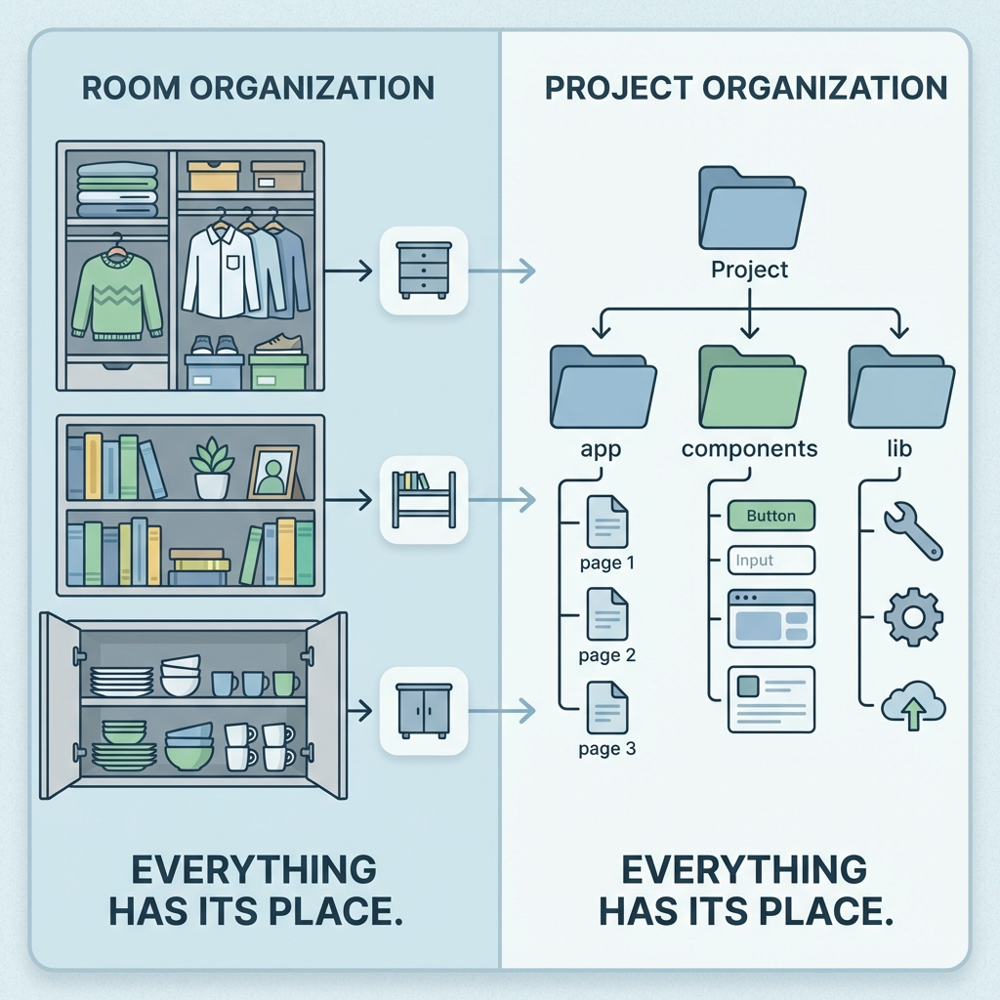

> "기능 추가하려고 하면 어디를 고쳐야 할지 모르겠어. 버튼 하나 바꾸려는데 파일이 10군데 흩어져 있고, 수정했더니 다른 페이지가 깨져. 구조 없이 만들다 보니까 점점 꼬여만 가."

맞아. 처음엔 파일 몇 개라서 괜찮았는데, 기능 추가하다 보니 파일이 수십 개로 늘어나고, 어디에 뭐가 있는지 모르게 돼.

**근데 왜 이렇게 될까?**

처음엔 "일단 되게만 하자"로 시작해. AI한테 "버튼 만들어줘", "API 연결해줘" 하면서 파일이 여기저기 생겨. 구조 없이 쌓다 보니 나중엔 "어디를 고쳐야 할지" 몰라서 손을 못 대게 돼.

프로젝트 구조는 **처음부터 정해놔야 해**. 나중에 정리하려면 전체를 뜯어고쳐야 해서 더 어려워.

오늘은 프로젝트 파일을 어떻게 나눠서 정리하는지, AI한테 "어디에 만들어줘"를 정확히 지시하는 법을 배울 거야.

---

## 이 글을 읽고 나면

- 프로젝트 파일을 역할별로 나누는 기본 구조를 이해할 수 있어
- AI한테 "components 폴더에 만들어줘"처럼 정확한 경로를 지시할 수 있어
- "어디를 고쳐야 할지" 찾는 시간을 줄일 수 있어

---

## 프로젝트 구조란?

프로젝트 구조는 **"어디에 뭘 놓을지 정하는 규칙"**이야.



**핵심: 프로젝트가 커질수록 구조가 중요해.**

처음엔 파일 5개 정도면 별 상관 없어. AI한테 시키면 금방 나오니까.

근데 여기서 멈추는 사람이 대부분이야. 기능 추가하려다가 파일이 50개, 100개가 되면 구조 없이는 못 살아. 차이를 만드는 건 "처음부터 구조를 어떻게 잡느냐"야.

---

## 가장 기본적인 구조

Next.js 프로젝트를 만들면 AI가 이런 구조로 만들어줘.

```
my-project/
├── app/              ← 페이지들 (화면)
├── components/       ← 재사용하는 UI 조각들
├── lib/              ← 유틸리티, 헬퍼 함수들
├── public/           ← 이미지, 아이콘 같은 정적 파일들
└── package.json      ← 프로젝트 설정 파일
```

💡 **잠깐, 폴더 이름들이 뭐냐?**

- **app**: 사용자가 보는 **페이지**들이 들어가. 메인 페이지, 로그인 페이지, 마이페이지 등.
- **components**: 여러 페이지에서 **재사용하는 UI 조각**들. 버튼, 카드, 헤더 같은 거.
- **lib**: **도구 함수**들. 날짜 포맷 바꾸기, API 호출 공통 로직 등.
- **public**: **이미지, 아이콘** 같은 파일들. 로고, 배경 이미지 등.

---

## 프로젝트가 커지면 어떻게 변해?

기능이 추가되면서 폴더가 더 세분화돼.

```
my-project/
├── app/                    ← 페이지
│   ├── login/             ← 로그인 페이지
│   ├── dashboard/         ← 대시보드 페이지
│   └── settings/          ← 설정 페이지
│
├── components/             ← UI 컴포넌트
│   ├── Button.tsx         ← 버튼
│   ├── Card.tsx           ← 카드
│   └── Header.tsx         ← 헤더
│
├── lib/                    ← 유틸리티
│   ├── supabase.ts        ← Supabase 연결 설정
│   ├── formatDate.ts      ← 날짜 포맷 함수
│   └── api.ts             ← API 호출 공통 로직
│
├── types/                  ← 타입 정의 (TypeScript 쓸 때)
│   └── user.ts            ← 유저 데이터 타입
│
├── hooks/                  ← 커스텀 훅 (React 패턴)
│   └── useAuth.ts         ← 로그인 상태 관리 훅
│
└── public/                 ← 정적 파일
    ├── logo.png           ← 로고
    └── favicon.ico        ← 파비콘
```

**패턴이 보여?**

- **역할별로 폴더를 나눠**
- **페이지는 app 폴더에**
- **재사용하는 UI는 components 폴더에**
- **DB나 API 관련 코드는 lib 폴더에**

---

## AI한테 이렇게 지시해봐

프로젝트 구조를 알면 AI한테 **"어디에 만들어줘"**를 정확히 말할 수 있어.

근데 솔직히 말하면, **처음부터 이렇게 구체적으로 지시하기 쉽지 않아**.

"components 폴더에 Button.tsx로 만들어줘"

이렇게 말하려면 폴더 구조도 알아야 하고, 파일 이름 규칙도 알아야 해. 처음엔 막막하지.

그래서 **두 가지 접근법**이 있어:

```
┌─────────────────────────────────────────────────────────────┐
│                   두 가지 접근법                              │
├─────────────────────────────────────────────────────────────┤
│                                                             │
│  🔰 접근법 1: 일단 만들고 → 나중에 정리 (처음일 때)          │
│     "버튼 만들어줘" → 일단 돌아가게 → "구조 정리해줘"        │
│                                                             │
│  🎯 접근법 2: 처음부터 구조 잡고 시작 (익숙해지면)           │
│     "components 폴더에 Button.tsx로 만들어줘"               │
│                                                             │
│  💡 어떤 게 더 좋냐?                                        │
│     둘 다 괜찮아! 본인 상황에 맞게 선택하면 돼.              │
│     처음엔 1번으로 시작하고, 익숙해지면 2번으로 가면 돼.      │
│                                                             │
└─────────────────────────────────────────────────────────────┘
```

---

### 접근법 1: 일단 만들고 → 리팩토링

**리팩토링**이 뭐냐면, **"작동은 그대로 두고 코드 구조만 정리하는 것"**이야.

```
┌─────────────────────────────────────────────────────────────┐
│  리팩토링 = 코드 청소                                         │
├─────────────────────────────────────────────────────────────┤
│                                                             │
│  🧹 방 청소 비유                                             │
│     옷이 여기저기 흩어져 있음 → 다 모아서 옷장에 정리        │
│     방 기능은 그대로, 깔끔해짐                               │
│                                                             │
│  💻 코드 리팩토링                                            │
│     파일이 여기저기 흩어져 있음 → 폴더별로 정리              │
│     기능은 그대로, 구조가 깔끔해짐                           │
│                                                             │
└─────────────────────────────────────────────────────────────┘
```

이 접근법은 이렇게 해:

```
1단계: 일단 되게 만들기
나: "할 일 추가하는 기능 만들어줘"
→ AI가 대충 만들어줌. 일단 돌아감.

2단계: 기능 몇 개 더 추가
나: "삭제 기능도 만들어줘"
나: "완료 체크도 만들어줘"
→ 파일이 좀 지저분해짐. 근데 일단 다 돌아감.

3단계: 구조 정리 (리팩토링)
나: "지금 파일들 좀 지저분한데, 폴더 구조 정리해줘.
    components, lib 폴더로 나눠줘."
→ AI가 기존 코드를 구조에 맞게 정리해줌.
```

**장점**: 처음엔 빨리 만들 수 있어. 구조 몰라도 돼.
**단점**: 나중에 정리할 때 시간이 좀 걸려.

---

### 접근법 2: 처음부터 구조 잡고 시작

개발 경험이 쌓이면 이쪽이 더 효율적이야.

❌ **나쁜 예 (어디에 만들지 안 알려줌)**
```
나: "버튼 컴포넌트 만들어줘"
```
→ AI가 어디에 만들지 몰라서 이상한 곳에 만들 수도 있어.

✅ **좋은 예 (정확한 위치 지시)**
```
나: "components 폴더에 Button.tsx 파일로 버튼 컴포넌트 만들어줘"
```
→ AI가 정확히 어디에 만들어야 하는지 알아.

**장점**: 처음부터 깔끔해. 나중에 정리할 필요 없어.
**단점**: 구조를 미리 알아야 해.

---

### 추천: 이렇게 성장해봐

```
처음 1~2개 프로젝트: 접근법 1 (일단 만들고 → 리팩토링)
   ↓
점점 익숙해지면: 접근법 2 (처음부터 구조 잡기)
```

이 시리즈에서도 **PART 5~7 프로젝트**할 때 두 접근법을 섞어서 써볼 거야.

---

❌ **나쁜 예 (막연하게 API 연결 요청)**
```
나: "Supabase 연결해줘"
```
→ 파일이 여기저기 흩어져.

✅ **좋은 예 (구조화된 요청)**
```
나: "lib 폴더에 supabase.ts 파일 만들어서 Supabase 클라이언트 설정해줘.
    다른 파일에서 import해서 쓸 수 있게 export 해줘."
```
→ 한 곳에 모아서 관리하기 쉬워.

---

## 실제 대화 예시

AI랑 프로젝트를 처음 시작할 때 이렇게 대화해.

┌────────────────────────────────────────────────────────────────┐
│  1단계: 프로젝트 구조 제안 받기                                  │
├────────────────────────────────────────────────────────────────┤
│                                                                │
│  나: "할 일 관리 웹앱 만들 건데, Next.js로 시작할게.            │
│      프로젝트 구조 어떻게 잡으면 좋을까?"                       │
│                                                                │
│  AI: "기본 구조는 이렇게 가면 좋을 것 같아:                     │
│                                                                │
│      app/                   - 페이지들                        │
│      components/            - UI 컴포넌트                     │
│      lib/supabase.ts        - DB 연결 설정                    │
│      types/todo.ts          - 할 일 데이터 타입               │
│                                                                │
│      나중에 기능 추가되면 폴더를 더 나눌 수 있어."              │
│                                                                │
│  나: "좋아. 근데 types 폴더는 나중에 추가해도 될 것 같은데?     │
│      일단 app, components, lib만 시작하자."                    │
│                                                                │
│  AI: "응, 필요할 때 추가하면 돼."                               │
│                                                                │
│  나: "그렇게 시작하자."                                         │
│                                                                │
└────────────────────────────────────────────────────────────────┘

┌────────────────────────────────────────────────────────────────┐
│  2단계: 기능별로 정확히 지시하기                                 │
├────────────────────────────────────────────────────────────────┤
│                                                                │
│  나: "components 폴더에 TodoCard 컴포넌트 만들어줘.             │
│      할 일 제목, 완료 여부, 삭제 버튼이 들어가야 해."           │
│                                                                │
│  AI: "components/TodoCard.tsx 만들었어.                        │
│      props로 title, completed, onDelete 받게 했어."            │
│                                                                │
│  나: "app/dashboard 폴더 만들고, 거기에 page.tsx 만들어줘.     │
│      여기서 할 일 목록을 보여줄 거야."                          │
│                                                                │
│  AI: "app/dashboard/page.tsx 만들었어.                         │
│      Supabase에서 할 일 목록 가져오게 했어."                    │
│                                                                │
└────────────────────────────────────────────────────────────────┘

┌────────────────────────────────────────────────────────────────┐
│  3단계: 수정할 때도 정확한 경로로                                │
├────────────────────────────────────────────────────────────────┤
│                                                                │
│  나: "components/TodoCard.tsx에서 삭제 버튼 색깔 빨간색으로     │
│      바꿔줘."                                                   │
│                                                                │
│  AI: "TodoCard.tsx 수정했어. 삭제 버튼 빨간색으로 했어."        │
│                                                                │
│  [기능 확인]                                                   │
│  - 대시보드 페이지 열어보기 → 할 일 목록 잘 나옴              │
│  - 삭제 버튼 눌러보기 → 삭제 잘 됨                            │
│  - 삭제 버튼 색깔 확인 → 빨간색 잘 나옴                        │
│                                                                │
│  💡 AI가 코드를 짜면 끝이 아니야. 만들고 나서 반드시 직접      │
│     확인해야 해. 이 과정을 건너뛰면 나중에 문제가 생겨도       │
│     어디가 문제인지 못 찾아.                                   │
│                                                                │
└────────────────────────────────────────────────────────────────┘

┌────────────────────────────────────────────────────────────────┐
│  4단계: 미세 조정은 직접 해보기                                   │
├────────────────────────────────────────────────────────────────┤
│                                                                │
│  나: "삭제 버튼 위치를 오른쪽으로 좀만 옮겨줘."                   │
│                                                                │
│  AI: "TodoCard.tsx 수정했어. margin-left: 8px 추가했어."        │
│                                                                │
│  [확인해보니 아직 미세하게 안 맞음]                              │
│                                                                │
│  💡 여기서 포인트!                                              │
│  AI가 "TodoCard.tsx를 수정했다"고 알려줬지?                     │
│  그럼 이제 너가 직접 그 파일을 열어서 조정해볼 수 있어.         │
│                                                                │
│  margin-left: 8px → margin-left: 12px                          │
│                                                                │
│  CSS 문법을 몰라도 돼.                                          │
│  AI가 "이 파일의 이 부분을 수정했다"고 알려주면,                │
│  그 숫자를 조금씩 바꿔보면서 원하는 결과를 찾을 수 있어.        │
│                                                                │
│  이게 바이브 코딩의 장점이야.                                    │
│  AI가 맥락을 알려주면, 너가 직접 미세 조정할 수 있어.           │
│                                                                │
└────────────────────────────────────────────────────────────────┘

**이 대화에서 핵심:**

1. **처음부터 구조를 정해** → "이 폴더에 이 역할"
2. **파일 만들 때마다 경로를 말해줘** → "components 폴더에"
3. **수정할 때도 정확한 경로로** → "components/TodoCard.tsx에서"
4. **미세 조정은 직접 해보기** → AI가 알려준 파일 열어서 숫자만 바꿔보기

이렇게 하면 파일이 100개가 돼도 어디에 뭐가 있는지 바로 알 수 있어.

---

## 주의사항: AI가 제안하는 구조가 항상 맞진 않아

AI는 일반적인 구조를 제안해. 근데 우리 프로젝트에 딱 맞는 구조는 아닐 수 있어.

⚠️ **AI 제안을 무조건 따르지 마**

```
AI: "features 폴더를 만들어서 기능별로 나누면 좋겠어."
```

이게 우리 프로젝트에 맞아?

- 프로젝트가 작으면 → 너무 복잡해. `components` 폴더로 충분해.
- 프로젝트가 크면 → 좋은 제안이야. 기능별로 나누면 관리하기 쉬워.

**판단은 너가 해야 해.**

---

## 프로젝트 구조의 원칙

헷갈릴 때 이 원칙을 기억해.

```
┌─────────────────────────────────────────────────────────────┐
│                  프로젝트 구조 원칙                           │
├─────────────────────────────────────────────────────────────┤
│                                                             │
│  1️⃣ 역할별로 나눠                                            │
│     페이지, 컴포넌트, API, DB... 역할이 다르면 폴더를 나눠.    │
│                                                             │
│  2️⃣ 재사용하는 건 따로 모아                                  │
│     여러 곳에서 쓰는 버튼, 카드 같은 건 components 폴더에.     │
│                                                             │
│  3️⃣ 너무 복잡하게 나누지 마                                  │
│     파일이 몇 개 안 되면 폴더 하나로 충분해.                   │
│                                                             │
│  4️⃣ 나중에 바꿀 수 있어                                      │
│     처음엔 단순하게 시작하고, 커지면 나눠.                     │
│                                                             │
└─────────────────────────────────────────────────────────────┘
```

---

## 핵심 정리

```
✅ 프로젝트 구조는 "어디에 뭘 놓을지 정하는 규칙"
   → 역할별로 폴더를 나눠서 파일을 정리해

✅ 기본 구조
   → app: 페이지들
   → components: 재사용 UI 조각들
   → lib: 유틸리티 함수들
   → public: 이미지, 아이콘

✅ AI한테 요청할 때:
   "components 폴더에 Button.tsx 파일로 버튼 컴포넌트 만들어줘"
   → 정확한 경로를 알려줘야 AI가 올바른 곳에 만들어
```
