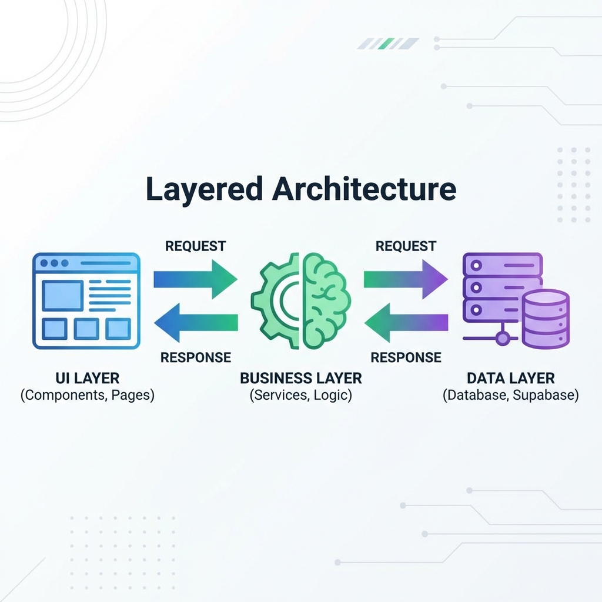

> "개념도 배우고 대화 예시도 봤는데, 막상 제가 직접 프로젝트 시작하려니까 첫 마디가 안 나와요. '뭘 만들지'부터 막막한데 어디서부터 시작해야 하죠?"

20편에서 AI와 어떻게 대화하는지 봤지? 근데 그건 "이미 뭘 만들지 정해진 상태"였어.

**실제로는 뭘 만들지부터 정해야 해.**

"할 일 관리 앱 만들까?" → "어떤 기능이 필요하지?" → "어떤 기술로 만들지?" → "구조는 어떻게?"

이 과정이 **기획과 아키텍처**야.

처음엔 다들 "그냥 만들면 되는 거 아니야?"라고 생각해. 근데 기획 없이 만들면 어떻게 될까?

- 만들다 보니 "어? 이 기능 추가하려면 처음부터 다시 만들어야 하네"
- "로그인 기능 넣으려니까 지금 구조로는 안 되네"
- "DB 설계를 이렇게 했어야 했는데..."

**기획 단계에서 큰 그림을 잡으면, 나중에 안 꼬여.**

PART 5는 4편으로 구성돼:
- **21편 (오늘)**: 뭘 만들지 정하고, 기술 스택과 아키텍처 결정
- 22편: 프론트엔드 구조 잡고 UI 만들기
- 23편: 백엔드 연결하고 데이터 흐름 완성
- 24편: 배포해서 실제로 쓸 수 있게 만들기

오늘은 **첫 단계**야. 프로젝트의 방향을 정하는 거지.

---

## 이 글을 읽고 나면

- 프로젝트 기획을 어떻게 시작하는지 알 수 있어
- "뭘 만들지"를 정하는 기준을 알 수 있어
- 기술 스택을 선택하는 대화를 AI와 할 수 있어
- 아키텍처를 결정하는 과정을 경험할 수 있어
- "이제 만들 준비가 됐다"는 상태가 뭔지 알 수 있어

---

## PART 4 복습: 설계 개념들

잠깐 20편에서 배운 걸 떠올려볼까?



이제 이 개념들을 **실제 프로젝트**에 적용해볼 거야.

---

## 오늘 만들 프로젝트: 할 일 관리 웹앱

**왜 할 일 관리 앱이냐?**

간단해 보이지만, 실무 서비스의 핵심 기능이 다 들어가:

```
┌─────────────────────────────────────────────────────────────┐
│          할 일 관리 앱에 들어갈 핵심 기능                     │
├─────────────────────────────────────────────────────────────┤
│                                                             │
│  ✅ 인증 (Authentication)                                    │
│     - 로그인, 회원가입                                       │
│     - 본인 것만 보기                                         │
│                                                             │
│  ✅ CRUD (Create, Read, Update, Delete)                     │
│     - 할 일 추가 (Create)                                    │
│     - 할 일 목록 보기 (Read)                                 │
│     - 완료 체크 (Update)                                     │
│     - 할 일 삭제 (Delete)                                    │
│                                                             │
│  ✅ 데이터 영속성 (Data Persistence)                         │
│     - DB에 저장                                              │
│     - 새로고침해도 유지                                      │
│     - 다른 기기에서도 동기화                                 │
│                                                             │
│  💡 이 3가지를 할 수 있으면:                                 │
│     → 대부분의 웹 서비스를 만들 수 있어                      │
│                                                             │
└─────────────────────────────────────────────────────────────┘
```

할 일 관리 앱으로 이 3가지를 배우면, 다른 서비스도 만들 수 있어.

---

## 1단계: 기획 - 뭘 만들지 정하기

**"할 일 관리 앱 만들 거야"**

이것만으로는 부족해. 더 구체적으로 정해야 해.

### 기능 목록 정하기

```
┌─────────────────────────────────────────────────────────────┐
│                    기능 목록 (MVP)                            │
├─────────────────────────────────────────────────────────────┤
│                                                             │
│  MVP = Minimum Viable Product                               │
│  (최소 기능 제품 = 핵심 기능만 넣은 첫 버전)                 │
│                                                             │
│  ✅ 필수 기능 (없으면 서비스가 안 됨)                        │
│     - 이메일 로그인/회원가입                                 │
│     - 할 일 추가                                            │
│     - 할 일 목록 보기                                       │
│     - 완료 체크                                             │
│     - 할 일 삭제                                            │
│                                                             │
│  🔜 나중에 추가 (지금은 안 만듦)                            │
│     - 할 일 수정                                            │
│     - 카테고리/태그                                         │
│     - 마감일                                                │
│     - 우선순위                                              │
│     - 공유 기능                                             │
│                                                             │
│  💡 왜 나중에?                                              │
│     → 일단 핵심 기능 완성하고 테스트                        │
│     → 잘 돌아가면 그때 추가                                 │
│                                                             │
└─────────────────────────────────────────────────────────────┘
```

**핵심: 처음부터 다 넣으려고 하지 마.**

필수 기능만 넣고, 나머지는 나중에 추가하는 게 훨씬 쉬워.

### 사용자 시나리오

"누가, 어떻게 쓸지" 상상해봐:

```
📱 사용자 A의 하루

1. 아침에 앱 접속
   → 로그인 (이메일/비밀번호)
   → 어제 만든 할 일 목록이 그대로 있음

2. 오늘 할 일 추가
   → "회의 자료 준비" 입력
   → 추가 버튼 클릭
   → 목록에 표시됨

3. 할 일 완료
   → "우유 사기" 체크박스 클릭
   → 취소선 표시됨

4. 완료된 할 일 삭제
   → 삭제 버튼 클릭
   → 목록에서 사라짐

5. 다른 기기에서 접속
   → 로그인하면 같은 목록 보임
```

이런 시나리오를 써보면, **어떤 기능이 필요한지** 명확해져.

---

## 2단계: 기술 스택 결정

이제 AI와 대화를 시작할 차례야.

┌───────────────────────────────────────────────────────────────────────┐
│  2-1: 기술 스택 고민                                                   │
├───────────────────────────────────────────────────────────────────────┤
│                                                                       │
│  나: "할 일 관리 웹앱 만들 건데, 기술 스택 추천해줘.                  │
│                                                                       │
│      요구사항:                                                        │
│      - 웹 브라우저에서 돌아가야 해 (모바일 앱 아님)                   │
│      - 로그인 기능 필요                                              │
│      - DB에 저장해서 다른 기기에서도 보여야 함                        │
│      - 빠르게 개발 가능해야 함 (나는 비개발자)                        │
│      - 배포도 쉬워야 함"                                             │
│                                                                       │
│  AI: "요구사항 고려해서 추천할게:                                     │
│                                                                       │
│      **프론트엔드: Next.js ⭐**                                        │
│      - React 기반이라서 UI 컴포넌트 만들기 쉬움                       │
│      - 서버 사이드 렌더링 지원 (SEO 좋음)                            │
│      - Vercel로 배포 한 번에 가능                                    │
│      - AI가 Next.js 코드 잘 생성함 (학습 데이터 많음)                │
│                                                                       │
│      **백엔드/DB: Supabase ⭐**                                        │
│      - BaaS (Backend as a Service)라서 서버 안 만들어도 됨           │
│      - 로그인 기능 (Auth) 기본 제공                                  │
│      - PostgreSQL DB 포함                                            │
│      - 실시간 동기화 지원                                            │
│      - 무료 플랜으로 시작 가능                                       │
│                                                                       │
│      **상태 관리: zustand ⭐**                                         │
│      - 코드가 Redux보다 훨씬 짧음                                    │
│      - 배우기 쉬움                                                   │
│      - 작은 프로젝트에 딱 맞음                                       │
│                                                                       │
│      **배포: Vercel**                                                │
│      - Next.js 배포 최적화되어 있음                                  │
│      - Git 연결하면 자동 배포                                        │
│      - 무료 플랜 충분함                                              │
│                                                                       │
│      대안:                                                            │
│      - Firebase도 괜찮지만, Supabase가 SQL이라 데이터 다루기 쉬움     │
│      - Redux도 가능하지만, zustand가 학습 곡선 낮음"                  │
│                                                                       │
│  나: "좋아. Next.js + Supabase + zustand로 가자.                     │
│                                                                       │
│      근데 Next.js 버전은?                                            │
│      App Router랑 Pages Router 중에 뭐가 좋아?"                      │
│                                                                       │
│  AI: "Next.js 14+ (App Router) 추천해.                               │
│                                                                       │
│      App Router가 최신이고:                                          │
│      - 서버 컴포넌트 지원 (성능 좋음)                                │
│      - 레이아웃 관리 쉬움                                            │
│      - 공식 문서도 App Router 기준으로 작성됨                        │
│                                                                       │
│      Pages Router는 예전 방식이야.                                   │
│      새로 시작하면 App Router로 가는 게 좋아."                        │
│                                                                       │
│  나: "App Router로 가자."                                            │
│                                                                       │
└───────────────────────────────────────────────────────────────────────┘

**이 대화에서 뭘 했냐?**

- 요구사항을 먼저 말했어 (웹, 로그인, DB, 빠른 개발, 쉬운 배포)
- AI가 이유를 설명하면서 추천했어
- 대안도 들었지만, 추천 이유가 합리적이어서 받아들였어
- 세부 옵션 (App Router vs Pages Router)도 물어봤어

💡 **기술 스택 정리**

```
✅ 최종 결정

Frontend: Next.js 14 (App Router)
Backend/DB: Supabase
State: zustand
Deploy: Vercel

→ 이제 이 기술들로 아키텍처를 정할 차례
```

---

## 3단계: 아키텍처 결정

기술 스택을 정했으니, 이제 **구조**를 정해야 해.

17편에서 배운 **레이어드 아키텍처**를 적용할 거야.

┌───────────────────────────────────────────────────────────────────────┐
│  3-1: 아키텍처 설계                                                    │
├───────────────────────────────────────────────────────────────────────┤
│                                                                       │
│  나: "프로젝트 구조를 레이어드 아키텍처로 잡을 건데,                  │
│      폴더 구조 제안해줘.                                              │
│                                                                       │
│      레이어는 3개:                                                    │
│      - UI 레이어: 사용자가 보는 화면                                  │
│      - 비즈니스 레이어: 할 일 추가/삭제 같은 로직                     │
│      - 데이터 레이어: Supabase 연결, DB 접근                         │
│                                                                       │
│      중요한 건, UI가 DB에 직접 접근하지 않게.                         │
│      반드시 비즈니스 레이어를 거쳐야 해."                              │
│                                                                       │
│  AI: "Next.js App Router 기준으로 폴더 구조 제안할게:                 │
│                                                                       │
│      project-root/                                                   │
│      ├── app/                    (Next.js App Router)                │
│      │   ├── page.tsx            (메인 페이지)                       │
│      │   ├── login/page.tsx      (로그인)                            │
│      │   └── signup/page.tsx     (회원가입)                          │
│      │                                                               │
│      ├── components/             (UI 레이어)                         │
│      │   ├── TodoList/                                               │
│      │   │   ├── TodoListContainer.tsx                              │
│      │   │   └── TodoListPresenter.tsx                              │
│      │   ├── TodoForm/                                               │
│      │   │   ├── TodoFormContainer.tsx                              │
│      │   │   └── TodoFormPresenter.tsx                              │
│      │   └── TodoItem/                                               │
│      │       └── TodoItemPresenter.tsx                              │
│      │                                                               │
│      ├── services/               (비즈니스 레이어)                    │
│      │   └── todoService.ts      (할 일 CRUD 로직)                   │
│      │                                                               │
│      ├── lib/                    (데이터 레이어)                      │
│      │   └── supabase.ts         (Supabase 클라이언트)               │
│      │                                                               │
│      ├── store/                  (상태 관리)                          │
│      │   └── useTodoStore.ts     (zustand store)                    │
│      │                                                               │
│      └── types/                  (타입 정의)                          │
│          └── todo.ts             (Todo 타입)                         │
│                                                                       │
│      데이터 흐름:                                                     │
│      컴포넌트 → 서비스 → Supabase 클라이언트 → DB                   │
│                                                                       │
│      이렇게 하면:                                                     │
│      - 나중에 DB를 바꿔도 서비스 레이어만 수정                        │
│      - UI 수정할 때 비즈니스 로직 안 건드림                          │
│      - 테스트하기 쉬움 (레이어별로 분리)                             │
│                                                                       │
│      각 레이어 설명:                                                  │
│                                                                       │
│      **UI 레이어 (components/)**                                     │
│      - 사용자한테 보이는 부분                                         │
│      - Container: 로직 (데이터 가져오기, 이벤트 처리)                │
│      - Presenter: UI만 (props 받아서 화면 그리기)                    │
│      - DB 직접 접근 금지 → 서비스 레이어 호출                         │
│                                                                       │
│      **비즈니스 레이어 (services/)**                                  │
│      - 할 일 추가, 삭제, 완료 같은 로직                              │
│      - 데이터 레이어 호출해서 DB 작업                                │
│      - UI와 DB 사이의 다리 역할                                      │
│                                                                       │
│      **데이터 레이어 (lib/)**                                         │
│      - Supabase 클라이언트 설정                                      │
│      - DB 테이블에 실제로 접근                                       │
│      - 서비스 레이어만 호출 가능"                                    │
│                                                                       │
│  나: "좋아. 각 레이어의 책임이 명확하네.                              │
│      Container-Presenter 패턴도 적용했고.                            │
│                                                                       │
│      근데 store/는 어느 레이어야?"                                    │
│                                                                       │
│  AI: "store/는 **횡단 관심사(Cross-cutting concern)**야.             │
│                                                                       │
│      모든 레이어에서 접근할 수 있어:                                  │
│      - 컴포넌트가 todos 읽기                                         │
│      - 서비스가 todos 업데이트                                       │
│                                                                       │
│      전역 상태(zustand)는 '앱 전체의 메모리'라고 생각하면 돼.         │
│      레이어 구조 바깥에 있는 공유 저장소야."                          │
│                                                                       │
│  나: "알겠어. 그럼 흐름은:                                            │
│      1. 사용자가 '할 일 추가' 버튼 클릭 (UI 레이어)                  │
│      2. Container가 todoService.addTodo() 호출 (비즈니스 레이어)     │
│      3. 서비스가 Supabase에 저장 (데이터 레이어)                     │
│      4. 저장 성공하면 zustand store 업데이트 (상태 관리)             │
│      5. Presenter가 자동으로 리렌더링 (UI 레이어)                    │
│                                                                       │
│      이 순서지?"                                                      │
│                                                                       │
│  AI: "정확해! 데이터 흐름을 완벽하게 이해했네.                        │
│                                                                       │
│      한 가지 더:                                                      │
│      에러 처리도 각 레이어에서 해야 해.                               │
│                                                                       │
│      - 서비스: DB 에러 잡아서 처리                                   │
│      - Container: 서비스 에러 받아서 UI에 표시                       │
│      - Presenter: 에러 메시지 화면에 보여주기                        │
│                                                                       │
│      이렇게 하면 에러가 어디서 생겼는지 바로 알 수 있어."             │
│                                                                       │
└───────────────────────────────────────────────────────────────────────┘

**이 대화에서 뭘 했냐?**

- 17편(아키텍처)에서 배운 **레이어드 아키텍처** 적용
- 18편(디자인 패턴)에서 배운 **Container-Presenter 패턴** 적용
- 폴더 구조로 레이어를 명확히 분리
- 데이터 흐름을 단계별로 확인
- 에러 처리까지 고려

---

## 4단계: 데이터 설계

이제 **어떤 데이터를 어디에 저장할지** 정해야 해.

┌───────────────────────────────────────────────────────────────────────┐
│  4-1: DB 테이블 설계                                                   │
├───────────────────────────────────────────────────────────────────────┤
│                                                                       │
│  나: "DB 테이블 설계하자.                                             │
│                                                                       │
│      필요한 테이블:                                                   │
│      1. users - Supabase Auth가 자동으로 만들어주는 거 쓸게           │
│      2. todos - 할 일 정보                                           │
│                                                                       │
│      todos 테이블 필드:                                               │
│      - id: UUID, 자동 생성                                           │
│      - user_id: users.id 외래키 (누구 것인지)                        │
│      - title: 할 일 내용, 텍스트                                     │
│      - is_completed: 완료 여부, boolean, 기본값 false                │
│      - created_at: 생성 시간, timestamp, 자동                        │
│                                                                       │
│      RLS (Row Level Security) 켜서 본인 것만 보게 해줘."             │
│                                                                       │
│  AI: "todos 테이블 SQL 작성했어:                                      │
│                                                                       │
│      CREATE TABLE todos (                                            │
│        id UUID PRIMARY KEY DEFAULT uuid_generate_v4(),               │
│        user_id UUID REFERENCES auth.users(id) ON DELETE CASCADE,     │
│        title TEXT NOT NULL,                                          │
│        is_completed BOOLEAN DEFAULT false,                           │
│        created_at TIMESTAMP DEFAULT now()                            │
│      );                                                              │
│                                                                       │
│      RLS 정책 (본인 것만 접근):                                       │
│                                                                       │
│      ALTER TABLE todos ENABLE ROW LEVEL SECURITY;                    │
│                                                                       │
│      -- SELECT: 본인 것만 조회                                       │
│      CREATE POLICY "Users can view own todos"                        │
│      ON todos FOR SELECT                                             │
│      USING (auth.uid() = user_id);                                   │
│                                                                       │
│      -- INSERT: 본인 이름으로만 추가                                 │
│      CREATE POLICY "Users can insert own todos"                      │
│      ON todos FOR INSERT                                             │
│      WITH CHECK (auth.uid() = user_id);                              │
│                                                                       │
│      -- UPDATE: 본인 것만 수정                                       │
│      CREATE POLICY "Users can update own todos"                      │
│      ON todos FOR UPDATE                                             │
│      USING (auth.uid() = user_id);                                   │
│                                                                       │
│      -- DELETE: 본인 것만 삭제                                       │
│      CREATE POLICY "Users can delete own todos"                      │
│      ON todos FOR DELETE                                             │
│      USING (auth.uid() = user_id);                                   │
│                                                                       │
│      Supabase 대시보드 SQL Editor에서 실행하면 돼."                   │
│                                                                       │
│  나: "ON DELETE CASCADE가 뭐야?"                                     │
│                                                                       │
│  AI: "유저가 탈퇴하면 그 유저의 todos도 자동으로 삭제된다는 뜻이야.   │
│                                                                       │
│      CASCADE = 연쇄 삭제                                              │
│                                                                       │
│      만약 CASCADE 안 붙이면:                                          │
│      - 유저 탈퇴 시도                                                │
│      - 에러: 'todos가 남아있어서 삭제 안 됨'                          │
│                                                                       │
│      CASCADE 붙이면:                                                 │
│      - 유저 탈퇴                                                     │
│      - 자동으로 그 유저의 todos 전부 삭제                            │
│      - 깔끔하게 정리됨"                                              │
│                                                                       │
└───────────────────────────────────────────────────────────────────────┘

┌───────────────────────────────────────────────────────────────────────┐
│  4-2: 상태 관리 설계                                                   │
├───────────────────────────────────────────────────────────────────────┤
│                                                                       │
│  나: "상태 관리 설계하자.                                             │
│                                                                       │
│      19편에서 배운 대로:                                              │
│      - 전역 상태 (zustand): user, todos                              │
│      - DB (Supabase): 영구 저장                                      │
│      - 로컬 상태 (컴포넌트): 입력 폼                                  │
│                                                                       │
│      흐름:                                                            │
│      1. 앱 시작 → DB에서 todos 가져와서 zustand에 넣기               │
│      2. 할 일 추가 → DB 저장 성공 → zustand 업데이트                 │
│      3. 할 일 완료/삭제 → DB 반영 → zustand 업데이트                 │
│                                                                       │
│      zustand store 구조 제안해줘."                                    │
│                                                                       │
│  AI: "zustand store 설계:                                            │
│                                                                       │
│      // store/useTodoStore.ts                                        │
│                                                                       │
│      interface TodoStore {                                           │
│        // 상태                                                        │
│        user: User | null;                                            │
│        todos: Todo[];                                                │
│        loading: boolean;                                             │
│        error: string | null;                                         │
│                                                                       │
│        // 액션                                                        │
│        setUser: (user: User | null) => void;                         │
│        fetchTodos: () => Promise<void>;                              │
│        addTodo: (title: string) => Promise<void>;                    │
│        toggleTodo: (id: string) => Promise<void>;                    │
│        deleteTodo: (id: string) => Promise<void>;                    │
│      }                                                               │
│                                                                       │
│      특징:                                                            │
│      - user: 로그인한 사용자 정보 (싱글톤 패턴)                       │
│      - todos: 할 일 목록 (배열)                                      │
│      - loading: API 호출 중인지 표시                                 │
│      - error: 에러 메시지 저장                                       │
│                                                                       │
│      todos 배열은 옵저버 패턴으로:                                    │
│      - todos 바뀌면 TodoList 자동 리렌더링                           │
│      - zustand가 알아서 처리해줌"                                    │
│                                                                       │
│  나: "좋아. 로컬 상태는?"                                            │
│                                                                       │
│  AI: "로컬 상태 (컴포넌트 메모리):                                    │
│                                                                       │
│      TodoFormContainer:                                              │
│      - inputValue: 입력 중인 텍스트                                  │
│      - React useState로 관리                                         │
│      - 추가 버튼 누르면 zustand의 addTodo() 호출                     │
│                                                                       │
│      왜 로컬 상태?                                                    │
│      - 입력 중인 내용은 앱 전체가 알 필요 없음                        │
│      - 추가 완료될 때만 전역(zustand)으로 올리면 됨                   │
│      - 불필요한 리렌더링 방지"                                       │
│                                                                       │
└───────────────────────────────────────────────────────────────────────┘

**이 대화에서 뭘 했냐?**

- 16편(자료구조): todos는 **배열**, 각 항목은 **객체**
- 19편(상태 관리): **전역(zustand) + DB(Supabase) + 로컬(입력)** 조합
- 18편(디자인 패턴): user는 **싱글톤**, todos 변화는 **옵저버 패턴**
- DB 설계와 상태 관리를 함께 고려

---

## 지금까지 정한 것들

여기까지 오면, **이제 만들 준비가 된 거야.**

```
┌─────────────────────────────────────────────────────────────┐
│                  기획과 아키텍처 완료                         │
├─────────────────────────────────────────────────────────────┤
│                                                             │
│  ✅ 기획                                                     │
│     - MVP 기능 정의 (로그인, CRUD)                           │
│     - 사용자 시나리오 작성                                   │
│                                                             │
│  ✅ 기술 스택                                                │
│     - Next.js 14 (App Router)                               │
│     - Supabase (Auth + DB)                                  │
│     - zustand (상태 관리)                                    │
│     - Vercel (배포)                                         │
│                                                             │
│  ✅ 아키텍처                                                 │
│     - 레이어드 (UI / 비즈니스 / 데이터)                      │
│     - Container-Presenter 패턴                              │
│     - 폴더 구조 설계 완료                                    │
│                                                             │
│  ✅ 데이터 설계                                              │
│     - DB 테이블: todos (id, user_id, title, ...)           │
│     - RLS 정책: 본인 것만 접근                               │
│     - 상태 관리: zustand(전역) + DB(영구) + 로컬(입력)       │
│                                                             │
│  ✅ 데이터 흐름                                              │
│     - 컴포넌트 → 서비스 → Supabase → DB                    │
│     - DB 저장 성공 → zustand 업데이트 → UI 리렌더링         │
│                                                             │
│  🚀 다음 단계                                                │
│     - 22편: 프론트엔드 구조 잡고 UI 만들기                   │
│     - 23편: 백엔드 연결하고 데이터 흐름 완성                 │
│     - 24편: 배포                                            │
│                                                             │
└─────────────────────────────────────────────────────────────┘
```

---

## AI한테 이렇게 요청해봐

### 상황 1: 기술 스택 추천받을 때

**나쁜 예 (추상적)**
```
"웹앱 만들 건데, 기술 스택 추천해줘"
```

→ 요구사항이 없어서 AI가 뭘 추천해야 할지 몰라

**좋은 예 (요구사항 포함)**
```
"할 일 관리 웹앱 만들 건데, 기술 스택 추천해줘.

요구사항:
- 웹 브라우저에서 작동
- 로그인 기능 필요
- DB에 저장 (다른 기기 동기화)
- 빠른 개발 (비개발자)
- 쉬운 배포"
```

→ 요구사항이 명확해서 AI가 적합한 스택 추천 가능

---

### 상황 2: 아키텍처 결정할 때

**나쁜 예 (방향 없음)**
```
"프로젝트 구조 잡아줘"
```

→ AI가 알아서 구조 잡아. 근데 내가 원하는 구조가 아닐 수 있어.

**좋은 예 (명확한 방향)**
```
"레이어드 아키텍처로 폴더 구조 잡아줘.

레이어 3개:
- UI 레이어 (components/)
- 비즈니스 레이어 (services/)
- 데이터 레이어 (lib/)

UI가 DB에 직접 접근하지 않고,
반드시 서비스 레이어를 거치게."
```

→ 내가 원하는 구조를 명확히 제시. AI가 그에 맞게 설계.

---

### 상황 3: DB 설계할 때

**나쁜 예 (필드만 나열)**
```
"todos 테이블 만들어줘.
id, title, completed, user_id"
```

→ 타입, 제약조건, 관계가 명확하지 않아

**좋은 예 (타입과 제약조건 명시)**
```
"todos 테이블 만들어줘.

필드:
- id: UUID, 자동 생성
- user_id: users.id 외래키, CASCADE 삭제
- title: TEXT, NOT NULL
- is_completed: BOOLEAN, 기본값 false
- created_at: TIMESTAMP, 자동

RLS 켜서 본인 것만 CRUD 가능하게."
```

→ 구체적인 타입과 제약조건. AI가 정확히 구현 가능.

---

## 실전 팁

### 1. 기획 단계를 건너뛰지 마

```
❌ "할 일 관리 앱 만들어줘" → 바로 코드
   → 나중에 기능 추가하려니 구조가 안 맞음

✅ 기획 (MVP 정의) → 기술 스택 → 아키텍처 → 데이터 설계 → 코드
   → 확장 가능한 구조
```

### 2. AI한테 대안을 물어봐

```
나: "상태 관리 옵션 알려줘. 각각 장단점도."

AI: "1. Context - 기본, 근데 복잡해질 수 있음
     2. zustand - 코드 짧고 쉬움
     3. Redux - 대규모용, 학습 곡선 높음"

나: "우리 프로젝트 작으니까 zustand로 가자"
```

### 3. 모르는 용어는 바로 물어봐

```
AI: "ON DELETE CASCADE로..."

나: "CASCADE가 뭐야?"

AI: "유저 삭제하면 관련 데이터도 자동 삭제되는 거야"

→ 이해하고 넘어가기. 나중에 헷갈리지 않게.
```

### 4. 데이터 흐름을 확인해

```
나: "흐름 정리해줘.
    사용자가 할 일 추가 버튼 누르면 어떻게 돼?"

AI: "1. Container가 addTodo() 호출
     2. 서비스가 DB에 저장
     3. 성공하면 zustand 업데이트
     4. Presenter 리렌더링"

→ 흐름을 이해하면 디버깅이 쉬워져
```

---

## 코드 문법 몰라도 돼

💡 **잠깐, SQL 문법 몰라도 되냐?**

괜찮아. **개념**만 알면 돼.

```
너가 알아야 할 것:
✅ todos 테이블에 어떤 필드가 필요한지
✅ user_id로 users와 연결된다는 것
✅ RLS로 본인 것만 접근한다는 것

너가 몰라도 되는 것:
❌ CREATE TABLE 문법
❌ REFERENCES 키워드
❌ RLS POLICY 작성법

→ "이런 필드로 테이블 만들어줘" 하면 AI가 SQL 작성
```

**근데 하면 할수록 보여.**

"아, CREATE TABLE은 테이블 만드는 거구나"
"REFERENCES는 다른 테이블이랑 연결하는 거네"

이게 보이기 시작하면 DB 설계가 훨씬 쉬워져.

---

## 오늘의 핵심 정리

```
✅ 기획 먼저, 코드는 나중에
   → MVP 정의 → 사용자 시나리오 → 기술 스택 → 아키텍처 → 데이터 설계

✅ 요구사항을 명확히 말하기
   → "웹앱 만들어줘" (X)
   → "웹, 로그인, DB 저장, 빠른 개발, 쉬운 배포" (O)

✅ AI한테 대안을 듣고 판단하기
   → "알아서 해줘" (X)
   → "옵션 알려줘" → 듣고 → "2번으로 가자" (O)

✅ 레이어드 아키텍처로 구조 잡기
   → UI / 비즈니스 / 데이터 레이어 분리
   → UI가 DB에 직접 접근 금지

✅ 상태 관리는 조합
   → 전역(zustand) + DB(Supabase) + 로컬(입력)

✅ AI한테 요청할 때:
   "할 일 관리 웹앱 만들 건데,

    기술 스택:
    - Next.js 14 (App Router)
    - Supabase (Auth + DB)
    - zustand (상태 관리)

    아키텍처:
    - 레이어드 (UI / 비즈니스 / 데이터)
    - Container-Presenter 패턴

    DB:
    - todos 테이블 (id, user_id, title, is_completed, created_at)
    - RLS로 본인 것만 접근

    상태:
    - zustand(user, todos) + DB(영구) + 로컬(입력)"
```
