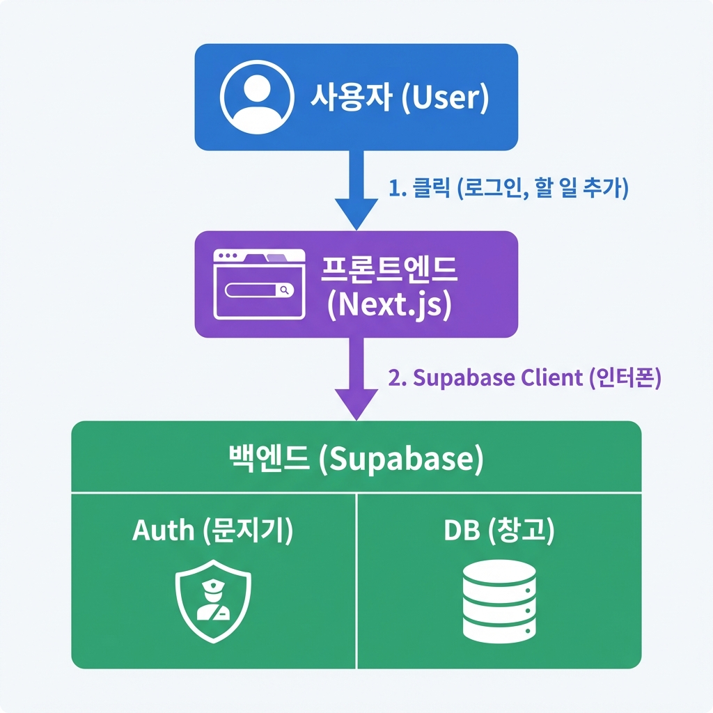

> "열심히 만들었는데, 새로고침하면 다 사라져..."
> "다른 기기에서 들어가니까 제 할 일이 하나도 안 보여."

22편에서 만든 앱은 **기억상실증**에 걸린 상태야.
새로고침만 하면 모든 게 리셋돼. 데이터를 **내 브라우저의 임시 메모리**에만 저장했으니까.

이제 우리 앱에 **영구적인 기억**을 만들어줄 차례야.
새로고침해도, 핸드폰으로 접속해도 내 할 일이 그대로 남아있게 만들어볼게.

그러려면 **백엔드(Backend)**와 **데이터베이스(DB)**가 필요해.
겁먹지 마. 우리는 직접 서버를 만드는 게 아니라, **Supabase**라는 이미 잘 지어진 집을 빌려 쓸 거니까.

---

## 이 글을 읽고 나면

- **Supabase**를 내 프론트엔드 프로젝트(Next.js)와 연결할 수 있어
- **Auth(인증)**를 붙여서 진짜 '로그인' 기능을 구현할 수 있어
- **CRUD(생성/조회/수정/삭제)**를 통해 데이터를 영구적으로 저장할 수 있어

---

## 1. 큰 그림: 홀과 주방 연결하기

15편에서 배웠던 식당 비유, 기억나지?

- **프론트엔드 (Next.js)**: 손님이 있는 **식당 홀** (22편에서 만듦)
- **백엔드 (Supabase)**: 요리가 만들어지는 **주방** (오늘 연결함)

지금 상황은 홀 직원이 주방에 주문을 안 넣고, 그냥 종이에 적었다가 버리는 꼴이야.
이제 주방과 홀을 연결하는 **인터폰(Supabase Client)**을 설치할 거야.

우리는 AI한테 딱 3가지만 시키면 돼.
1. 인터폰 설치해줘 (**Supabase 연결**)
2. 문지기 세워줘 (**Auth 구현**)
3. 창고 써줘 (**CRUD 구현**)

---

## 2. 단계별 구현 가이드

### 1단계: Supabase 연결 (인터폰 설치)

먼저 우리 프로젝트(Next.js)가 Supabase와 대화할 수 있게 연결해야 해.

**🧑🏻‍💻 나 (사용자)**
> "우리 프로젝트에 Supabase 연결할 거야.
>
> 1. 필요한 패키지(`@supabase/supabase-js`) 설치해줘.
> 2. `lib/supabase.ts` 파일 만들어서 Supabase 클라이언트 설정해줘.
> 3. `.env.local` 파일에 환경변수 들어갈 자리도 마련해줘."

**🤖 AI**
> 패키지 설치하고 설정 파일을 만들게.
> `.env.local` 파일에 `NEXT_PUBLIC_SUPABASE_URL`과 `ANON_KEY`를 넣을 준비를 해둘 테니,
> Supabase 대시보드에서 찾아서 채워줘.

 

> [!IMPORTANT]
> **휴먼터치 시간!**
> AI가 코드는 짜주지만, 비밀번호(API Key)는 너가 직접 넣어야 해.
> Supabase 웹사이트 → Project Settings → API 메뉴에서 URL과 Key를 복사해서 `.env.local` 파일에 붙여넣어.

 

### 2단계: 로그인/로그아웃 구현 (Auth)

연결이 됐으니 문지기를 세워.
복잡한 보안 코드? 몰라도 돼. **"Supabase Auth 써줘"** 한 마디면 돼.

**🧑🏻‍💻 나 (사용자)**
> "로그인 기능을 만들자.
> `components/AuthButton.tsx` 컴포넌트를 만들어줘.
>
> 기능:
> 1. 로그인 안 했을 때: 'Google로 로그인' 버튼 보여주기
> 2. 로그인 했을 때: '로그아웃' 버튼 보여주기
> 3. **Supabase Auth**의 `signInWithOAuth` 기능 사용해서 구현해줘."

**🤖 AI**
> Supabase Auth를 사용해서 버튼을 만들게.
> 구글 로그인을 사용하려면 Supabase 대시보드에서 Google Provider 설정을 켜야 해.

 

### 3단계: 진짜 데이터 저장하기 (CRUD)

이제 가장 중요한 **CRUD**야.
메모리(Store)에 저장하던 걸 **DB**에 저장하도록 바꿀 거야.

**🧑🏻‍💻 나 (사용자)**
> "이제 DB랑 연동하자. `services/todoService.ts` 파일을 만들어줘.
>
> 아까 만든 `todos` 테이블이랑 연결해서 4가지 함수를 구현해줘:
>
> 1. **가져오기 (Read)**: `select *` 로 내 할 일 목록 가져오기
> 2. **추가하기 (Create)**: `insert` 로 새 할 일 저장하기
> 3. **수정하기 (Update)**: `update` 로 완료 상태(is_completed) 바꾸기
> 4. **삭제하기 (Delete)**: `delete` 로 할 일 지우기
>
> 그리고 `zustand` 스토어(`useTodoStore`)를 수정해서, 이 서비스 함수들을 호출하게 해줘."

**🤖 AI**
> 1. `services/todoService.ts`에 Supabase 연결 함수들을 만들고,
> 2. `store/useTodoStore.ts`에서 배열을 조작하는 대신 이 함수들을 부르도록 수정할게.
>
> 이제 데이터를 추가하면 진짜 DB에 저장돼!

---

## 3. 휴먼터치: 진짜 '저장'됐는지 확인하기

코드는 AI가 다 짰어.
이제 진짜 **'서버'**에 저장되는지 검증해볼 시간이야. 22편과는 확연히 다를 거야.

### 검증 체크리스트

1. **새로고침의 마법**
   - 할 일을 추가해.
   - 브라우저를 새로고침(F5) 해.
   - **그대로 남아 있어?** (성공!)
   - *22편에서는 사라졌었잖아? 이제 영구 저장된 거야.*

2. **기기 간 동기화**
   - 크롬 시크릿 탭을 켜거나, 다른 브라우저(사파리, 엣지)를 켜.
   - 똑같이 로그인을 해.
   - **아까 추가한 할 일이 보여?** (성공!)
   - *내 컴퓨터에 저장된 게 아니라, 저 멀리 Supabase 서버에 저장됐다는 뜻이야.*

3. **삭제 확인**
   - 하나를 삭제해.
   - 새로고침 해봐.
   - **진짜 사라졌어?** (성공!)

3가지 다 통과했다면?
너는 이제 **"풀스택(Full-stack) 서비스"**를 만든 거야.

---

## 4. 자주 겪는 문제 해결 (Q&A)

막히는 부분이 있다면 여기를 체크해봐.

**Q. "로그인 했는데 자꾸 풀려"**
> A. Supabase 설정에서 `Site URL`을 확인해봐.
> Authentication → URL Configuration에 `http://localhost:3000`이 등록되어 있어야 해.

**Q. "저장은 되는데 불러오기가 안 돼" (또는 그 반대)**
> A. **RLS(Row Level Security)** 정책 때문일 확률이 99%야.
> 21편에서 RLS 정책 설정했었잖아? 만약 안 했다면 AI한테 이렇게 시켜봐.
>
> *"Supabase SQL 에디터에 넣을 코드를 짜줘. `todos` 테이블에 대해 로그인한 사용자는 자기 데이터만 CRUD 할 수 있게 RLS 정책을 설정해줘."*

---

## 오늘의 핵심 정리

✅ **프론트엔드와 백엔드 연결**: `Supabase Client` 라이브러리가 다리 역할을 해.
✅ **인증(Auth)**: 복잡한 코딩 없이 `Supabase Auth` 도구를 쓰면 로그인이 뚝딱 돼.
✅ **CRUD**:
   - **C**reate: `insert` (추가)
   - **R**ead: `select` (조회)
   - **U**pdate: `update` (수정)
   - **D**elete: `delete` (삭제)
✅ **영구 저장**: 이제 새로고침해도, 컴퓨터를 껐다 켜도 데이터가 살아있어.
