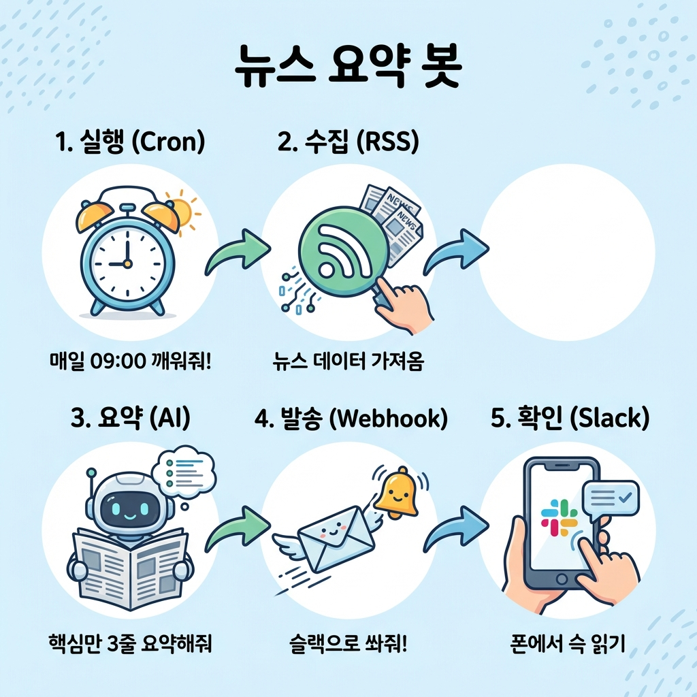
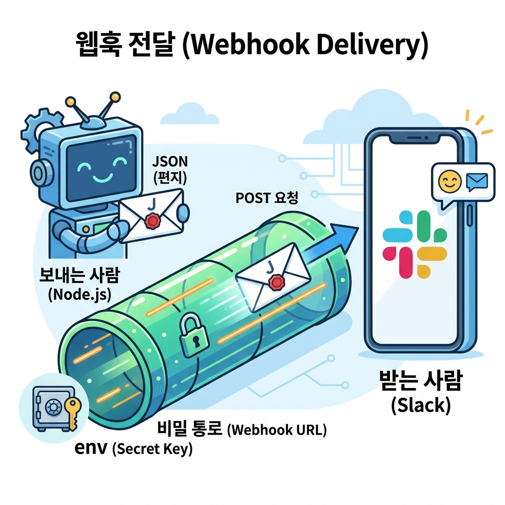

> "매일 아침 9시마다 경쟁사 뉴스를 검색해서 엑셀에 정리하고 있어.
> 30분밖에 안 걸리긴 하는데... 이걸 1년 내내 하려니까 너무 지겨워."

30분이 짧아 보여?
매일 30분이면 **1년에 180시간**이야. 한 달치 업무 시간을 단순 반복 작업에 버리고 있는 거지.

**"이거 컴퓨터가 대신해줄 수 없나?"**
이 생각이 드는 순간이 바로 **자동화(Automation)**가 필요한 타이밍이야.

개발자들은 이런 단순 반복 작업을 절대 직접 안 해.
컴퓨터한테 시키면 더 빠르고, 더 정확하고, 무엇보다 **지치지 않거든.**

이 글에서는 "데이터를 수집해서 슬랙으로 보내는" 파이프라인을 처음부터 끝까지 만들어볼 거야.

---

## 이 글을 읽고 나면

- 어떤 일이 '자동화 가능한 일'인지 알아볼 수 있어.
- **크론(Cron)**과 **웹훅(Webhook)**이 뭔지 이해할 수 있어.
- RSS로 데이터를 수집하고, 슬랙으로 발송하는 봇을 만들 수 있어.

---

## 1. 자동화, 무엇을 맡길 수 있나?

모든 일을 자동화할 수는 없어.
근데 아래 3가지 조건에 맞는다면, 그건 **컴퓨터가 제일 좋아하는 일**이야.

```
┌─────────────────────────────────────────────────────────────┐
│                    자동화하기 딱 좋은 일                         │
├───────────────┬───────────────────────┬─────────────────────┤
│    반복적      │       규칙적           │      데이터 처리      │
│  (Repetitive) │     (Rule-based)      │        (Data)       │
├───────────────┼───────────────────────┼─────────────────────┤
│ 매일/매주     │ 판단이 필요 없음        │ 텍스트, 숫자, 파일    │
│ 똑같이 하는 일  │ "A면 B한다"가 명확함    │ 컴퓨터가 읽을 수 있음  │
└───────────────┴───────────────────────┴─────────────────────┘
```

### 이런 건 자동화하기 어려워 (사람의 영역)
- "이 뉴스, 우리 회사에 중요한 건가?" **(판단)**
- "이 디자인, 요즘 트렌드에 맞나?" **(감각)**
- "거래처 담당자 기분이 안 좋아 보이네" **(눈치)**

### 이런 건 자동화가 쉬워 (AI의 영역)
- "특정 키워드가 들어간 기사만 모으기" **(단순 검색)**
- "모은 기사를 3줄로 요약하기" **(AI 요약)**
- "요약된 내용을 매일 9시에 슬랙으로 보내기" **(정기 실행)**

---

## 2. 자동화의 핵심 도구 2가지

개발자들이 숨 쉬듯이 쓰는 단어 딱 2개만 알면 돼.

### 크론 (Cron): "알람 시계"
우리가 아침 7시에 알람을 맞추듯이, 컴퓨터한테도 알람을 맞출 수 있어.
**"매일 아침 9시에 실행해"**라고 명령해두는 거야. 이걸 **크론(Cron)**이라고 해.

> **AI한테 이렇게 말하면 돼:**
> "이 코드를 **크론(Cron)**으로 매일 아침 9시에 실행해줘."

### 웹훅 (Webhook): "초인종"
내가 계속 문 앞에 서서 택배 왔나 확인하는 건(Polling) 힘들잖아.
웹훅은 **"택배 오면 초인종 눌러줘"** 같은 시스템이야.

- **API**: 내가 달라고 해야 줌 ("뉴스 줘")
- **Webhook**: 준비되면 알아서 던져줌 ("뉴스 나왔어!")

우리가 만들 **슬랙 봇**도 이 웹훅을 써.
"뉴스가 요약되면 → 슬랙 알림을 울려줘(웹훅)" 방식이야.

---

## 3. 이번에 만들 프로젝트: 뉴스 요약 슬랙 봇

**[목표]**
매일 아침 9시, 내가 관심 있는 키워드('AI', '자동화')의 뉴스를 찾아서,
GPT가 3줄로 요약한 뒤, 우리 팀 슬랙 채널에 쏘아주는 봇.



```
┌──────────────────────────────────────────────────────────────────┐
│                   뉴스 요약 봇 구조도                             │
├─────────────┬─────────────┬──────────────┬─────────────┬─────────┤
│  1. 실행    │  2. 수집    │  3. 요약     │  4. 발송     │  5. 확인  │
│  (Cron)     │   (RSS)     │   (AI)       │  (Webhook)  │  (Slack) │
├─────────────┼─────────────┼──────────────┼─────────────┼─────────┤
│ 매일 09:00  │ 뉴스 검색   │ 핵심만 3줄    │ 슬랙으로     │ 폰에서   │
│ 깨워줘!     │ 데이터 가져옴 │ 요약해줘      │ 쏴줘!       │ 슥 읽기   │
└─────────────┴─────────────┴──────────────┴─────────────┴─────────┘
```

---

## 4. 데이터 수집: 크롤링 vs RSS

데이터를 수집하는 방법은 크게 두 가지가 있어.

### 1) 크롤링 (Crawling): "도둑"
남의 사이트(HTML)를 몰래 긁어가는 방식이야.
- **장점**: 화면에 보이는 건 다 가져올 수 있어.
- **단점**: 사이트 구조가 바뀌면 에러 나. 주인이 싫어해서 차단될 수 있어.

### 2) RSS: "전단지"
"제발 우리 소식 좀 가져가주세요" 하고 사이트 주인이 대문 앞에 놔둔 정리된 문서야.
- **장점**: 구조가 안 바뀜(XML 표준). 합법적이고 안전해.
- **단점**: RSS를 제공하는 사이트만 가능해. (다행히 구글 뉴스는 제공해!)

**우리는 초보자에게 안전하고 확실한 RSS를 쓸 거야.**

---

## 5. 실전: 뉴스 수집기 만들기

이번 프로젝트는 브라우저가 아니라, 내 컴퓨터 내부(터미널)에서 돌아가는 **Node.js** 프로그램이야.

### 1단계: 프로젝트 세팅

터미널을 열고 새 폴더를 만들어서 시작해봐.

```bash
mkdir my-news-bot
cd my-news-bot
npm init -y
```

그리고 RSS를 읽어주는 도구(`rss-parser`)를 설치해.

```bash
npm install rss-parser
```

<br/>

### 2단계: AI에게 코드 요청하기

이제 AI(신입사원)에게 일을 시켜보자.
**"RSS 주소에서 데이터를 가져와서, 제목과 링크만 보여줘"**라고 할 거야.

**나 (팀장)**
> "Node.js로 짤 거야. `rss-parser` 라이브러리를 써서
> 구글 뉴스 RSS('인공지능' 검색 결과)를 읽어오는 코드를 `index.js`에 짜줘.
> 가져온 기사 중 최신 3개의 **제목**과 **링크**만 콘솔에 깔끔하게 출력해줘."

**AI (신입사원)**
> "좋아! `rss-parser`로 구글 뉴스 RSS를 파싱하는 코드를 작성할게.
> `output`은 이렇게 나올 거야."

```javascript
// AI가 짜준 코드 예시 (index.js)
const Parser = require('rss-parser');
const parser = new Parser();

(async () => {
  // 구글 뉴스 RSS 주소 (인공지능 검색)
  const feed = await parser.parseURL('https://news.google.com/rss/search?q=인공지능&hl=ko&gl=KR&ceid=KR:ko');

  console.log(`=== '${feed.title}' 최신 뉴스 ===`);

  // 최신 3개만 반복
  feed.items.slice(0, 3).forEach(item => {
    console.log(`[제목] ${item.title}`);
    console.log(`[링크] ${item.link}`);
    console.log('-------------------');
  });
})();
```

<br/>

### 3단계: 실행 및 확인

코드를 저장했다면 직접 실행해봐.

```bash
node index.js
```

터미널에 뉴스가 쫙 뜨나?
방금 **인터넷상의 데이터를 내 컴퓨터로 납치(?)**해온 거야.

---

## 6. GPT로 요약 붙이기

제목만 가져오니까 좀 아쉽지?
내용을 3줄로 요약까지 해주면 완벽할 것 같아.

여기서는 **AI API** (16편에서 배운 OpenRouter)를 쓰면 돼.
무료 모델도 있지만, **개념만 먼저 잡고 갈게.**

**나 (팀장)**
> "좋아. 이제 이 제목이랑 링크를 가지고 GPT한테 요약을 시키고 싶어.
> `openai` 라이브러리를 써서, 각 기사 제목을 3줄로 요약하는 코드를 추가해줘."

**AI (신입사원)**
> "좋아, `feed.items`를 돌면서 각 제목을 GPT 프롬프트에 넣으면 돼.
> '다음 뉴스 제목을 보고 핵심 내용을 3줄로 요약해줘: [제목]' 이렇게."

> [!TIP]
> **왜 본문을 안 긁어와?**
> 뉴스 사이트마다 본문 구조가 달라서, 본문을 긁어오려면 훨씬 복잡한 크롤링(Puppeteer 등)이 필요해.
> 초보 때는 **'제목을 보고 내용을 추측해서 요약해줘'**라고만 해도 충분히 쓸만해. (가성비 최고!)

---

## 7. 슬랙으로 발송하기

뉴스 요약까지는 했는데, 매일 아침마다 터미널 켜서 확인해야 하나?
이러면 자동화가 아니잖아.

진정한 자동화는 **"내가 신경 쓰지 않아도 내 눈앞에 배달되는 것"**이야.
매일 아침 커피 마실 때, 슬랙으로 요약본이 딱 와있어야 진짜지.



### 슬랙 앱 만들고 주소 받기 (1분컷)

이 부분은 AI가 못 해줘. 너가 직접 슬랙 사이트에서 클릭해야 해.
천천히 따라와봐.

1.  [Slack API 사이트](https://api.slack.com/apps) 접속
2.  **Create New App** 클릭 → **From scratch** 선택
3.  앱 이름(예: `Morning News Bot`) 짓고 워크스페이스 선택
4.  만들어진 앱 설정 메뉴에서 **Incoming Webhooks** 클릭
5.  **Activate Incoming Webhooks** 스위치 켜기 (ON)
6.  **Add New Webhook to Workspace** 버튼 누르고, 메시지 받을 채널 선택

그러면 알 수 없는 문자가 섞인 긴 주소가 나올 거야.
`https://hooks.slack.com/services/T000.../B000.../XXXX...`

이게 바로 **우리만의 비밀 우체통 주소**야!
이걸 복사해둬.

### 슬랙 전송 코드 작성

이제 AI한테 배달을 시켜보자.
위에서 만든 요약 코드 뒤에 붙여보자.

**나 (팀장)**
> "방금 만든 뉴스 요약본(text)을 슬랙으로 보내고 싶어.
> `axios` 라이브러리를 써서, 이 웹훅 주소로 POST 요청을 보내는 코드를 짜줘.
>
> *주의: 웹훅 주소는 코드에 직접 박지 말고 `process.env.SLACK_WEBHOOK_URL`에서 가져오게 해줘.*"

**AI (신입사원)**
> "좋아! `axios`를 설치하고 코드를 추가할게.
> 슬랙은 `text`라는 이름으로 보따리(JSON)를 싸서 보내야 알아들어."

```bash
npm install axios dotenv
```

```javascript
// AI가 짜준 코드 (부분)
const axios = require('axios');
require('dotenv').config(); // 환경변수 쓰려면 이거 필요해

async function sendToSlack(message) {
  const url = process.env.SLACK_WEBHOOK_URL;

  try {
    // 슬랙으로 POST 요청 (편지 넣기)
    await axios.post(url, {
      text: message // 보낼 내용
    });
    console.log('초인종 눌렀어!');
  } catch (error) {
    console.error('배달 실패:', error);
  }
}
```

<br/>

### 환경변수 설정 (보안)

프로젝트 폴더에 `.env` 파일을 만들고, 아까 복사한 주소를 붙여넣어.

```
SLACK_WEBHOOK_URL=https://hooks.slack.com/services/T000...
```

<br/>

### 실행 및 확인

```bash
node index.js
```

잠시 후...
**슬랙 알림음!**

"모닝 뉴스 요약봇: 오늘의 AI 뉴스입니다..."

너의 첫 봇이 말을 걸어왔어!
이 순간의 짜릿함, 절대 잊지 못할 거야.

---

## 8. 메시지 예쁘게 꾸미기 (선택)

그냥 글자만 보내면 심심하잖아.
슬랙은 **굵게 쓰기** 같은 꾸미기 기능을 지원해.

비개발자가 복잡한 문법(Block Kit)을 공부할 필요는 없어.
AI한테 이렇게 툭 던져봐.

> **"슬랙 메시지 보낼 때, 중요 키워드는 굵게(**) 표시하고, 제목엔 이모지 붙여줘."**

그러면 AI가 알아서 `*bold*`나 `:newspaper:` 같은 특수 기호를 섞어서 보내줄 거야.
이게 바로 **"어떻게(구현)는 AI에게, 무엇을(디자인)은 사람에게"** 맡기는 똑똑한 협업이야.

---

## 오늘의 핵심 정리

**자동화 대상**: 반복적이고, 규칙적이고, 데이터가 있는 일.
**크론(Cron)**: 정해진 시간에 실행하는 '알람 시계'.
**웹훅(Webhook)**: 이벤트가 발생하면 알려주는 '초인종'.
**RSS**: 크롤링보다 안전하고 편한 데이터 수집 방법.
**웹훅 URL**: 비밀번호가 필요 없는 나만의 슬랙 우체통 주소.
**환경변수(.env)**: 비밀 주소는 코드에 직접 적지 말고 따로 보관해.

다음 편에서는 이 봇을 **내가 자는 동안에도 알아서 돌아가게** 만들어볼 거야.
