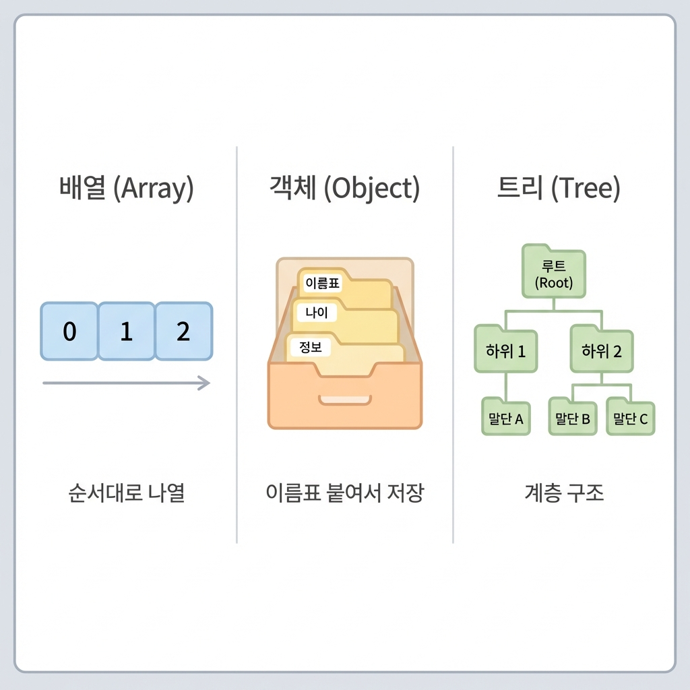

> "할 일 관리 앱 만들었는데, 카테고리 추가하려니까 완전 꼬여버렸어요. 처음엔 단순했는데, 기능 하나 추가하니까 전체를 다시 짜야 한대요. 데이터를 어떻게 정리해야 이런 일이 안 생기나요?"

기능은 만들었는데, 나중에 추가/수정하려니까 구조 자체를 뜯어고쳐야 하는 거야.

**왜 이런 일이 생길까?**

처음에 데이터를 **어떻게 정리할지** 생각 없이 시작해서 그래. 단순할 땐 괜찮았는데, 복잡해지니까 한계가 드러나는 거지.

이게 바로 **자료구조(Data Structure)** 문제야. 데이터를 어떤 형태로 정리하느냐에 따라 나중에 확장이 쉬울 수도, 불가능할 수도 있어.

자료구조를 알면 AI한테 **"이 구조로 관리해줘"**라고 정확히 말할 수 있어. 그러면 AI가 확장 가능한 구조로 만들어줘.

오늘부터 **PART 4: 기술 개념 - 설계**가 시작돼.

```
🚫 이거 모르면: "구조 잡아줘" → 매번 다른 구조 → 나중에 기능 추가할 때 다 꼬임
✅ 이거 알면: "레이어드로 통일해줘"라고 말하면 → 일관된 구조 → 고도화가 됨
```

---

## 이 글을 읽고 나면

- 자료구조가 뭔지, 왜 필요한지 알 수 있어
- 자주 쓰는 자료구조 3가지를 구분할 수 있어
- 상황에 맞는 자료구조를 선택할 수 있어
- AI한테 "이 구조로 관리해줘"를 요청할 수 있어

---

## 자료구조가 뭐냐?

**자료구조**는 데이터를 **어떤 형태로 정리할지** 정하는 거야.

```
┌─────────────────────────────────────────────────────────────┐
│                     자료구조 = 데이터 정리법                   │
├─────────────────────────────────────────────────────────────┤
│                                                             │
│  📚 서류 정리 비유                                           │
│     - 순서대로 쌓기 (리스트)                                 │
│     - 폴더 안에 폴더 (트리)                                  │
│     - 이름표 붙인 서랍 (객체)                                │
│                                                             │
│  💻 데이터 정리                                              │
│     - 할 일 순서대로 나열 (배열)                             │
│     - 카테고리 안에 하위 카테고리 (트리)                      │
│     - 사용자 정보 이름-값 쌍으로 (객체)                       │
│                                                             │
│  💡 왜 중요해?                                               │
│     - 처음 구조를 잘못 잡으면 나중에 확장이 막혀              │
│     - "할 일만 저장" → "카테고리도 추가" 하려면 구조 교체     │
│     - 자료구조를 미리 생각하면 확장이 쉬워                    │
│                                                             │
└─────────────────────────────────────────────────────────────┘
```

---

## PART 3 복습: 데이터는 어디에 저장되나

12편에서 **어디에 저장할지**를 배웠지?

```
┌─────────────────────────────────────────────────────────────┐
│                  데이터 저장 위치 (12편)                       │
├───────────────┬───────────────┬───────────────────────────────┤
│  메모리       │ localStorage  │  DB (서버)                    │
├───────────────┼───────────────┼───────────────────────────────┤
│  입력 중 데이터│ 설정값        │  사용자 데이터                 │
│  새로고침하면  │ 기기별로 저장  │ 어디서든 접근                  │
│  사라짐       │ 유지됨        │ 가능                          │
└───────────────┴───────────────┴───────────────────────────────┘
```

**오늘 배울 건: 그 데이터를 어떤 형태로 정리할지**

- 12편: **어디에** 저장? → 메모리 / localStorage / DB
- 16편(오늘): **어떻게** 정리? → 배열 / 객체 / 트리

---

## 자주 쓰는 자료구조

바이브 코더가 알아야 할 자료구조야.



---

## 1. 배열 (Array / List): 순서대로 나열

**배열**은 데이터를 **순서대로 나열**하는 거야.

```
┌─────────────────────────────────────────────────────────────┐
│                       배열 (Array)                           │
├─────────────────────────────────────────────────────────────┤
│                                                             │
│  📝 현실 비유                                                │
│     할 일을 메모장에 1, 2, 3번으로 적어두는 것               │
│                                                             │
│  💻 데이터 예시                                              │
│     [ "밥 먹기", "코딩하기", "운동하기" ]                    │
│                                                             │
│  ✅ 언제 쓰냐?                                               │
│     - 순서가 있는 것                                         │
│     - 같은 종류의 데이터 여러 개                             │
│     - 추가/삭제가 자주 일어남                                │
│                                                             │
│  💡 예시                                                     │
│     - 할 일 목록                                             │
│     - 댓글 목록                                              │
│     - 주문 내역                                              │
│     - 게시글 목록                                            │
│                                                             │
└─────────────────────────────────────────────────────────────┘
```

**배열의 핵심: 순서가 있어**

```
할 일 목록 (배열로 저장)
┌───┬────────────┐
│ 0 │ 밥 먹기     │
├───┼────────────┤
│ 1 │ 코딩하기    │
├───┼────────────┤
│ 2 │ 운동하기    │
└───┴────────────┘

→ 첫 번째, 두 번째... 순서가 있어
→ 0번부터 시작 (컴퓨터는 0부터 세)
```

**📦 실제 데이터 예시**

```json
// 할 일 목록 (배열)
[
  { "id": 1, "title": "밥 먹기", "completed": false },
  { "id": 2, "title": "코딩하기", "completed": true },
  { "id": 3, "title": "운동하기", "completed": false }
]

// 댓글 목록 (배열)
[
  { "id": 101, "author": "김철수", "content": "좋은 글이네!" },
  { "id": 102, "author": "이영희", "content": "고마워~" }
]

// 주문 내역 (배열)
[
  { "orderId": "ORD001", "product": "무선 이어폰", "price": 50000 },
  { "orderId": "ORD002", "product": "키보드", "price": 80000 }
]
```

---

## 2. 객체 (Object / Dictionary): 이름표 붙인 서랍

**객체**는 데이터에 **이름표를 붙여서** 저장하는 거야.

```
┌─────────────────────────────────────────────────────────────┐
│                      객체 (Object)                           │
├─────────────────────────────────────────────────────────────┤
│                                                             │
│  📦 현실 비유                                                │
│     서랍장에 "이름", "나이", "주소" 라벨 붙여서 정리         │
│                                                             │
│  💻 데이터 예시                                              │
│     {                                                       │
│       "이름": "김철수",                                      │
│       "나이": 30,                                           │
│       "직업": "마케터"                                       │
│     }                                                       │
│                                                             │
│  ✅ 언제 쓰냐?                                               │
│     - 항목마다 의미가 다름                                   │
│     - 이름으로 찾아야 함                                     │
│     - 구조가 정해져 있음                                     │
│                                                             │
│  💡 예시                                                     │
│     - 사용자 정보                                            │
│     - 설정값                                                │
│     - 폼 입력 데이터                                         │
│     - API 응답 데이터                                        │
│                                                             │
└─────────────────────────────────────────────────────────────┘
```

**객체의 핵심: 이름표로 찾아**

```
사용자 정보 (객체로 저장)
┌──────────┬──────────┐
│  이름     │  김철수   │
├──────────┼──────────┤
│  나이     │  30      │
├──────────┼──────────┤
│  직업     │  마케터   │
└──────────┴──────────┘

→ "이름"을 찾으면 "김철수"가 나와
→ 순서 상관없이 이름으로 접근
```

**📦 실제 데이터 예시**

```json
// 사용자 정보 (객체)
{
  "id": 1,
  "name": "김철수",
  "email": "kim@example.com",
  "age": 30,
  "job": "마케터"
}

// 앱 설정 (객체)
{
  "darkMode": true,
  "language": "ko",
  "notifications": {
    "email": true,
    "push": false
  }
}

// 게시글 하나 (객체)
{
  "id": 42,
  "title": "바이브 코딩 후기",
  "content": "AI랑 같이 코딩하니까 신세계...",
  "author": "김철수",
  "createdAt": "2026-01-12",
  "likes": 25
}
```

---

## 3. 트리 (Tree): 폴더 안에 폴더

**트리**는 데이터를 **계층 구조**로 정리하는 거야.

```
┌─────────────────────────────────────────────────────────────┐
│                       트리 (Tree)                            │
├─────────────────────────────────────────────────────────────┤
│                                                             │
│  📁 현실 비유                                                │
│     폴더 안에 폴더, 그 안에 또 폴더...                       │
│     회사 조직도: 대표 → 부서장 → 팀장 → 팀원                │
│                                                             │
│  💻 데이터 예시                                              │
│     업무                                                     │
│     ├─ 기획                                                 │
│     │  ├─ 문서 작성                                         │
│     │  └─ 회의 준비                                         │
│     └─ 개발                                                 │
│        ├─ 프론트엔드                                         │
│        └─ 백엔드                                             │
│                                                             │
│  ✅ 언제 쓰냐?                                               │
│     - 상하 관계가 있음                                       │
│     - 부모-자식 구조                                         │
│     - 그룹 안에 그룹                                         │
│                                                             │
│  💡 예시                                                     │
│     - 카테고리 (대분류 > 중분류 > 소분류)                    │
│     - 댓글-대댓글                                            │
│     - 조직도                                                │
│     - 파일 시스템                                            │
│                                                             │
└─────────────────────────────────────────────────────────────┘
```

**트리의 핵심: 부모-자식 관계**

```
카테고리 (트리 구조)
           [전체]
            /  \
        [업무] [개인]
         /  \    \
     [기획][개발][취미]
```

**📦 실제 데이터 예시**

```json
// 카테고리 (트리를 배열+객체로 표현)
[
  { "id": 1, "name": "전체", "parentId": null },
  { "id": 2, "name": "업무", "parentId": 1 },
  { "id": 3, "name": "개인", "parentId": 1 },
  { "id": 4, "name": "기획", "parentId": 2 },
  { "id": 5, "name": "개발", "parentId": 2 },
  { "id": 6, "name": "취미", "parentId": 3 }
]
// → parentId로 누가 누구의 하위인지 알 수 있어

// 댓글-대댓글 (트리 구조)
[
  { "id": 1, "content": "좋은 글이네!", "parentId": null },
  { "id": 2, "content": "동감해", "parentId": 1 },
  { "id": 3, "content": "나도!", "parentId": 1 },
  { "id": 4, "content": "완전 공감", "parentId": 2 }
]
// → 댓글 1번에 대댓글 2, 3이 달리고, 대댓글 2에 4가 달림

// 조직도 (트리 구조)
[
  { "id": 1, "name": "대표", "parentId": null },
  { "id": 2, "name": "개발팀장", "parentId": 1 },
  { "id": 3, "name": "마케팅팀장", "parentId": 1 },
  { "id": 4, "name": "프론트개발자", "parentId": 2 },
  { "id": 5, "name": "백엔드개발자", "parentId": 2 }
]
```

---

## 4. 큐 (Queue): 줄 서기

**큐**는 **먼저 온 게 먼저 처리**되는 구조야. 은행 번호표처럼.

```
┌─────────────────────────────────────────────────────────────┐
│                        큐 (Queue)                            │
├─────────────────────────────────────────────────────────────┤
│                                                             │
│  🎫 현실 비유                                                │
│     은행 번호표: 1번 → 2번 → 3번 순서대로 처리              │
│     놀이공원 줄: 먼저 온 사람이 먼저 탐                      │
│                                                             │
│  💻 데이터 예시                                              │
│     [작업1] → [작업2] → [작업3] →                           │
│        ↑                     ↑                              │
│     먼저 들어옴            나중에 들어옴                     │
│        ↓                                                    │
│     먼저 처리됨 (FIFO: First In, First Out)                 │
│                                                             │
│  ✅ 언제 쓰냐?                                               │
│     - 순서대로 처리해야 하는 작업들                          │
│     - 한꺼번에 처리 못 하고 하나씩 해야 할 때               │
│     - 자동화 시스템에서 많이 씀                              │
│                                                             │
│  💡 예시                                                     │
│     - 이메일 발송 대기열                                     │
│     - 주문 처리 대기열                                       │
│     - 알림 발송 큐                                           │
│     - 웹훅 처리 큐                                           │
│                                                             │
└─────────────────────────────────────────────────────────────┘
```

**📦 실제 사용 예시: 이메일 발송**

```
회원가입 100명이 동시에 하면?
→ 이메일 서버가 한꺼번에 100개 못 보냄
→ 큐에 넣고 순서대로 하나씩 발송

┌────────────────────────────────────────────┐
│  이메일 발송 큐                              │
├────────────────────────────────────────────┤
│                                            │
│  [가입환영 메일] → [가입환영 메일] → ...    │
│   user1@...       user2@...                │
│       ↓                                    │
│   1개씩 순서대로 발송                        │
│                                            │
└────────────────────────────────────────────┘
```

---

## 5. 스택 (Stack): 접시 쌓기

**스택**은 **나중에 온 게 먼저 처리**되는 구조야. 접시 쌓기처럼.

```
┌─────────────────────────────────────────────────────────────┐
│                       스택 (Stack)                           │
├─────────────────────────────────────────────────────────────┤
│                                                             │
│  🍽️ 현실 비유                                               │
│     접시 쌓기: 맨 위에 쌓고, 맨 위부터 꺼냄                  │
│     책 쌓기: 맨 위 책부터 읽음                               │
│                                                             │
│  💻 데이터 예시                                              │
│         ┌─────┐                                            │
│         │ 3번 │  ← 마지막에 들어옴, 먼저 나감               │
│         ├─────┤                                            │
│         │ 2번 │                                            │
│         ├─────┤                                            │
│         │ 1번 │  ← 먼저 들어옴, 나중에 나감                 │
│         └─────┘                                            │
│     (LIFO: Last In, First Out)                             │
│                                                             │
│  ✅ 언제 쓰냐?                                               │
│     - 되돌리기(Undo) 기능                                   │
│     - 뒤로가기 기능                                         │
│     - 최근 작업 기록                                        │
│                                                             │
│  💡 예시                                                     │
│     - Ctrl+Z 되돌리기                                       │
│     - 브라우저 뒤로가기                                      │
│     - 최근 본 상품 목록                                      │
│                                                             │
└─────────────────────────────────────────────────────────────┘
```

**📦 실제 사용 예시: 되돌리기(Undo)**

```
문서 편집 중 되돌리기

1. "안녕" 입력 → 스택에 저장
2. "하세요" 입력 → 스택에 저장
3. Ctrl+Z 누르면 → 맨 위("하세요")부터 취소

┌────────────────────────────────────────────┐
│  작업 기록 스택                              │
├────────────────────────────────────────────┤
│         ┌──────────────┐                   │
│         │ "하세요" 입력 │ ← Ctrl+Z하면     │
│         ├──────────────┤    이거 먼저 취소 │
│         │ "안녕" 입력   │                   │
│         └──────────────┘                   │
└────────────────────────────────────────────┘
```

---

## 큐 vs 스택: 헷갈릴 때

```
┌─────────────────────────────────────────────────────────────┐
│                    큐 vs 스택 비교                            │
├─────────────────────────────────────────────────────────────┤
│                                                             │
│  🎫 큐 (Queue) = 줄 서기                                     │
│     "먼저 온 사람이 먼저 가"                                 │
│     → 이메일 발송, 주문 처리, 알림                           │
│                                                             │
│  🍽️ 스택 (Stack) = 접시 쌓기                                 │
│     "나중에 온 게 먼저 나가"                                 │
│     → 되돌리기, 뒤로가기                                    │
│                                                             │
│  💡 기억하는 법:                                             │
│     - 순서대로 처리? → 큐                                    │
│     - 최근 거 먼저? → 스택                                   │
│                                                             │
└─────────────────────────────────────────────────────────────┘
```

---

## 자동화와 웹훅: 큐가 필요한 이유

자동화를 만들다 보면 **웹훅(Webhook)**을 자주 만나. 웹훅이랑 큐는 짝꿍이야.

```
┌─────────────────────────────────────────────────────────────┐
│                  웹훅 + 큐 = 자동화의 핵심                     │
├─────────────────────────────────────────────────────────────┤
│                                                             │
│  🔔 웹훅(Webhook)이 뭐냐?                                    │
│     "이벤트가 생기면 알려주는 알림"                          │
│     - 결제 완료되면 → 내 서버에 알림                         │
│     - 주문 들어오면 → 내 서버에 알림                         │
│     - 폼 제출되면 → 내 서버에 알림                           │
│                                                             │
│  ⚠️ 문제: 한꺼번에 많이 오면?                                │
│     블랙프라이데이에 주문 1000개가 동시에 들어오면           │
│     → 서버가 한꺼번에 1000개 처리 못 함                      │
│     → 일부가 실패하거나 서버가 죽음                          │
│                                                             │
│  ✅ 해결: 큐에 넣고 순서대로 처리                            │
│     웹훅 도착 → 큐에 저장 → 하나씩 처리                      │
│     → 서버가 안정적으로 처리 가능                            │
│                                                             │
└─────────────────────────────────────────────────────────────┘
```

**📦 실제 예시: 결제 완료 후 자동화**

```
결제 완료 웹훅이 오면:
1. 주문 확인 이메일 발송
2. 재고 차감
3. 판매자에게 알림
4. 슬랙에 메시지

→ 이걸 다 동시에 하면 서버가 힘들어
→ 큐에 넣고 순서대로 처리하면 안정적

┌────────────────────────────────────────────┐
│  주문 처리 흐름                              │
├────────────────────────────────────────────┤
│                                            │
│  [결제 완료 웹훅]                            │
│        ↓                                   │
│  [큐에 저장]                                │
│        ↓                                   │
│  순서대로 처리:                              │
│    1. 이메일 발송 ✅                        │
│    2. 재고 차감 ✅                          │
│    3. 판매자 알림 ✅                        │
│    4. 슬랙 메시지 ✅                        │
│                                            │
└────────────────────────────────────────────┘
```

**🔧 AI한테 이렇게 요청해봐:**

```
나: "결제 완료되면 이메일 보내고 재고 차감하는 자동화 만들어줘.
    웹훅으로 결제 알림 받을 건데, 주문이 많을 때를 대비해서
    큐로 처리하게 해줘."

→ AI가 웹훅 수신 + 큐 + 순차 처리 구조로 만들어줌
```

---

## 상황별 자료구조 선택 가이드

```
┌─────────────────────────────────────────────────────────────┐
│                 상황별 자료구조 선택 가이드                    │
├─────────────────────────────────────────────────────────────┤
│                                                             │
│  🔵 기본 자료구조                                            │
│  ─────────────────                                          │
│  🎯 데이터가 순서대로 나열되어야 하나?                        │
│     YES → 배열                                              │
│     - 할 일 목록, 댓글 목록, 주문 내역                        │
│                                                             │
│  🎯 항목마다 이름이 있고, 의미가 다른가?                       │
│     YES → 객체                                              │
│     - 사용자 정보, 설정값, 폼 데이터                          │
│                                                             │
│  🎯 데이터가 그룹 안에 그룹 형태인가?                          │
│     YES → 트리                                              │
│     - 카테고리, 댓글-대댓글, 조직도                          │
│                                                             │
│  🟡 자동화할 때                                              │
│  ─────────────────                                          │
│  🎯 작업을 순서대로 처리해야 하나?                            │
│     YES → 큐                                                │
│     - 이메일 발송, 알림, 주문 처리, 웹훅 처리                │
│                                                             │
│  🎯 최근 거를 먼저 처리해야 하나?                             │
│     YES → 스택                                              │
│     - 되돌리기(Undo), 뒤로가기, 최근 기록                    │
│                                                             │
└─────────────────────────────────────────────────────────────┘
```

---

## 실전 예시: 쇼핑몰 데이터 구조

쇼핑몰을 만든다면 어떻게 정리할까?

```
┌─────────────────────────────────────────────────────────────┐
│                    쇼핑몰 데이터 구조                          │
├─────────────────────────────────────────────────────────────┤
│                                                             │
│  1. 상품 목록 → 배열                                         │
│     [ 상품1, 상품2, 상품3, ... ]                             │
│     → 순서대로 나열해서 보여줘야 함                          │
│                                                             │
│  2. 상품 정보 → 객체                                         │
│     {                                                       │
│       "이름": "무선 이어폰",                                 │
│       "가격": 50000,                                        │
│       "재고": 100,                                          │
│       "설명": "..."                                         │
│     }                                                       │
│     → 항목마다 의미가 다름                                   │
│                                                             │
│  3. 카테고리 → 트리                                          │
│     전자제품                                                 │
│     ├─ 컴퓨터                                                │
│     │  ├─ 노트북                                            │
│     │  └─ 데스크탑                                          │
│     └─ 모바일                                                │
│        ├─ 스마트폰                                           │
│        └─ 태블릿                                             │
│     → 계층 구조                                              │
│                                                             │
│  4. 장바구니 → 배열 안에 객체                                 │
│     [                                                       │
│       { "상품ID": 123, "수량": 2 },                         │
│       { "상품ID": 456, "수량": 1 }                          │
│     ]                                                       │
│     → 여러 상품(배열) + 각 상품 정보(객체)                    │
│                                                             │
└─────────────────────────────────────────────────────────────┘
```

**핵심: 자료구조를 조합해서 써**

---

## AI한테 이렇게 요청해봐

자료구조를 알면 AI한테 **어떤 형태로 관리할지** 정확히 말할 수 있어.

### 상황 1: 할 일 관리 앱

**나쁜 예 (구조 언급 없음)**
```
나: "할 일 관리 앱 만들어줘"
```
→ AI가 알아서 구조를 정하는데, 나중에 카테고리 추가하려면 전부 다시 짜야 할 수도 있어.

**좋은 예 (자료구조 지정)**
```
나: "할 일 관리 앱 만들 건데,
    할 일 목록은 배열로 관리해줘.
    각 할 일은 객체로 만들어서 제목, 완료여부, 마감일 필드 넣어줘.
    나중에 카테고리 기능 추가할 거니까 카테고리 ID 필드도 미리 넣어줘."
```
→ AI가 확장 가능한 구조로 만들어줘.

---

### 상황 2: 댓글 시스템

**나쁜 예**
```
나: "댓글 기능 만들어줘"
```

**좋은 예**
```
나: "댓글 기능 만들 건데,
    댓글 목록은 배열로 관리해줘.
    대댓글도 있으니까 트리 구조로 부모 댓글 ID를 참조하게 해줘.
    각 댓글은 객체로 작성자, 내용, 작성일 필드 넣어줘."
```

---

### 상황 3: 쇼핑몰 카테고리

**나쁜 예**
```
나: "카테고리 만들어줘"
```

**좋은 예**
```
나: "상품 카테고리를 트리 구조로 만들어줘.
    대분류, 중분류, 소분류까지 3단계로 갈 수 있게.
    각 카테고리는 ID, 이름, 부모 카테고리 ID 필드로 관리해줘."
```

---

## 자료구조 선택의 실수 사례

실제로 자주 발생하는 실수야.

### 사례 1: 할 일을 단순 문자열로 저장

```
❌ 잘못된 구조 (확장 불가)
할 일: "밥 먹기"

→ 완료 여부를 어떻게 저장?
→ 마감일은?
→ 카테고리는?
```

```
✅ 올바른 구조 (확장 가능)
할 일: {
  "id": 1,
  "제목": "밥 먹기",
  "완료": false,
  "마감일": "2026-01-15",
  "카테고리ID": 2
}

→ 나중에 필드 추가 가능
→ 완료/미완료 필터링 가능
→ 카테고리별 분류 가능
```

---

### 사례 2: 카테고리를 배열로만 저장

```
❌ 잘못된 구조 (계층 불가)
카테고리: [ "업무", "개인", "기획", "개발" ]

→ "기획"이 "업무"의 하위인지 모름
→ 계층 구조 표현 불가
```

```
✅ 올바른 구조 (계층 가능)
카테고리: [
  { "id": 1, "이름": "업무", "부모ID": null },
  { "id": 2, "이름": "개인", "부모ID": null },
  { "id": 3, "이름": "기획", "부모ID": 1 },
  { "id": 4, "이름": "개발", "부모ID": 1 }
]

→ "기획"의 부모ID가 1("업무")
→ 트리로 표현 가능
```

---

## 실제 대화 예시

AI랑 자료구조 정하면서 대화할 때 이렇게 해.

┌────────────────────────────────────────────────────────────────┐
│  상황: 할 일 관리 앱 만들기                                       │
├────────────────────────────────────────────────────────────────┤
│                                                                │
│  나: "할 일 관리 앱 만들 건데, Next.js + Supabase로 갈 거야."  │
│                                                                │
│  AI: "할 일 데이터 구조 어떻게 할까?                            │
│      1. 간단하게 제목만 저장?                                   │
│      2. 제목, 완료 여부, 마감일 포함?                           │
│      3. 카테고리까지?"                                          │
│                                                                │
│  나: "2번으로 가되, 나중에 카테고리 추가할 거니까               │
│      카테고리 ID 필드도 미리 넣어줘. 기본값은 null로."          │
│                                                                │
│  AI: "알겠어. 그럼 이렇게 구조 잡을게:                          │
│                                                                │
│      todos 테이블 (DB)                                         │
│      - id: 고유 ID                                             │
│      - title: 제목                                             │
│      - completed: 완료 여부 (true/false)                       │
│      - due_date: 마감일                                        │
│      - category_id: 카테고리 ID (null 허용)                    │
│      - created_at: 생성일                                      │
│                                                                │
│      프론트엔드에선 할 일 목록을 배열로 관리하고,               │
│      각 할 일은 이 객체 형태로 저장할게."                       │
│                                                                │
│  나: "좋아. 그렇게 만들어줘."                                   │
│                                                                │
│  💡 여기서 뭐가 중요했냐?                                       │
│     - "배열로 관리", "객체 형태" 언급                           │
│     - 나중 확장(카테고리) 미리 고려                             │
│     - AI가 테이블 구조 제안하면 확인 후 진행                    │
│                                                                │
└────────────────────────────────────────────────────────────────┘

┌────────────────────────────────────────────────────────────────┐
│  상황: 나중에 카테고리 기능 추가                                 │
├────────────────────────────────────────────────────────────────┤
│                                                                │
│  나: "카테고리 기능 추가할 건데,                                │
│      업무/개인 대분류 아래에 세부 카테고리 넣을 수 있게 해줘."  │
│                                                                │
│  AI: "트리 구조로 만들면 되겠네.                                │
│                                                                │
│      categories 테이블                                         │
│      - id: 카테고리 ID                                         │
│      - name: 카테고리 이름                                     │
│      - parent_id: 부모 카테고리 ID (null이면 최상위)           │
│                                                                │
│      예시:                                                     │
│      { id: 1, name: "업무", parent_id: null }                 │
│      { id: 2, name: "기획", parent_id: 1 }                    │
│      { id: 3, name: "개발", parent_id: 1 }                    │
│                                                                │
│      이렇게 하면 '업무' 아래 '기획', '개발'이 들어가."          │
│                                                                │
│  나: "그렇게 해줘. 그리고 할 일 목록에서                        │
│      카테고리별로 필터링할 수 있게 해줘."                       │
│                                                                │
│  AI: "할 일 조회할 때 category_id로 필터링하는                 │
│      API 만들게."                                              │
│                                                                │
│  [기능 확인]                                                   │
│  - 카테고리 추가 → 트리 구조로 표시됨 ✅                       │
│  - 할 일 작성 시 카테고리 선택 가능 ✅                         │
│  - 카테고리별 할 일 필터링 ✅                                  │
│                                                                │
│  💡 처음에 category_id 필드를 미리 넣어뒀기 때문에             │
│     todos 테이블은 건드릴 필요 없이 categories 테이블만        │
│     추가하면 됐어. 이게 확장 가능한 구조야.                     │
│                                                                │
└────────────────────────────────────────────────────────────────┘

---

## 자료구조 선택 체크리스트

프로젝트 시작할 때 이렇게 생각해봐.

```
□ 1. 데이터가 순서대로 나열되어야 하나?
   YES → 배열 사용
   - 할 일 목록, 댓글, 주문 내역 등

□ 2. 항목마다 이름이 있고 의미가 다른가?
   YES → 객체 사용
   - 사용자 정보, 설정, 폼 데이터 등

□ 3. 데이터가 그룹 안에 그룹 형태인가?
   YES → 트리 사용
   - 카테고리, 댓글-대댓글, 조직도 등

□ 4. 나중에 기능이 추가될 가능성이 있나?
   YES → 필드를 미리 넣어두기
   - category_id 같은 예비 필드

□ 5. 데이터가 복잡하면 조합하기
   - 배열 안에 객체
   - 객체 안에 배열
   - 트리 구조 + 객체 정보
```

---

## 코드 문법 몰라도 돼

💡 **잠깐, 나는 코드를 못 짜는데?**

괜찮아. 자료구조 **개념**만 알면 돼.

```
너가 알아야 할 것:
✅ 배열 = 순서대로 나열
✅ 객체 = 이름표 붙인 데이터
✅ 트리 = 계층 구조

너가 몰라도 되는 것:
❌ 배열을 코드로 어떻게 만드는지
❌ 객체를 어떻게 선언하는지
❌ 트리를 어떻게 구현하는지

→ AI한테 "배열로 관리해줘"라고 말만 하면 돼.
→ AI가 코드로 만들어줘.
```

---

## 처음부터 완벽한 구조는 없어

⚠️ **처음부터 모든 걸 완벽하게 설계할 수 없어**

```
┌─────────────────────────────────────────────────────────────┐
│                  현실적인 자료구조 설계                        │
├─────────────────────────────────────────────────────────────┤
│                                                             │
│  ❌ 비현실적 (처음부터 완벽)                                 │
│     처음부터 모든 확장 가능성을 고려해서 완벽한 구조 설계     │
│     → 불가능해. 나중에 뭐가 필요할지 몰라.                   │
│                                                             │
│  ✅ 현실적 (단계적 확장)                                     │
│     1단계: 기본 구조로 시작                                 │
│     2단계: 기능 추가하면서 필요한 필드 추가                  │
│     3단계: 구조가 막히면 그때 재설계                         │
│                                                             │
│  💡 핵심 원칙:                                               │
│     - 처음엔 단순하게 시작                                   │
│     - 확장 가능성만 염두                                     │
│     - 나중에 바꿀 수 있다는 마음                             │
│     - "완벽한 설계" 같은 건 없어                             │
│                                                             │
└─────────────────────────────────────────────────────────────┘
```

**근데 이것만은 지켜:**
- 단순 문자열보다는 객체로
- 확장될 것 같으면 예비 필드 미리
- 계층 구조면 처음부터 트리로

---

## 다음 단계: 아키텍처

자료구조를 알았으면 이제 **어디에 뭘 둘지** 정하는 게 아키텍처야.

```
오늘 배운 것: 데이터를 어떤 형태로 정리?
              → 배열 / 객체 / 트리

다음 편: 코드를 어떻게 구조화?
         → 프론트엔드 / 백엔드 / DB 각각 어떻게 나눌까
         → 레이어드 아키텍처, 클린 아키텍처 등
```

---

## 오늘의 핵심 정리

```
✅ 자료구조 = 데이터 정리법
   → 처음 구조를 잘못 잡으면 나중에 확장이 막혀

✅ 기본 자료구조 3가지 (꼭 알아야 함)
   → 배열: 순서대로 나열 (할 일 목록, 댓글 등)
   → 객체: 이름표 붙인 데이터 (사용자 정보, 설정 등)
   → 트리: 계층 구조 (카테고리, 조직도 등)

✅ 자동화할 때 알면 좋은 것
   → 큐: 줄 서기, 먼저 온 게 먼저 처리 (이메일 발송, 웹훅 처리)
   → 스택: 접시 쌓기, 나중에 온 게 먼저 처리 (되돌리기, 뒤로가기)
   → 웹훅: 이벤트 알림 받기 (결제 완료, 주문 접수 등)

✅ 상황별 선택
   → 순서가 있나? → 배열
   → 항목마다 의미가 다른가? → 객체
   → 그룹 안에 그룹? → 트리
   → 순서대로 처리? → 큐
   → 최근 거 먼저? → 스택

✅ 코드 문법 몰라도 돼
   → "배열로 관리해줘", "큐로 처리해줘" 한 마디면 됨
```
