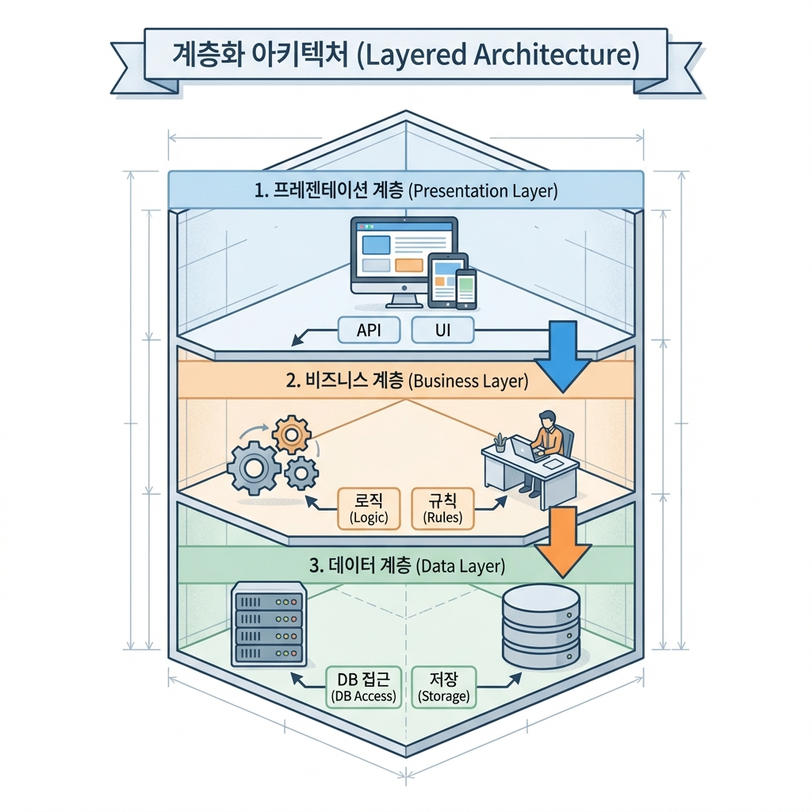

> "기능 추가하려고 코드 열었는데, 어디를 고쳐야 할지 모르겠어요. 파일은 수십 개인데 뭐가 뭔지... AI가 짠 코드라 저는 더 모르겠고, 이거 계속 추가해도 괜찮은 건가요?"

처음엔 AI가 코드를 만들어줘서 신기했는데, 기능 추가할 때마다 "이거 어디에 넣지?" "이거 건드려도 되나?" 막막해지는 거야.

**왜 이런 일이 생길까?**

코드가 **어떤 원칙 없이** 마구잡이로 쌓여서 그래. 파일은 많은데 역할이 뒤죽박죽이면, 어디를 고쳐야 할지 찾기도 힘들고, 수정하면 다른 곳이 꼬이기도 해.

이게 바로 **아키텍처(Architecture)** 문제야. 코드를 어떤 구조로 정리하느냐에 따라 나중에 고도화가 쉬울 수도, 막힐 수도 있어.

아키텍처를 알면 AI한테 **"레이어드 아키텍처로 가되, 서비스 레이어 분리해줘"**라고 정확히 말할 수 있어. 그러면 AI가 확장 가능한 구조로 만들어줘.

---

## 이 글을 읽고 나면

- 아키텍처가 뭔지, 왜 필요한지 알 수 있어
- 주요 아키텍처 패턴 3가지를 구분할 수 있어
- 상황에 맞는 아키텍처를 선택할 수 있어
- AI한테 "이 아키텍처로 가자"라고 말할 수 있어

---

## 아키텍처가 뭐냐?

**아키텍처**는 코드를 **어떻게 구조화할지** 정하는 거야.

```
┌─────────────────────────────────────────────────────────────┐
│                   아키텍처 = 코드 정리법                       │
├─────────────────────────────────────────────────────────────┤
│                                                             │
│  🏢 건축 비유                                                │
│     - 아파트: 층별로 구역 나눔                               │
│     - 사무실: 부서별로 방 배치                               │
│     - 공장: 공정별로 라인 분리                               │
│                                                             │
│  💻 코드 정리                                                │
│     - UI 코드는 components 폴더에                           │
│     - 비즈니스 로직은 services 폴더에                        │
│     - DB 접근은 repositories 폴더에                         │
│                                                             │
│  💡 왜 중요해?                                               │
│     - 코드가 어디에 있는지 찾기 쉬워                          │
│     - 수정할 때 다른 곳이 안 꼬여                            │
│     - 팀원이 봐도 구조를 바로 이해해                          │
│     - 기능 추가가 쉬워                                       │
│                                                             │
└─────────────────────────────────────────────────────────────┘
```

---

## PART 4 복습: 자료구조에서 아키텍처로

16편에서 **데이터를 어떻게 정리할지**를 배웠지?

```
┌─────────────────────────────────────────────────────────────┐
│                  자료구조 (16편)                              │
├─────────────────────────────────────────────────────────────┤
│                                                             │
│  🔵 기본                                                    │
│  ───────────────────────────────────────────────            │
│  배열: 순서대로 나열 (할 일 목록, 댓글)                       │
│  객체: 이름표 붙인 데이터 (사용자 정보, 설정)                 │
│  트리: 계층 구조 (카테고리, 조직도)                          │
│                                                             │
│  🟡 자동화할 때                                              │
│  ───────────────────────────────────────────────            │
│  큐: 줄 서기 (이메일 발송, 웹훅 처리)                        │
│  스택: 접시 쌓기 (되돌리기, 뒤로가기)                        │
│                                                             │
└─────────────────────────────────────────────────────────────┘
```

**오늘 배울 건: 코드를 어떻게 정리할지**

- 16편: **데이터**를 어떻게 정리? → 배열 / 객체 / 트리 / 큐 / 스택
- 17편(오늘): **코드**를 어떻게 정리? → 레이어드 / 클린 / MVC

---

## 자료구조 vs 아키텍처: 뭐가 다르냐?

같은 할 일 관리 앱이라도 관점이 달라. **프로젝트 폴더**를 보면 바로 이해돼.

```
┌─────────────────────────────────────────────────────────────┐
│     🗂️ 자료구조 (16편): 데이터 "안"을 어떻게 정리할까?         │
├─────────────────────────────────────────────────────────────┤
│                                                             │
│  할 일 데이터 하나를 열어보면:                                │
│                                                             │
│  {                                                          │
│    "id": 1,                    ← 객체 (이름표 붙인 데이터)   │
│    "title": "밥 먹기",                                       │
│    "completed": false,                                      │
│    "categoryId": 2                                          │
│  }                                                          │
│                                                             │
│  할 일 목록 전체를 보면:                                      │
│                                                             │
│  [                             ← 배열 (순서대로 나열)         │
│    { id: 1, ... },                                          │
│    { id: 2, ... },                                          │
│    { id: 3, ... }                                           │
│  ]                                                          │
│                                                             │
│  💡 자료구조 = 데이터 "내용물"의 형태                         │
│                                                             │
└─────────────────────────────────────────────────────────────┘

┌─────────────────────────────────────────────────────────────┐
│     📁 아키텍처 (17편): 코드 "파일"을 어떻게 정리할까?         │
├─────────────────────────────────────────────────────────────┤
│                                                             │
│  프로젝트 폴더 구조를 보면:                                   │
│                                                             │
│  프로젝트/                                                   │
│  ├── api/                    ← 1층: 사용자 요청 받기         │
│  │   └── todos.ts                                           │
│  ├── services/               ← 2층: 비즈니스 로직            │
│  │   └── todoService.ts                                     │
│  └── repositories/           ← 3층: DB 저장/조회            │
│      └── todoRepository.ts                                  │
│                                                             │
│  💡 아키텍처 = 코드 "파일"의 배치                            │
│                                                             │
└─────────────────────────────────────────────────────────────┘
```

**한 줄 요약:**
- 자료구조: 데이터를 배열/객체/트리 중 뭘로 담을까?
- 아키텍처: 코드 파일을 어느 폴더에 둘까?

---

## 둘 다 필요한 이유: 같은 프로젝트, 다른 관점

할 일 관리 앱 하나를 만들 때, 두 개념이 동시에 적용돼.

```
┌─────────────────────────────────────────────────────────────┐
│          할 일 관리 앱: 자료구조 + 아키텍처 함께 보기          │
├─────────────────────────────────────────────────────────────┤
│                                                             │
│  📁 프로젝트 폴더 (아키텍처)                                  │
│  ──────────────────────────────                              │
│  프로젝트/                                                   │
│  ├── api/todos.ts           ← 요청을 받아서                 │
│  │       │                                                  │
│  │       └─ "POST /api/todos 요청 들어왔다"                 │
│  │                    ↓                                     │
│  ├── services/todoService.ts ← 로직을 처리하고               │
│  │       │                                                  │
│  │       └─ "제목이 비었으면 에러, 아니면 저장"              │
│  │                    ↓                                     │
│  └── repositories/todoRepo.ts ← DB에 저장                   │
│          │                                                  │
│          └─ "todos 테이블에 INSERT"                         │
│                                                             │
│  💾 DB 테이블 (자료구조)                                     │
│  ──────────────────────────────                              │
│  todos 테이블 = 배열처럼 여러 행                              │
│  ┌────┬───────────┬───────────┬────────────┐               │
│  │ id │ title     │ completed │ categoryId │  ← 각 행은 객체│
│  ├────┼───────────┼───────────┼────────────┤               │
│  │ 1  │ 밥 먹기    │ false     │ null       │               │
│  │ 2  │ 코딩하기   │ true      │ 1          │               │
│  │ 3  │ 운동하기   │ false     │ 2          │               │
│  └────┴───────────┴───────────┴────────────┘               │
│                                                             │
│  ✅ 정리:                                                   │
│     - 자료구조: 데이터가 배열+객체 형태로 저장됨              │
│     - 아키텍처: 코드가 api → services → repositories로 분리 │
│                                                             │
└─────────────────────────────────────────────────────────────┘
```

**비유로 이해하기:**

```
🏠 집을 짓는다고 생각해봐

자료구조 = 가구 배치
  - 거실에 소파를 어떻게 놓을까? (ㄱ자? 일자?)
  - 책장에 책을 어떻게 정리할까? (장르별? 가나다순?)

아키텍처 = 방 구조
  - 1층에 뭘 둘까? (거실, 주방)
  - 2층에 뭘 둘까? (침실, 서재)
  - 지하에 뭘 둘까? (창고)

→ 가구(데이터)를 어떻게 배치하든, 방(코드)이 잘 나뉘어 있어야
  나중에 방 하나 리모델링해도 다른 방이 안 꼬여.
```

**자동화에서 큐와 아키텍처:**

```
┌─────────────────────────────────────────────────────────────┐
│          자동화 시스템: 자료구조(큐) + 아키텍처 함께 보기       │
├─────────────────────────────────────────────────────────────┤
│                                                             │
│  📁 프로젝트 폴더 (아키텍처)                                  │
│  ──────────────────────────────                              │
│  프로젝트/                                                   │
│  ├── api/webhooks.ts         ← 웹훅 받는 곳                 │
│  ├── queues/orderQueue.ts    ← 큐 관리                      │
│  ├── workers/orderWorker.ts  ← 큐에서 꺼내서 처리           │
│  └── services/orderService.ts ← 실제 로직                   │
│                                                             │
│  📨 주문 처리 큐 (자료구조)                                   │
│  ──────────────────────────────                              │
│  [주문1] → [주문2] → [주문3] → ...                          │
│     ↓                                                       │
│  먼저 온 주문부터 순서대로 처리                               │
│                                                             │
│  ✅ 정리:                                                   │
│     - 자료구조(큐): 주문을 순서대로 저장                      │
│     - 아키텍처: 웹훅/큐/워커/서비스로 역할 분리              │
│                                                             │
└─────────────────────────────────────────────────────────────┘
```

---

## 왜 아키텍처가 필요하냐?

아키텍처 없이 코드를 짜면 이런 일이 생겨.

```
┌─────────────────────────────────────────────────────────────┐
│                  아키텍처 없을 때 vs 있을 때                   │
├─────────────────────────────────────────────────────────────┤
│                                                             │
│  ❌ 아키텍처 없을 때 (스파게티 코드)                          │
│     - 버튼 클릭 코드에 DB 저장 코드가 섞여 있음               │
│     - 같은 로직이 여기저기 중복됨                             │
│     - 한 곳 고치면 다른 곳이 꼬임                            │
│     - "이거 어디서 고쳐야 해?" → 찾기도 힘듦                  │
│                                                             │
│  ✅ 아키텍처 있을 때 (정리된 코드)                            │
│     - UI 코드 / 로직 코드 / DB 코드 분리됨                   │
│     - 같은 로직은 한 곳에만 있음                             │
│     - 한 곳 고쳐도 다른 곳 안 꼬임                           │
│     - "이거 어디서 고쳐야 해?" → 바로 찾음                    │
│                                                             │
│  💡 핵심: 역할별로 코드를 나눠두면 관리가 쉬워                │
│                                                             │
└─────────────────────────────────────────────────────────────┘
```

---

## 프론트엔드와 백엔드의 아키텍처

11편에서 프론트엔드와 백엔드를 배웠지? 각각 구조화 방법이 달라.

```
┌─────────────────────────────────────────────────────────────┐
│              프론트엔드 vs 백엔드 아키텍처                     │
├─────────────────────────────────────────────────────────────┤
│                                                             │
│  🎨 프론트엔드 (웹 브라우저, 앱)                             │
│     - 사용자가 보는 화면                                     │
│     - 컴포넌트로 나눔 (버튼, 폼, 카드 등)                    │
│     - 상태 관리 (로그인 정보, 입력 데이터 등)                │
│                                                             │
│  ⚙️ 백엔드 (서버)                                           │
│     - 보이지 않는 곳에서 돌아가는 로직                       │
│     - 레이어로 나눔 (API, 비즈니스 로직, DB 접근)            │
│     - 데이터 처리와 저장                                     │
│                                                             │
│  💡 둘 다 "역할별로 나눈다"는 원칙은 같아                     │
│                                                             │
└─────────────────────────────────────────────────────────────┘
```

---

## 주요 아키텍처 패턴 3가지

바이브 코더가 알아야 할 아키텍처는 3개만 알면 돼.

```
┌─────────────────────────────────────────────────────────────┐
│            바이브 코더가 알아야 할 아키텍처 3가지              │
├─────────────────────────────────────────────────────────────┤
│                                                             │
│  1. 레이어드 아키텍처 (Layered Architecture)                 │
│     층층이 쌓기 - 제일 많이 쓰임                             │
│     → 할 일 관리, 쇼핑몰, 게시판 등 대부분 서비스             │
│                                                             │
│  2. MVC (Model-View-Controller)                             │
│     역할 3가지로 나누기 - 프론트엔드에서 많이 씀              │
│     → 화면 복잡한 서비스                                     │
│                                                             │
│  3. 클린 아키텍처 (Clean Architecture)                       │
│     안쪽부터 바깥쪽으로 - 규모 큰 서비스                      │
│     → 나중에 기술 스택 바꿀 가능성 있을 때                    │
│                                                             │
│  💡 처음엔 레이어드로 시작하면 돼                             │
│                                                             │
└─────────────────────────────────────────────────────────────┘
```

---

## 1. 레이어드 아키텍처: 층층이 쌓기

**레이어드 아키텍처**는 코드를 **층으로 나누는** 거야.



**레이어드 아키텍처 예시: 할 일 추가**

```
사용자가 "할 일 추가" 버튼 클릭

┌────────────────────────────────────────────┐
│  1층: Presentation (API)                   │
│  POST /api/todos 요청 받음                 │
│  → 데이터 받아서 2층으로 전달              │
└────────────────────────────────────────────┘
          ↓
┌────────────────────────────────────────────┐
│  2층: Business (Service)                   │
│  할 일 추가 로직 처리                       │
│  - 제목이 비어있으면 에러                   │
│  - 마감일 검증                             │
│  → OK면 3층으로 전달                       │
└────────────────────────────────────────────┘
          ↓
┌────────────────────────────────────────────┐
│  3층: Data (Repository)                    │
│  DB에 저장                                 │
│  → todos 테이블에 INSERT                   │
└────────────────────────────────────────────┘
          ↓
          완료
```

**📦 실제 폴더 구조 예시**

```
프로젝트/
├── api/              (1층: API 엔드포인트)
│   └── todos.ts
├── services/         (2층: 비즈니스 로직)
│   └── todoService.ts
└── repositories/     (3층: DB 접근)
    └── todoRepository.ts
```

---

## 2. MVC: 역할 3가지로 나누기

**MVC**는 코드를 **Model, View, Controller**로 나누는 거야.

```
┌─────────────────────────────────────────────────────────────┐
│                      MVC (Model-View-Controller)             │
├─────────────────────────────────────────────────────────────┤
│                                                             │
│  🎭 연극 비유                                                │
│     View: 무대 (관객이 보는 것)                              │
│     Controller: 연출가 (지시하는 사람)                       │
│     Model: 대본 (데이터와 규칙)                              │
│                                                             │
│  💻 코드 구조                                                │
│     ┌─────────┐                                            │
│     │  View   │  ← 사용자가 보는 화면                       │
│     └────┬────┘                                            │
│          ↓                                                 │
│     ┌─────────┐                                            │
│     │Controller│ ← 사용자 입력 받아서 Model 조작            │
│     └────┬────┘                                            │
│          ↓                                                 │
│     ┌─────────┐                                            │
│     │  Model  │  ← 데이터와 비즈니스 로직                   │
│     └─────────┘                                            │
│                                                             │
│  ✅ 특징                                                     │
│     - View: 화면만 담당                                      │
│     - Controller: 흐름 제어                                 │
│     - Model: 데이터와 규칙                                   │
│                                                             │
│  💡 언제 쓰냐?                                               │
│     - 프론트엔드 (React, Vue 등)                            │
│     - 화면과 로직 분리가 중요할 때                           │
│     - 사용자 상호작용이 많을 때                              │
│                                                             │
└─────────────────────────────────────────────────────────────┘
```

**MVC 예시: 할 일 목록 화면**

```
사용자가 할 일 목록 페이지 열기

┌────────────────────────────────────────────┐
│  View (화면)                               │
│  할 일 목록 화면 표시                       │
│  - 버튼, 입력창, 리스트                     │
│  → 사용자가 "추가" 버튼 클릭                │
└────────────────────────────────────────────┘
          ↓
┌────────────────────────────────────────────┐
│  Controller (제어)                         │
│  버튼 클릭 이벤트 받음                      │
│  → Model한테 "할 일 추가해줘" 요청          │
└────────────────────────────────────────────┘
          ↓
┌────────────────────────────────────────────┐
│  Model (데이터 + 로직)                      │
│  할 일 추가 처리                            │
│  → DB에 저장하고 View한테 알림             │
└────────────────────────────────────────────┘
          ↓
          화면 업데이트
```

**📦 실제 폴더 구조 예시 (프론트엔드)**

```
프로젝트/
├── views/            (View: 화면)
│   └── TodoList.tsx
├── controllers/      (Controller: 제어)
│   └── todoController.ts
└── models/           (Model: 데이터)
    └── todoModel.ts
```

---

## 3. 클린 아키텍처: 지금 당장은 몰라도 돼

**클린 아키텍처**는 코드를 **동심원으로 나누는** 고급 기법이야.

```
┌─────────────────────────────────────────────────────────────┐
│            🚨 바이브 코더한테 솔직한 이야기                    │
├─────────────────────────────────────────────────────────────┤
│                                                             │
│  클린 아키텍처... 지금 당장은 몰라도 돼.                      │
│                                                             │
│  ❓ 왜냐?                                                    │
│     - 이건 큰 프로젝트(파일 수십 개 이상)에서 쓰는 거야      │
│     - 처음 만드는 할 일 관리 앱? 레이어드면 충분해           │
│     - "클린 아키텍처"라는 이름이 있다는 것만 알면 돼         │
│                                                             │
│  💡 언제 필요해지냐?                                         │
│     - 파일 하나가 1000줄 넘어갈 때                           │
│     - "어디 고쳐야 하지?" 찾는 데 5분 이상 걸릴 때           │
│     - 뭔가 구조가 비효율적으로 느껴질 때                     │
│     - 기능 추가할 때마다 여러 파일을 동시에 고쳐야 할 때     │
│                                                             │
│  ✅ 그때 이렇게 하면 돼:                                     │
│     "이 프로젝트 구조가 복잡해졌는데,                        │
│      클린 아키텍처로 리팩토링 제안해줘"                       │
│                                                             │
│     → AI가 현재 구조를 분석하고 개선안을 제시해줘            │
│                                                             │
└─────────────────────────────────────────────────────────────┘
```

**그래도 개념은 알아두면 좋아:**

```
┌─────────────────────────────────────────────────────────────┐
│                  클린 아키텍처 (Clean Architecture)            │
├─────────────────────────────────────────────────────────────┤
│                                                             │
│  🎯 핵심 아이디어 (이것만 기억해)                             │
│     "핵심 로직은 DB나 API 같은 외부 기술과 분리"             │
│     → 나중에 DB를 바꿔도 핵심 로직은 안 건드림               │
│                                                             │
│  💻 코드 구조 (참고용)                                       │
│          ┌─────────────────┐                               │
│          │   Frameworks    │  ← DB, API 등 (바깥)         │
│          │  ┌───────────┐  │                               │
│          │  │ Interface │  │  ← 연결 역할                 │
│          │  │ ┌───────┐ │  │                               │
│          │  │ │ 핵심   │ │  │  ← 비즈니스 로직 (안쪽)     │
│          │  │ │ 로직   │ │  │                              │
│          │  │ └───────┘ │  │                               │
│          │  └───────────┘  │                               │
│          └─────────────────┘                               │
│     → 안쪽(핵심)은 바깥쪽(DB, API)을 몰라                    │
│                                                             │
│  📊 규모별 아키텍처                                          │
│     파일 10개 미만  → 구조 신경 안 써도 됨                  │
│     파일 10~50개   → 레이어드면 충분                        │
│     파일 50개 이상  → 클린 아키텍처 고려                    │
│                                                             │
└─────────────────────────────────────────────────────────────┘
```

**🔧 리팩토링이 필요할 때 AI한테 이렇게 말해:**

```
❌ "클린 아키텍처로 처음부터 다시 만들어줘"
   → 과한 요청. 시간 오래 걸리고 복잡해짐.

✅ "이 파일이 너무 길어졌어. 역할별로 분리해줘"
   → 점진적 개선. 필요한 부분만 정리.

✅ "services 폴더가 복잡해졌는데, 클린 아키텍처 관점에서
   어떻게 정리하면 좋을지 제안해줘"
   → AI가 현재 상황에 맞는 구조를 제안해줌.

✅ "파일이 1000줄 넘었어. 리팩토링 방법 알려줘"
   → AI가 분리 방법을 단계별로 안내해줌.
```

---

## 레이어드 vs MVC vs 클린: 어떤 걸 쓸까?

```
┌─────────────────────────────────────────────────────────────┐
│                 상황별 아키텍처 선택 가이드                    │
├─────────────────────────────────────────────────────────────┤
│                                                             │
│  🎯 바이브 코더라면? → 레이어드로 시작해                      │
│     - 가장 단순하고 직관적                                   │
│     - 할 일 관리, 게시판, 쇼핑몰 등 다 가능                  │
│     - 나중에 복잡해지면 그때 구조 정리하면 됨                │
│                                                             │
│  🎯 프론트엔드 만든다면? → 컴포넌트 기반                     │
│     - React, Vue 등 프론트엔드 프레임워크                    │
│     - 화면과 로직 분리                                       │
│     - MVC는 몰라도 돼, "컴포넌트로 나눠줘"면 충분            │
│                                                             │
│  🎯 클린 아키텍처는? → 나중에 필요하면 리팩토링              │
│     - 처음부터 선택하는 게 아냐                              │
│     - 파일이 많아지고 복잡해지면 그때 전환 검토              │
│     - "구조 정리해줘"라고 하면 AI가 알아서 제안해줌          │
│                                                             │
│  💡 바이브 코더의 현실적인 순서                              │
│     1. 처음: "레이어드로 만들어줘"                           │
│     2. 복잡해지면: "구조 정리해줘"                           │
│     3. 더 커지면: "클린 아키텍처로 리팩토링 방법 알려줘"     │
│                                                             │
└─────────────────────────────────────────────────────────────┘
```

---

## 실전 예시: 쇼핑몰 아키텍처

쇼핑몰을 만든다면 어떤 아키텍처를 쓸까?

```
┌─────────────────────────────────────────────────────────────┐
│                    쇼핑몰 아키텍처 (레이어드)                  │
├─────────────────────────────────────────────────────────────┤
│                                                             │
│  🎨 프론트엔드 (Next.js)                                    │
│     ┌─────────────────────────────────┐                    │
│     │  components/                    │  ← UI 컴포넌트      │
│     │    - ProductCard.tsx            │     (버튼, 카드)    │
│     │    - CartButton.tsx             │                    │
│     ├─────────────────────────────────┤                    │
│     │  pages/                         │  ← 페이지           │
│     │    - products/[id].tsx          │     (라우팅)        │
│     │    - cart.tsx                   │                    │
│     ├─────────────────────────────────┤                    │
│     │  hooks/                         │  ← 상태 관리        │
│     │    - useCart.ts                 │                    │
│     │    - useAuth.ts                 │                    │
│     └─────────────────────────────────┘                    │
│                                                             │
│  ⚙️ 백엔드 (Supabase Functions)                            │
│     ┌─────────────────────────────────┐                    │
│     │  api/                           │  ← API 엔드포인트   │
│     │    - products.ts                │     (1층)          │
│     │    - orders.ts                  │                    │
│     ├─────────────────────────────────┤                    │
│     │  services/                      │  ← 비즈니스 로직    │
│     │    - productService.ts          │     (2층)          │
│     │    - orderService.ts            │                    │
│     ├─────────────────────────────────┤                    │
│     │  repositories/                  │  ← DB 접근          │
│     │    - productRepo.ts             │     (3층)          │
│     │    - orderRepo.ts               │                    │
│     └─────────────────────────────────┘                    │
│                                                             │
│  💾 DB (Supabase)                                           │
│     - products 테이블                                       │
│     - orders 테이블                                         │
│     - users 테이블                                          │
│                                                             │
└─────────────────────────────────────────────────────────────┘
```

---

## AI한테 이렇게 요청해봐

아키텍처를 알면 AI한테 **어떤 구조로 만들지** 정확히 말할 수 있어.

### 상황 1: 할 일 관리 앱 (백엔드)

**나쁜 예 (구조 언급 없음)**
```
나: "할 일 관리 API 만들어줘"
```
→ AI가 알아서 구조를 정하는데, 파일이 어디에 뭐가 있는지 나중에 찾기 힘들 수 있어.

**좋은 예 (아키텍처 지정)**
```
나: "할 일 관리 API 만들 건데, Next.js + Supabase 쓸 거야.
    레이어드 아키텍처로 가줘.

    api/ 폴더에 엔드포인트,
    services/ 폴더에 비즈니스 로직,
    repositories/ 폴더에 DB 접근 코드 분리해줘.

    나중에 알림 기능 추가할 거니까 확장 가능하게 만들어줘."
```
→ AI가 3층 구조로 깔끔하게 만들어줘.

---

### 상황 2: 쇼핑몰 (프론트엔드)

**나쁜 예**
```
나: "상품 목록 페이지 만들어줘"
```

**좋은 예**
```
나: "쇼핑몰 프론트엔드 만들 건데, Next.js 쓸 거야.
    컴포넌트 기반으로 가되, 이렇게 나눠줘:

    - components/: 재사용 가능한 UI (버튼, 카드 등)
    - pages/: 페이지별 라우팅
    - hooks/: 상태 관리 (장바구니, 인증 등)
    - api/: API 호출 함수

    상품 카드는 여러 페이지에서 재사용할 거니까
    components/ProductCard.tsx로 만들어줘."
```

---

### 상황 3: 프로젝트가 복잡해졌을 때 (리팩토링)

**처음부터 완벽한 구조로 시작할 필요 없어.**
일단 레이어드로 만들고, 나중에 복잡해지면 그때 리팩토링하면 돼.

**비현실적 (처음부터 완벽하게)**
```
나: "클린 아키텍처로 가줘. core/, adapters/, infrastructure/ 분리해서..."
```
→ 비개발자가 이렇게 말하기 어려워. 이건 나중에 필요할 때 하면 돼.

**현실적 (일단 만들고 → 문제 생기면 → 리팩토링)**
```
[처음]
나: "할 일 관리 앱 만들어줘. 레이어드 아키텍처로."
→ AI가 기본 구조로 만들어줌

[몇 달 후, 파일이 많아지고 복잡해짐]
나: "services 폴더에 파일이 20개가 넘었어.
    찾기가 힘들어졌는데, 구조 정리 좀 해줘."
→ AI가 도메인별로 폴더를 나누거나, 구조 개선안을 제시해줌

[더 커지면]
나: "결제 로직이랑 DB 접근 코드가 섞여 있어서
    나중에 PG사 바꾸려면 다 고쳐야 할 것 같아.
    분리하는 방법 알려줘."
→ AI가 클린 아키텍처 관점에서 리팩토링 방법을 안내해줌
```

💡 **핵심: 문제가 느껴질 때 그때 정리하면 돼.**

---

## 실제 대화 예시

AI랑 아키텍처 정하면서 대화할 때 이렇게 해.

┌────────────────────────────────────────────────────────────────┐
│  상황: 할 일 관리 앱 백엔드 만들기                                │
├────────────────────────────────────────────────────────────────┤
│                                                                │
│  나: "할 일 관리 API 만들 건데, Next.js + Supabase 쓸 거야."   │
│                                                                │
│  AI: "프로젝트 구조 어떻게 할까?                                │
│      1. 파일 하나에 다 넣기 (간단)                              │
│      2. 레이어드로 폴더 나누기 (권장)                           │
│      3. 클린 아키텍처 (복잡)"                                   │
│                                                                │
│  나: "2번으로 가줘. 나중에 알림 기능 추가할 거니까             │
│      서비스 레이어 분리해줘."                                   │
│                                                                │
│  AI: "알겠어. 레이어드 아키텍처로 구조 잡을게:                  │
│                                                                │
│      api/                  (1층: API 엔드포인트)               │
│        - todos.ts          - 요청 받고 응답                    │
│                                                                │
│      services/             (2층: 비즈니스 로직)                │
│        - todoService.ts    - 할 일 추가/수정/삭제 로직          │
│                            - 검증, 규칙 처리                    │
│                                                                │
│      repositories/         (3층: DB 접근)                      │
│        - todoRepo.ts       - Supabase 쿼리만                   │
│                                                                │
│      나중에 알림 기능 추가하면                                  │
│      services/notificationService.ts만 추가하면 돼."            │
│                                                                │
│  나: "좋아. 그렇게 만들어줘."                                   │
│                                                                │
│  💡 여기서 뭐가 중요했냐?                                       │
│     - "레이어드"라고 정확히 말함                                │
│     - 나중 확장(알림) 미리 고려                                 │
│     - AI가 구조 제안하면 확인 후 진행                           │
│                                                                │
└────────────────────────────────────────────────────────────────┘

┌────────────────────────────────────────────────────────────────┐
│  상황: 나중에 프론트엔드 추가                                    │
├────────────────────────────────────────────────────────────────┤
│                                                                │
│  나: "프론트엔드도 만들 건데, 화면 복잡하지 않으니까           │
│      컴포넌트만 잘 나눠줘."                                     │
│                                                                │
│  AI: "Next.js 프론트엔드 구조 제안할게:                         │
│                                                                │
│      app/                  (페이지 라우팅)                     │
│        - page.tsx          - 메인 페이지                       │
│        - todos/            - 할 일 페이지                      │
│                                                                │
│      components/           (재사용 컴포넌트)                   │
│        - TodoList.tsx      - 할 일 목록                        │
│        - TodoItem.tsx      - 할 일 항목                        │
│        - AddTodoForm.tsx   - 추가 폼                           │
│                                                                │
│      hooks/                (상태 관리)                         │
│        - useTodos.ts       - 할 일 데이터 관리                 │
│                                                                │
│      lib/                  (API 호출)                          │
│        - api.ts            - 백엔드 API 호출 함수               │
│                                                                │
│      각 컴포넌트는 한 가지 역할만 하게 만들게."                 │
│                                                                │
│  나: "좋아. AddTodoForm은 입력만 받고,                         │
│      실제 추가는 useTodos에서 하게 해줘."                       │
│                                                                │
│  AI: "알겠어, 관심사 분리할게."                                 │
│                                                                │
│  [기능 확인]                                                   │
│  - 할 일 추가 → 폼(UI)과 로직(hook) 분리 ✅                    │
│  - 코드 수정할 때 어디 고칠지 바로 알 수 있음 ✅               │
│                                                                │
│  💡 프론트와 백엔드 각각 구조화했어                             │
│     - 백엔드: 레이어드 (API → Service → Repository)            │
│     - 프론트: 컴포넌트 기반 (UI / 로직 / 상태 분리)            │
│                                                                │
└────────────────────────────────────────────────────────────────┘

---

## 아키텍처 선택 체크리스트

**바이브 코더는 고민할 필요 없어. 그냥 레이어드로 시작해.**

```
┌─────────────────────────────────────────────────────────────┐
│                  바이브 코더의 아키텍처 선택                    │
├─────────────────────────────────────────────────────────────┤
│                                                             │
│  □ 1. 뭘 만드냐?                                            │
│     - 백엔드 (API, 서버) → "레이어드로 만들어줘"            │
│     - 프론트엔드 (화면) → "컴포넌트로 나눠줘"               │
│     - 둘 다 → 각각 위 방식으로                              │
│                                                             │
│  □ 2. 처음 만드는 거야?                                     │
│     - YES → 레이어드로 충분해                               │
│     - 클린 아키텍처? 지금은 신경 쓰지 마                    │
│                                                             │
│  □ 3. 나중에 복잡해지면?                                    │
│     - "구조 정리해줘"라고 하면 됨                           │
│     - AI가 상황에 맞게 제안해줌                             │
│                                                             │
│  💡 핵심: 처음엔 단순하게, 문제 생기면 그때 정리            │
│                                                             │
└─────────────────────────────────────────────────────────────┘
```

---

## 코드 문법 몰라도 돼

💡 **잠깐, 나는 코드를 못 짜는데?**

괜찮아. 아키텍처 **개념**만 알면 돼.

```
너가 알아야 할 것:
✅ 레이어드 = 층으로 나누기
✅ MVC = 화면 / 제어 / 데이터 분리
✅ 클린 = 핵심 로직과 구현 분리

너가 몰라도 되는 것:
❌ 레이어를 코드로 어떻게 만드는지
❌ MVC를 어떻게 구현하는지
❌ 클린 아키텍처 세부 원칙

→ AI한테 "레이어드로 가줘"라고 말만 하면 돼.
→ AI가 구조 잡아줘.
```

---

## 처음부터 완벽한 구조는 없어

⚠️ **처음부터 모든 걸 완벽하게 설계할 수 없어**

```
┌─────────────────────────────────────────────────────────────┐
│                  현실적인 아키텍처 설계                        │
├─────────────────────────────────────────────────────────────┤
│                                                             │
│  ❌ 비현실적 (처음부터 완벽)                                 │
│     처음부터 클린 아키텍처로 모든 걸 설계                    │
│     → 오버엔지니어링. 작은 프로젝트엔 과함.                   │
│                                                             │
│  ✅ 현실적 (단계적 확장)                                     │
│     1단계: 레이어드로 시작 (단순하게)                        │
│     2단계: 복잡해지면 레이어 추가 분리                       │
│     3단계: 정말 커지면 클린으로 전환 검토                    │
│                                                             │
│  💡 핵심 원칙:                                               │
│     - 처음엔 단순하게 시작                                   │
│     - 역할만 분리하면 됨 (UI / 로직 / DB)                    │
│     - 나중에 바꿀 수 있다는 마음                             │
│     - "완벽한 설계" 같은 건 없어                             │
│                                                             │
└─────────────────────────────────────────────────────────────┘
```

**근데 이것만은 지켜:**
- UI 코드와 로직 코드는 분리
- DB 접근 코드는 따로 모아두기
- 같은 역할은 같은 폴더에
- 파일 이름 규칙 정해두기 (todoService.ts, todoRepo.ts)

---

## 다음 단계: 디자인 패턴

아키텍처를 알았으면 이제 **코드를 어떻게 짤지** 정하는 게 디자인 패턴이야.

```
오늘 배운 것: 전체 구조를 어떻게?
              → 레이어드 / MVC / 클린

다음 편: 코드 작성 패턴은?
         → 싱글톤, 팩토리, 옵저버 등
         → "이 컴포넌트는 Container-Presenter 패턴으로"
```

---

## 오늘의 핵심 정리

```
✅ 아키텍처 = 코드 파일 정리법
   → 자료구조(16편): 데이터를 배열/객체/트리/큐/스택으로
   → 아키텍처(17편): 코드 파일을 폴더별로 배치

✅ 바이브 코더는 레이어드만 알면 돼
   → 레이어드: 층으로 나누기 (API → 로직 → DB)
   → 컴포넌트 기반: 프론트엔드 화면 나누기
   → 자동화: 웹훅 → 큐 → 워커 → 서비스 구조
   → 클린: 나중에 복잡해지면 그때 알아도 됨

✅ 처음부터 완벽하게? NO!
   → 일단 "레이어드로 만들어줘"
   → 복잡해지면 "구조 정리해줘"
   → 더 커지면 "리팩토링 방법 알려줘"

✅ AI한테 요청할 때:
   "API 만들어줘" (X)
   "레이어드 아키텍처로 API 만들어줘" (O)
   "웹훅 받아서 큐로 처리하는 구조로 만들어줘" (O)
   → 이것만 말해도 AI가 폴더 구조 잡아줘

✅ 코드 문법 몰라도 돼
   → "레이어드로 해줘" 한 마디면 됨
```
