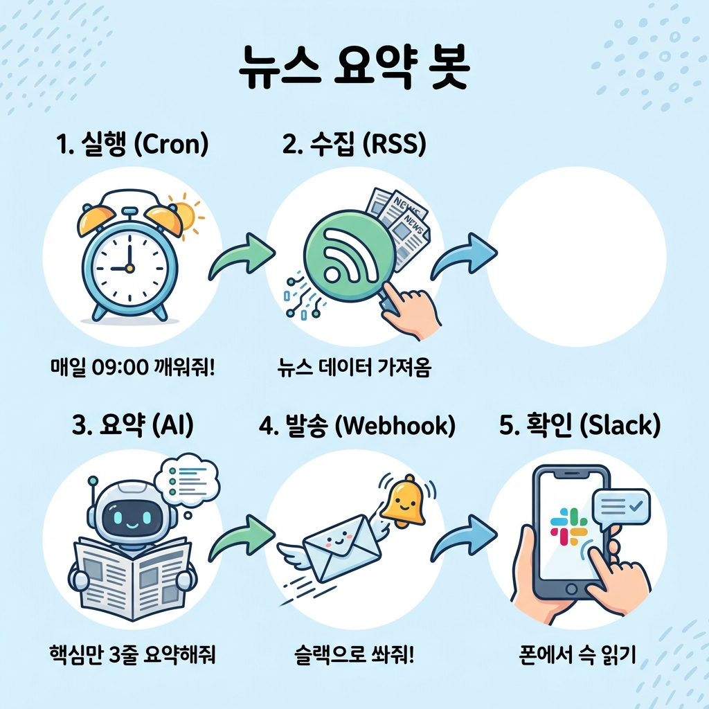

> "매일 아침 9시마다 경쟁사 뉴스를 검색해서 엑셀에 정리하고 있어.
> 30분밖에 안 걸리긴 하는데... 이걸 1년 내내 하려니까 너무 지겨워."

30분이 짧아 보여?
매일 30분이면 **1년에 180시간**이야. 한 달치 업무 시간을 단순 반복 작업에 버리고 있는 거지.

**"이거 컴퓨터가 대신해줄 수 없나?"**
이 생각이 드는 순간이 바로 **자동화(Automation)**가 필요한 타이밍이야.

개발자들은 이런 단순 반복 작업을 절대 직접 안 해.
컴퓨터한테 시키면 더 빠르고, 더 정확하고, 무엇보다 **지치지 않거든.**

---

## 이 글을 읽고 나면

- 어떤 일이 '자동화 가능한 일'인지 알아볼 수 있어.
- **크론(Cron)**과 **웹훅(Webhook)**이 뭔지 이해할 수 있어.
- AI에게 "이거 자동화해줘"라고 설계부터 맡길 수 있어.

---

## 1. 자동화, 무엇을 맡길 수 있나?

모든 일을 자동화할 수는 없어.
근데 아래 3가지 조건에 맞는다면, 그건 **컴퓨터가 제일 좋아하는 일**이야.

```
┌─────────────────────────────────────────────────────────────┐
│                    자동화하기 딱 좋은 일                         │
├───────────────┬───────────────────────┬─────────────────────┤
│    반복적      │       규칙적           │      데이터 처리      │
│  (Repetitive) │     (Rule-based)      │        (Data)       │
├───────────────┼───────────────────────┼─────────────────────┤
│ 매일/매주     │ 판단이 필요 없음        │ 텍스트, 숫자, 파일    │
│ 똑같이 하는 일  │ "A면 B한다"가 명확함    │ 컴퓨터가 읽을 수 있음  │
└───────────────┴───────────────────────┴─────────────────────┘
```

### 이런 건 자동화하기 어려워 (사람의 영역)
- "이 뉴스, 우리 회사에 중요한 건가?" **(판단)**
- "이 디자인, 요즘 트렌드에 맞나?" **(감각)**
- "거래처 담당자 기분이 안 좋아 보이네" **(눈치)**

### 이런 건 자동화가 쉬워 (AI의 영역)
- "특정 키워드가 들어간 기사만 모으기" **(단순 검색)**
- "모은 기사를 3줄로 요약하기" **(AI 요약)**
- "요약된 내용을 매일 9시에 슬랙으로 보내기" **(정기 실행)**

---

## 2. 자동화의 핵심 도구 2가지

개발자들이 숨 쉬듯이 쓰는 단어 딱 2개만 알면 돼.

### 크론 (Cron): "알람 시계"
우리가 아침 7시에 알람을 맞추듯이, 컴퓨터한테도 알람을 맞출 수 있어.
**"매일 아침 9시에 실행해"**라고 명령해두는 거야. 이걸 **크론(Cron)**이라고 해.

> **AI한테 이렇게 말하면 돼:**
> "이 코드를 **크론(Cron)**으로 매일 아침 9시에 실행해줘."

### 웹훅 (Webhook): "초인종"
내가 계속 문 앞에 서서 택배 왔나 확인하는 건(Polling) 힘들잖아.
웹훅은 **"택배 오면 초인종 눌러줘"** 같은 시스템이야.

- **API**: 내가 달라고 해야 줌 ("뉴스 줘")
- **Webhook**: 준비되면 알아서 던져줌 ("뉴스 나왔어!")

우리가 만들 **슬랙 봇**도 이 웹훅을 써.
"뉴스가 요약되면 → 슬랙 알림을 울려줘(웹훅)" 방식이야.

---

## 3. 이번에 만들 프로젝트: 뉴스 요약 슬랙 봇

PART 6에서는 너의 첫 자동화 비서를 만들 거야.

**[목표]**
매일 아침 9시, 내가 관심 있는 키워드('AI', '자동화')의 뉴스를 찾아서,
gpt가 3줄로 요약한 뒤, 우리 팀 슬랙 채널에 쏘아주는 봇.



```
┌──────────────────────────────────────────────────────────────────┐
│                   뉴스 요약 봇 구조도                             │
├─────────────┬─────────────┬──────────────┬─────────────┬─────────┤
│  1. 실행    │  2. 수집    │  3. 요약     │  4. 발송     │  5. 확인  │
│  (Cron)     │   (RSS)     │   (AI)       │  (Webhook)  │  (Slack) │
├─────────────┼─────────────┼──────────────┼─────────────┼─────────┤
│ 매일 09:00  │ 뉴스 검색   │ 핵심만 3줄    │ 슬랙으로     │ 폰에서   │
│ 깨워줘!     │ 데이터 가져옴 │ 요약해줘      │ 쏴줘!       │ 슥 읽기   │
└─────────────┴─────────────┴──────────────┴─────────────┴─────────┘
```

---

## 4. AI와 기획 회의 (상황극)

이제 AI(우리의 유능한 신입사원)와 회의를 시작해보자.
다짜고짜 "만들어줘"라고 하지 말고, **내가 불편한 점**과 **원하는 결과**를 명확히 말해주는 게 포인트야.

### 1단계: 기획 의도 전달

**나 (팀장)**
> "나 매일 뉴스 검색하는 거 너무 귀찮아. 이거 자동화하고 싶어.
> 매일 아침 9시에 'AI' 관련 뉴스만 모아서 슬랙으로 받고 싶어.
> 어떻게 구성하면 좋을까?"

**AI (신입사원)**
> "좋은 생각이야! 구조를 이렇게 짜보면 어때?
>
> 1. **실행**: GitHub Actions의 **Cron** 기능을 쓰면 무료로 매일 실행할 수 있어.
> 2. **수집**: 구글 뉴스 RSS를 쓰면 최신 뉴스를 쉽게 가져올 수 있고.
> 3. **발송**: 슬랙 **웹훅(Webhook)**을 쓰면 채널로 메시지를 쏠 수 있어."

### 2단계: 디테일 잡기

**나 (팀장)**
> "GitHub Actions? 그건 뭐야?"

**AI (신입사원)**
> "우리 지난번에 배운 GitHub(코드 저장소) 있잖아.
> 거기에 '특정 시간마다 이 코드를 실행해줘'라는 기능이 공짜로 들어있어.
> 별도 서버를 안 사도 돼서 좋아!"

**나 (팀장)**
> "오, 돈 안 드는 거 좋네.
> 근데 뉴스 제목만 보내면 안 읽을 것 같아.
> GPT한테 본문을 3줄로 요약시키자."

**AI (신입사원)**
> "좋아! 그럼 **'뉴스 수집 → GPT 요약 → 슬랙 전송'** 순서로 짤게."

---

어때?
우리가 **'크론'**과 **'웹훅'**이라는 단어를 조금만 알아도,
AI가 훨씬 더 구체적이고 효율적인(무료!) 해결책을 가져오잖아.

---

## 오늘의 핵심 정리

**자동화 대상**: 반복적이고, 규칙적이고, 데이터가 있는 일.
**크론(Cron)**: 정해진 시간에 실행하는 '알람 시계'.
**웹훅(Webhook)**: 이벤트가 발생하면 알려주는 '초인종'.

**AI한테 요청할 때:**
   "이 반복 작업 자동화하고 싶어. **크론**으로 매일 실행하고, 결과는 **웹훅**으로 보내줘."
