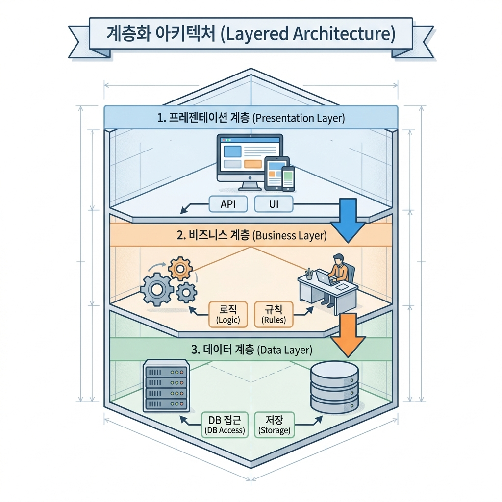

할일앱도 만들고, AI 서비스도 만들었어. 이제 좀 더 크고 복잡한 걸 만들려면?

"기능 추가하려니까 구조가 꼬여요" -- 이 문제, 설계를 모르면 반복돼.

설계를 알면 AI한테 **"레이어드로 가되, 상태는 전역으로"**라고 한 마디로 말할 수 있어. 그러면 AI가 확장 가능한 구조로 만들어줘.

---

## 자료구조: 데이터를 어떤 형태로 담을까

자료구조는 데이터를 **어떤 형태로 정리할지** 정하는 거야. 처음에 구조를 잘못 잡으면 나중에 확장이 막혀.

바이브 코더가 알아야 할 건 3개뿐이야.

**배열 (Array)** -- 순서대로 나열. 할 일 목록, 댓글 목록, 주문 내역처럼 같은 종류 데이터가 여러 개일 때.

**객체 (Object)** -- 이름표 붙인 서랍. 사용자 정보, 앱 설정처럼 항목마다 의미가 다를 때.

**Map / Set** -- 배열과 객체의 업그레이드판. 중복 제거(Set), 빠른 검색(Map)이 필요할 때.

```json
// 배열: 순서대로 나열
[
  { "id": 1, "title": "밥 먹기", "completed": false },
  { "id": 2, "title": "코딩하기", "completed": true }
]

// 객체: 이름표로 찾기
{
  "name": "김철수",
  "email": "kim@example.com",
  "darkMode": true
}
```

**AI한테 이렇게 말해:**

```
나: "할 일 목록은 배열로 관리해줘.
    각 할 일은 객체로 만들어서 제목, 완료여부, 마감일 필드 넣어줘.
    나중에 카테고리 추가할 거니까 categoryId 필드도 미리 넣어줘."
```

이렇게 하면 AI가 확장 가능한 구조로 만들어줘. "할 일 관리 앱 만들어줘"만 하면 나중에 카테고리 추가하려고 할 때 전부 다시 짜야 할 수도 있어.

### 자주 하는 실수

**할 일을 단순 문자열로 저장:**

```
"밥 먹기"  ← 완료 여부는? 마감일은? 카테고리는? 확장 불가.
```

```json
{ "id": 1, "title": "밥 먹기", "completed": false, "dueDate": "2026-01-15", "categoryId": 2 }
← 나중에 필드 추가 가능. 필터링 가능. 확장 가능.
```

**카테고리를 배열로만 저장:**

```
["업무", "개인", "기획", "개발"]  ← "기획"이 "업무" 하위인지 모름
```

```json
[
  { "id": 1, "name": "업무", "parentId": null },
  { "id": 3, "name": "기획", "parentId": 1 },
  { "id": 4, "name": "개발", "parentId": 1 }
]
← parentId로 트리 구조. "기획"이 "업무" 하위라는 걸 알 수 있어.
```

---

## 아키텍처: 코드를 어떻게 배치할까

아키텍처는 코드를 **어떤 구조로 정리할지** 정하는 거야. 폴더 구조라고 생각하면 돼.

바이브 코더라면 **레이어드 아키텍처**로 시작해. 코드를 층으로 나누는 거야.



```
프로젝트/
├── components/     (1층: UI - 사용자가 보는 화면)
├── services/       (2층: 비즈니스 로직 - 추가/삭제/완료 처리)
└── lib/            (3층: 데이터 - DB 접근)
```

핵심 규칙: **UI가 DB에 직접 접근하지 않아.** 반드시 서비스 레이어를 거쳐.

왜? 나중에 DB를 Supabase에서 다른 걸로 바꿔도 서비스 레이어만 수정하면 돼. UI 코드는 안 건드려도 돼.

**클린 아키텍처**는 나중에 파일이 50개 넘어가고 구조가 복잡해지면 그때 고려해. 처음부터 쓸 필요 없어.

```
바이브 코더의 현실적인 순서:
1. 처음: "레이어드로 만들어줘"
2. 복잡해지면: "구조 정리해줘"
3. 더 커지면: "클린 아키텍처로 리팩토링 방법 알려줘"
```

### 아키텍처 없으면 이렇게 돼

```
아키텍처 없을 때:
- 버튼 클릭 코드에 DB 저장 코드가 섞여 있음
- 같은 로직이 여기저기 중복됨
- 한 곳 고치면 다른 곳이 꼬임
- "이거 어디서 고쳐야 해?" → 찾기도 힘듦

아키텍처 있을 때:
- UI 코드 / 로직 코드 / DB 코드 분리됨
- 같은 로직은 한 곳에만
- "할 일 추가 로직 고치려면?" → services/todoService.ts 열면 돼
```

**AI한테 이렇게 말해:**

```
나: "레이어드 아키텍처로 폴더 나눠줘.
    components/에 UI, services/에 비즈니스 로직, lib/에 DB 접근.
    UI가 DB에 직접 접근하지 않고 서비스 레이어를 거치게 해줘."
```

### 실전 예시: 할 일 추가 흐름

```
사용자가 "할 일 추가" 버튼 클릭

1층 (components/TodoForm.tsx)
→ 입력값 받아서 서비스 호출

2층 (services/todoService.ts)
→ 제목이 비어있으면 에러
→ OK면 데이터 레이어 호출

3층 (lib/supabase.ts)
→ todos 테이블에 INSERT

→ 완료
```

각 층이 자기 역할만 해. 나중에 "제목 20자 제한" 같은 규칙 추가하려면? 2층(서비스)만 수정하면 돼.

---

## 디자인 패턴: 반복되는 문제의 해결법

디자인 패턴은 **"이런 상황에선 이렇게 짜라"**는 검증된 해결책이야. AI한테 패턴 이름만 말하면 일관된 코드가 나와.

자주 쓰는 3가지만 알면 돼.

### 팩토리 (Factory) -- 찍어내기

비슷한데 조금씩 다른 것들을 만들 때. 버튼 여러 종류, 카드 여러 타입.

```
// 팩토리 없이: 버튼마다 따로 코드 작성 → 3곳 수정
// 팩토리 있으면: createButton(type) 하나로 → 1곳만 수정

createButton('primary')   → 주요 버튼
createButton('secondary') → 보조 버튼
createButton('danger')    → 위험 버튼
```

### 옵저버 (Observer) -- 구독하기

하나가 바뀌면 관련된 것들이 자동 업데이트될 때. 로그인하면 헤더, 사이드바, 메인이 한꺼번에 바뀌어야 할 때.

```
// 옵저버 없이: 로그인 → 헤더 업데이트 호출 → 사이드바 호출 → 메인 호출
//   → 하나라도 빠뜨리면 동기화 안 됨

// 옵저버 있으면: 로그인 상태 변경 → 구독자 전체 자동 업데이트
//   → 빠뜨릴 일 없음
```

### 전략 (Strategy) -- 방법 바꾸기

같은 목적인데 방법이 여러 개일 때. 결제(카드/계좌/간편), 정렬(이름순/날짜순/인기순).

```
// 전략 없이: if 카드 → ... else if 계좌 → ... else if 간편 → ...
//   → 결제 수단 추가할 때마다 if 추가

// 전략 있으면: pay(전략) → 전략.execute()
//   → 새 결제 수단? 새 전략만 추가
```

### 실전: 쇼핑몰에서 패턴 조합하기

```
쇼핑몰 장바구니 하나에 여러 패턴이 들어가:

1. 옵저버: 상품 담으면 → 아이콘 숫자, 목록, 총액 자동 업데이트
2. 팩토리: 상품 카드를 일반/할인/품절 타입별로 생성
3. 전략: 결제할 때 카드/계좌/간편결제 중 선택
```

패턴은 필요할 때만 써. 간단한 건 그냥 짜고, 같은 문제가 반복되면 그때 패턴 도입하면 돼.

**AI한테 이렇게 말해:**

```
나: "결제 기능 만들 건데, 전략 패턴으로 해줘.
    카드/계좌/간편결제 3가지.
    나중에 네이버페이 추가할 수도 있으니까
    새 전략만 추가하면 되게 구조 잡아줘."
```

---

## 상태 관리: 데이터를 어디에 둘까

상태(State)는 **앱이 기억하는 데이터**야. 로그인 정보, 장바구니, 검색창 입력 내용 같은 거. 어디에 저장하느냐에 따라 새로고침하면 날아갈 수도, 유지될 수도 있어.

저장 위치는 4가지야.

| 저장 위치 | 특징 | 예시 |
|-----------|------|------|
| **로컬 상태** (메모리) | 컴포넌트 안에서만. 페이지 나가면 날아감 | 검색창 입력, 모달 열림/닫힘 |
| **전역 상태** (zustand 등) | 앱 전체에서 공유. 새로고침하면 날아감 | 로그인 상태, 장바구니 |
| **localStorage** | 브라우저에 저장. 새로고침해도 유지 | 다크모드, 언어 설정 |
| **서버 DB** | 서버에 저장. 어디서든 접근 가능 | 회원 정보, 게시글, 주문 내역 |

**판단 기준:**

```
다른 기기에서도 봐야 해? → DB
새로고침해도 유지되어야 해? → localStorage
여러 페이지에서 같이 써? → 전역 상태
그 외? → 로컬 상태
```

실전에선 **조합**해서 써. 로그인은 전역 + localStorage + DB. 장바구니는 비로그인이면 localStorage, 로그인이면 DB.

### 상태 관리 안 하면 이렇게 돼

```
로그인했는데 페이지 이동하면 로그아웃됨 → 전역 상태 안 썼기 때문
장바구니 담았는데 새로고침하면 사라짐 → DB 안 썼기 때문
다크모드 켰는데 다시 들어오면 꺼져 있음 → localStorage 안 썼기 때문
```

### 게시글 작성: 단계별 상태가 다른 경우

```
1. 작성 중 → 로컬 상태 (메모리). 입력하다가 나가면 사라져도 OK.
2. 임시 저장 → localStorage. "나중에 이어서 쓸래?" 물어볼 수 있어.
3. 작성 완료 → DB. 영구 저장. 다른 사람도 볼 수 있어.
```

이렇게 데이터 성격에 맞게 위치를 나눠야 해.

**AI한테 이렇게 말해:**

```
나: "로그인 상태는 zustand로 전역 관리해줘.
    토큰은 localStorage에 저장하고,
    앱 시작할 때 localStorage 확인해서 자동 로그인.
    로그아웃하면 전역 상태 null + localStorage 삭제."
```

---

## AI한테 설계 지시하는 법

개념을 다 배웠어. 이제 이걸 **조합해서 AI한테 말하는 법**이야.

핵심: **한 번에 다 말하지 마.** 단계별로 대화해.

### 나쁜 예 vs 좋은 예

```
나쁜 예:
"Next.js로 할 일 관리 앱 만들어줘.
 로그인, 회원가입, 할 일 추가/삭제/완료 넣고,
 Supabase 써서 DB 저장하고, 다른 기기에서도 동기화되게."

→ AI가 만들어주긴 해. 근데 폴더를 어떻게 나눴는지,
  데이터를 어디에 저장했는지 모르잖아.
  나중에 기능 추가하려면 "이 코드 뭐지?" → 다시 만들기 반복.
```

```
좋은 예:
단계별로 대화하면서 구조를 잡아가는 거야.
"일단 시킨다 → 확인한다 → 수정 요청한다 → 다음 단계로"
```

### 5단계 대화 흐름

**1단계: 기술 스택** -- "Next.js + Supabase + zustand 쓸 거야."

**2단계: 아키텍처** -- "레이어드 아키텍처로 폴더 나눠줘. UI / 서비스 / 데이터."

**3단계: 데이터 설계** -- "todos 테이블은 배열로 관리, 각 항목은 객체. 상태는 전역(zustand) + DB(Supabase) 조합."

**4단계: 컴포넌트 구조** -- "Container-Presenter 패턴으로. Container는 로직, Presenter는 UI만."

**5단계: 기능별 구현** -- "기능 단위로 하나씩 만들자. 로그인부터."

### 실전 대화 예시

```
나: "할 일 관리 웹앱 만들 건데, Next.js + Supabase 쓸 거야."
AI: "상태 관리는 어떻게 할까? 1. React Context 2. zustand 3. Redux"
나: "zustand로 가자. 규모 작으니까 간단한 게 좋겠어."
AI: "프로젝트 생성할까?"
나: "아직 안 돼. 구조부터 정하자."
나: "레이어드 아키텍처로 폴더 나눠줘. components/, services/, lib/."
AI: (폴더 구조 제안)
나: "좋아. 이제 데이터 설계하자. todos 테이블은..."
```

### 기능 단위로 확인

AI가 만들었으면 **바로 확인해**.

- 로그인 만들었으면 → 로그인해보고, 새로고침해보고
- 할 일 추가 만들었으면 → 추가해보고, DB에 저장됐는지 확인하고
- 문제 생기면 → 바로 피드백

"한 번에 다 만들어줘" 하면 나중에 어디가 문제인지 모르게 돼.

### 확인 안 하면 이렇게 돼

```
다 만들고 → 한꺼번에 테스트:
- 로그인은 되는데, 새로고침하면 풀림
- 할 일 추가는 되는데, DB 저장 안 됨
- 어디가 문제인지 모름 → 처음부터 다시

기능 단위로 확인:
- 로그인 만들고 → 확인 → 새로고침 문제 바로 발견 → 세션 추가
- 할 일 추가 만들고 → 확인 → DB 저장 확인
- 문제 범위가 좁아서 고치기 쉬움
```

### AI 제안 듣고 판단하기

AI가 옵션을 줬을 때 "알아서 해줘"는 안 돼. **선택은 네가 해**.

```
AI: "상태 관리 옵션:
    1. React Context - 기본 탑재, 코드 많음
    2. zustand - 코드 짧고 배우기 쉬움
    3. Redux - 대기업용, 배울 게 많음"

나: "zustand로 가자. 규모 작으니까 간단한 게 좋겠어."
```

AI가 왜 그걸 추천하는지 이해하고 선택하는 거야. 방향은 네가 잡아야 해.

---

## 한 줄 정리

"만들어줘" 대신 "레이어드로 가되, 상태는 전역으로, 패턴은 이걸로" -- 이 수준으로 말할 수 있으면 고도화가 돼.
