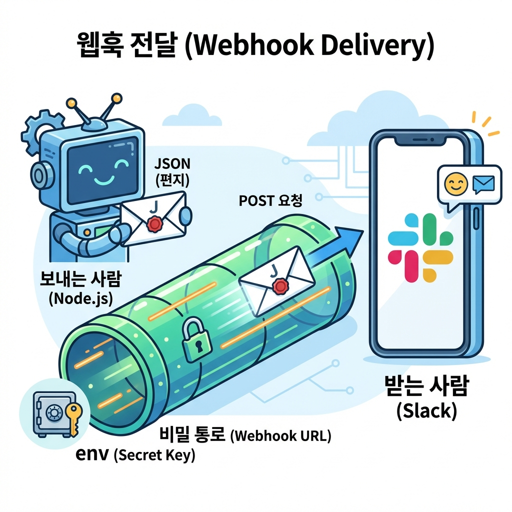

> "뉴스 요약까지는 코드를 짰는데...
> 매일 아침마다 터미널 켜서 확인해야 하나?
> 이러면 자동화가 아니잖아."

맞아. 진정한 자동화는 **"내가 신경 쓰지 않아도 내 눈앞에 배달되는 것"**이야.
매일 아침 커피 마실 때, 슬랙이나 카톡으로 요약본이 딱 와있어야 진짜지.

오늘은 우리 프로젝트의 화룡점정, **알림 봇**을 만들어볼 거야.
개발자들은 **웹훅(Webhook)**을 써서 이 마법을 부려.



---

## 이 글을 읽고 나면

- 슬랙으로 메시지를 보내는 **비밀 주소(Webhook URL)**를 만들 수 있어.
- 코드로 메시지를 쏘는(POST 요청) 방법을 알게 돼.
- AI한테 "이 메시지 슬랙으로 보내줘"라고 시킬 수 있어.

---

## 1. 웹훅 (Webhook): 디지털 초인종

지난 시간에 배운 웹훅 개념, 다시 복습해보자.
**"어떤 일이 생기면 나한테 알려줘"** 시스템이었지.

슬랙한테 이렇게 말하는 거야.
"내가 요 주소(URL)로 편지를 보내면, 네가 지정된 채팅방에 보여줘."

이 **주소(URL)** 하나만 있으면 비밀번호도, 복잡한 로그인도 필요 없어.
그냥 편지를 써서 우체통(URL)에 넣기만 하면 배달돼.
(그래서 이 주소는 비밀번호처럼 소중하게 다뤄야 해!)

---

## 2. 슬랙 앱 만들고 주소 받기 (1분컷)

이 부분은 AI가 못 해줘. 너가 직접 슬랙 사이트에서 클릭해야 해.
천천히 따라와봐.

1.  [Slack API 사이트](https://api.slack.com/apps) 접속
2.  **Create New App** 클릭 → **From scratch** 선택
3.  앱 이름(예: `Morning News Bot`) 짓고 워크스페이스 선택
4.  만들어진 앱 설정 메뉴에서 **Incoming Webhooks** 클릭
5.  **Activate Incoming Webhooks** 스위치 켜기 (ON)
6.  **Add New Webhook to Workspace** 버튼 누르고, 메시지 받을 채널 선택

그러면 알 수 없는 문자가 섞인 긴 주소가 나올 거야.
`https://hooks.slack.com/services/T000.../B000.../XXXX...`

이게 바로 **우리만의 비밀 우체통 주소**야!
이걸 복사해둬.

---

## 3. 실전: 메시지 쏘기 (상황극)

우체통 주소도 생겼으니 AI한테 배달을 시켜보자.
지난번(26편) 만든 요약 코드 뒤에 붙여보자.

### 1단계: 슬랙 전송 코드 작성

**나 (팀장)**
> "방금 만든 뉴스 요약본(text)을 슬랙으로 보내고 싶어.
> `axios` 라이브러리를 써서, 이 웹훅 주소로 POST 요청을 보내는 코드를 짜줘.
>
> *주의: 웹훅 주소는 코드에 직접 박지 말고 `process.env.SLACK_WEBHOOK_URL`에서 가져오게 해줘.*"

**AI (신입사원)**
> "좋아! `axios`를 설치하고 코드를 추가할게.
> 슬랙은 `text`라는 이름으로 보따리(JSON)를 싸서 보내야 알아들어."

```bash
npm install axios dotenv
```

```javascript
// AI가 짜준 코드 (부분)
const axios = require('axios');
require('dotenv').config(); // 환경변수 쓰려면 이거 필요해

async function sendToSlack(message) {
  const url = process.env.SLACK_WEBHOOK_URL;

  try {
    // 슬랙으로 POST 요청 (편지 넣기)
    await axios.post(url, {
      text: message // 보낼 내용
    });
    console.log('초인종 눌렀어!');
  } catch (error) {
    console.error('배달 실패:', error);
  }
}
```

<br/>

### 2단계: 환경변수 설정 (보안)

프로젝트 폴더에 `.env` 파일을 만들고, 아까 복사한 주소를 붙여넣어.

```
SLACK_WEBHOOK_URL=https://hooks.slack.com/services/T000...
```

<br/>

### 3단계: 실행 및 확인

```bash
node index.js
```

잠시 후...
**슬랙 알림음!**

"모닝 뉴스 요약봇: 오늘의 AI 뉴스입니다..."

너의 첫 봇이 말을 걸어왔어!
이 순간의 짜릿함, 절대 잊지 못할 거야.

---

## 4. 메시지 예쁘게 꾸미기 (선택)

그냥 글자만 보내면 심심하잖아.
슬랙은 **굵게 쓰기** 같은 꾸미기 기능을 지원해.

비개발자가 복잡한 문법(Block Kit)을 공부할 필요는 없어.
AI한테 이렇게 툭 던져봐.

> **"슬랙 메시지 보낼 때, 중요 키워드는 굵게(**) 표시하고, 제목엔 이모지 붙여줘."**

그러면 AI가 알아서 `*bold*`나 `:newspaper:` 같은 특수 기호를 섞어서 보내줄 거야.
이게 바로 **"어떻게(구현)는 AI에게, 무엇을(디자인)은 사람에게"** 맡기는 똑똑한 협업이야.

---

## 오늘의 핵심 정리

**웹훅 URL**: 비밀번호가 필요 없는 나만의 우체통 주소.
**슬랙 앱**: Incoming Webhook 기능을 켜면 주소를 받을 수 있어.
**환경변수(.env)**: 비밀 주소는 코드에 직접 적지 말고 따로 보관해.
