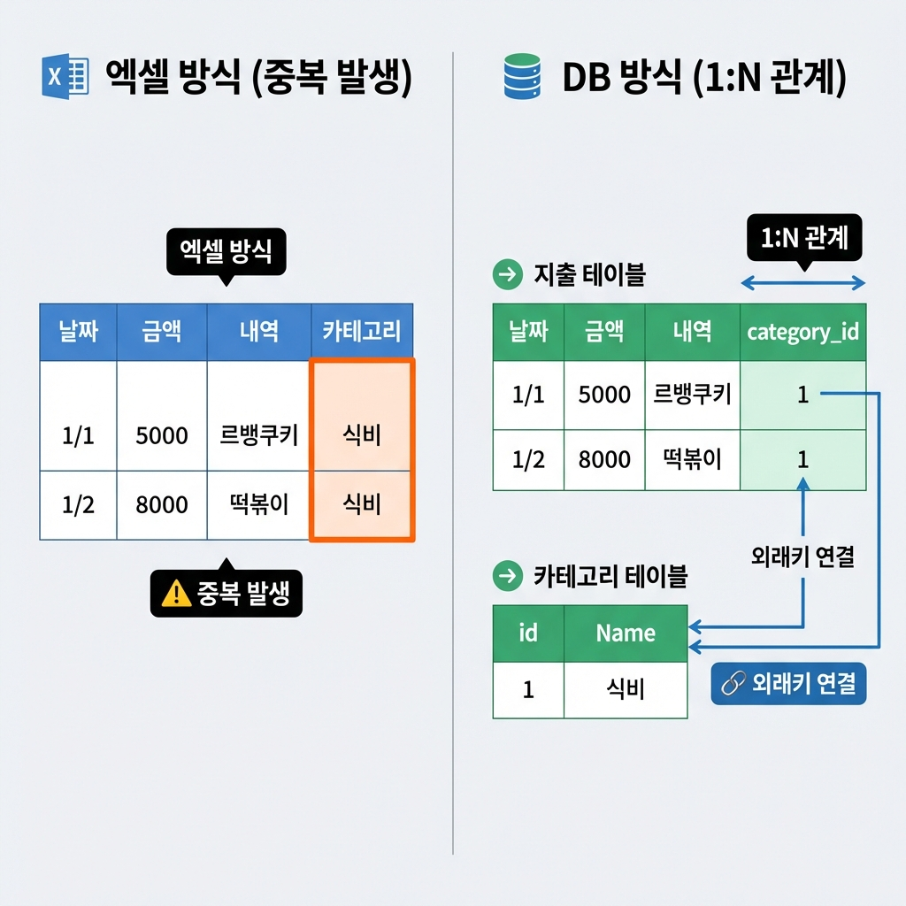
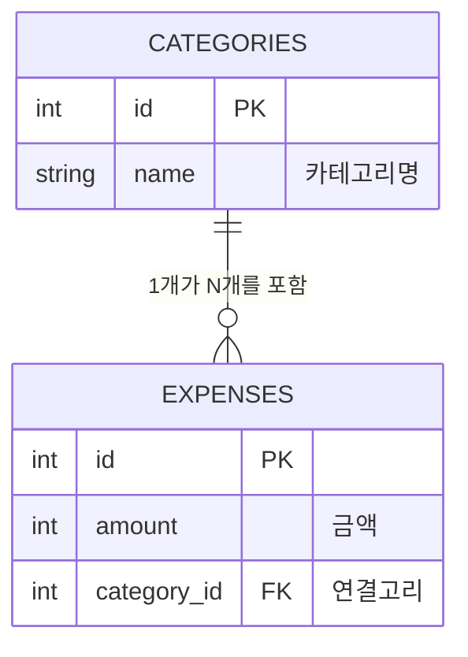

> "가계부 앱을 만들고 싶어. 로그인 화면부터 그리면 돼?"
>
> "아니. **데이터**부터 그려야 해."

서비스 만들 때 **화면(UI)**부터 생각하는 사람이 많아.
근데 화면은 언제든 바뀔 수 있어.
한번 정해지면 바꾸기 힘든 건 **데이터 구조(DB)**야.

이번 프로젝트처럼 "데이터를 보여주는 서비스"라면 더더욱 그래.
PART 7에서는 **'지출 대시보드'**를 만들면서 제대로 된 DB 설계를 배울 거야.
PART 5에서 Supabase로 할 일(Todos)을 저장해봤잖아? 그때는 테이블 하나만 썼는데, 이번엔 데이터끼리 관계를 맺어볼 거야.

이 글을 읽고 나면:
- 엑셀과 DB의 결정적 차이를 이해할 수 있어.
- **1:N 관계**가 뭔지, 왜 필요한지 알 수 있어.
- AI한테 "이런 관계의 테이블 설계해줘"라고 시킬 수 있어.

---

## 1. 엑셀 vs 관계형 DB

엑셀로 가계부를 쓴다면 이렇게 쓰겠지?

| 날짜 | 금액 | 내역 | 카테고리 |
|---|---|---|---|
| 1/1 | 5,000 | 르뱅쿠키 | 식비 |
| 1/1 | 1,200 | 버스비 | 교통비 |
| 1/2 | 8,000 | 떡볶이 | 식비 |

편해 보이지? 근데 문제가 있어.
'식비'라는 이름을 '음식'으로 바꾸고 싶다면?
'식비'라고 적힌 모든 칸을 찾아서 하나하나 고쳐야 해. (실수할 확률 100%)

그래서 개발자들은 데이터를 **쪼개서 관리**해.

**[카테고리 테이블]**
| ID | 이름 |
|---|---|
| 1 | 식비 |
| 2 | 교통비 |

**[지출 테이블]**
| 날짜 | 금액 | 내역 | **카테고리ID** |
|---|---|---|---|
| 1/1 | 5,000 | 르뱅쿠키 | **1** |
| 1/1 | 1,200 | 버스비 | **2** |
| 1/2 | 8,000 | 떡볶이 | **1** |

이제 '식비(ID:1)' 이름을 '음식'으로 바꾸고 싶으면?
**카테고리 테이블에서 딱 한 번만 고치면 돼.**
지출 테이블은 건드릴 필요가 없어.

이게 바로 **관계형 데이터베이스(RDB)**의 마법이야.

---

## 2. 1:N 관계와 외래키

방금 본 구조를 전문 용어로 표현해볼게.

### ① 1:N 관계 (One-to-Many)
- 하나의 카테고리(1)에는 여러 개의 지출(N)이 포함돼.
- 부모(카테고리)와 자식(지출) 관계라고도 해.

> **AI한테 이렇게 말하면 돼:**
> "카테고리와 지출은 **1:N 관계**야."

### ② 외래키 (Foreign Key)
- 지출 테이블에 있는 `카테고리ID` 보이지?
- 이게 바로 두 테이블을 연결해주는 연결고리야.
- "이 지출은 저 카테고리에 속해!"라고 가리키는 거야.
- 이걸 **외래키(Foreign Key)**라고 불러.

---

## 3. 실전: DB 설계하기 (상황극)

이제 AI(우리의 DB 전문가)와 함께 테이블을 설계해보자.

┌───────────────────────────────────────────────────────────────┐
│  1단계: 요구사항 전달                                            │
├───────────────────────────────────────────────────────────────┤
│                                                               │
│  나: "나 지출 내역 관리하는 앱 만들 거야.                         │
│      필요한 건 날짜, 금액, 내역, 그리고 카테고리야.                │
│      Supabase DB 테이블 설계해줘."                                │
│                                                               │
│  AI: "가장 간단한 방법은 하나의 테이블에 다 넣는 건데,             │
│      **카테고리 테이블을 분리**하는 게 관리하기 좋아.              │
│      분리해서 1:N 관계로 설계할까?"                               │
│                                                               │
│  나: "응. 분리해줘. 나중에 카테고리 색상도 넣고 싶거든."            │
│      (분리하면 카테고리별 색상 관리도 쉬워져!)                     │
│                                                               │
└───────────────────────────────────────────────────────────────┘

┌───────────────────────────────────────────────────────────────┐
│  2단계: 스키마(구조) 확정 및 SQL 생성                            │
├───────────────────────────────────────────────────────────────┤
│                                                               │
│  AI: "이렇게 설계했어.                                          │
│                                                               │
│  **1. categories (카테고리)**                                  │
│  - id: 숫자 (고유 키 - Primary Key)                            │
│  - name: 문자 (예: 식비)                                        │
│  - color: 문자 (예: #FF0000)                                    │
│                                                               │
│  **2. expenses (지출)**                                        │
│  - id: 숫자                                                    │
│  - amount: 숫자                                                │
│  - note: 문자                                                  │
│  - date: 날짜                                                  │
│  - **category_id**: 숫자 (categories 테이블 참조 - 외래키)      │
│                                                               │
│  비개발자니까, Supabase 대시보드에서 실행할 수 있는               │
│  SQL 코드로 줄까?"                                              │
│                                                               │
│  나: "응. SQL 줘. 그리고 ERD(관계도)도 그려줄 수 있어?"           │
│                                                               │
│  AI: "당연하지! Mermaid 문법으로 그려줄게."                      │
└───────────────────────────────────────────────────────────────┘

위와 같이 요청하면, AI가 SQL 코드와 함께 아래와 같은 **개념도(ERD)**를 그려줘.
(복잡해 보이지만, 화살표 방향만 봐. 카테고리 하나가 여러 지출을 가리키고 있지?)

---

## 4. 왜 이렇게까지 해야 하냐

"그냥 테이블 하나에 글자로 '식비', '교통비' 적으면 안 돼?"
당연히 돼. 작은 서비스면 상관없어.

근데 서비스가 커지면 이런 일이 생겨.
- "식비", "식사", "밥값" ... 같은 건데 이름이 제각각 섞임
- "식비" 통계 내려고 했더니 "밥값"은 빠짐
- 카테고리 이름 하나 바꾸는 데 밤샘 야근

**회사 업무로 치면 이런 거야.**
> 거래처 목록(엑셀) 따로, 주문 내역(엑셀) 따로 관리하잖아?
> 주문 내역에 매번 거래처 담당자 연락처를 새로 적지 않잖아.
> '거래처 코드'만 적고, 자세한 건 거래처 목록에서 찾아보지.
>
> **DB도 똑같아.** 중복을 피하기 위해 정보를 따로 관리하는 거야.

**데이터 설계는 건물을 짓는 기초 공사**와 같아.
처음에 잘해두면 나중에 층을 올려도 끄떡없는데,
대충 하면 나중에 다 부수고 다시 지어야 해.

---

## 오늘의 핵심 정리

✅ **데이터 설계**가 화면 설계보다 먼저야.
✅ 서로 다른 성격의 데이터는 **쪼개서 관리**해. (테이블 분리)
✅ **외래키**는 쪼개진 데이터를 연결하는 연결고리야.

✅ **AI한테 요청할 때:**
   "지출과 카테고리를 분리해서 1:N 관계로 설계해줘. `category_id`를 외래키로 잡아줘."
