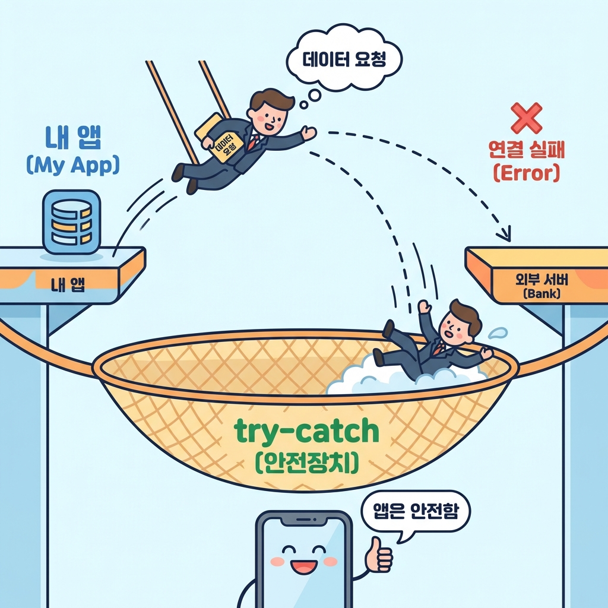

> "미국 여행 가서 15달러짜리 햄버거를 사 먹었어.
> 가계부엔 '15달러'라고 적었는데,
> 한국 돈으로 얼마인지도 자동으로 계산해주면 좋겠어."

DB에 저장된 데이터만 보여주는 건 재미없잖아.
세상엔 이미 훌륭한 데이터들이 넘쳐나. 오늘의 환율, 내일의 날씨, 이번 주 로또 번호...

이런 데이터를 내 서비스로 가져와서 보여주는 것,
그게 바로 **외부 API 연결**이야.

**동사무소(정부24)에서 등본 떼는 것과 비슷해.**
- 내 책상(내 DB)에 없어서 외부 기관에 요청해야 해
- **신분증(API Key)**이 있어야 해
- 신청하고 발급될 때까지 **기다려야 해(비동기)**
- 가끔 시스템 점검 중이면 **발급 실패(에러)**할 수도 있어

이 글을 읽고 나면:
- 내 서버가 아닌 **남의 서버**에서 데이터를 가져오는 법을 알게 돼.
- **API Key**가 왜 '인터넷 여권' 같은 존재인지 이해할 수 있어.
- 외부 서버 오류에 대비하는 **안전장치(Safety Net)**를 만드는 법을 배울 수 있어.

---

## 1. API Key: 인터넷 여권

지금까지는 내 집(내 DB) 냉장고를 여는 거라 자유로웠어.
근데 환율 정보는 **은행(남의 집)**에 있어. 남의 냉장고를 열려면 허락을 받아야겠지?

그래서 대부분의 외부 API는 **API Key**라는 걸 요구해.
일종의 **여권**이나 **출입증** 같은 거야.

> **주의:** 이 여권(Key)은 절대 남에게 보여주면 안 돼.
> 여권 사본을 인스타그램에 올리는 사람은 없잖아?
> 마찬가지로 API Key도 깃허브에 올리면 안 돼.
> 무조건 **`.env` 파일(금고)**에 숨겨야 해.

---

## 2. 실전: 환율 API 연결하기 (상황극)

이제 AI(우리의 외교관)에게 환율 정보를 가져오라고 시켜보자.
여기서 중요한 건 **'안전장치'**야. 남의 서버는 언제든 터질 수 있거든.

### AI에게 지시하기

**Tech Lead(나):** "환율 정보를 가져오되, 만약 실패하면 앱이 멈추지 말고 '조회 불가'라고라도 뜨게 해줘."

┌───────────────────────────────────────────────────────────────┐
│  1단계: 데이터 요청(Fetch) 및 안전장치 구현 요청                  │
├───────────────────────────────────────────────────────────────┤
│                                                               │
│  나: "현재 원/달러 환율 정보를 가져오는 함수를 만들어줘.           │
│      무료 API (`ExchangeRate-API` 등)를 사용해.                  │
│                                                               │
│  **요구사항:**                                                │
│  1. `fetch` 함수로 데이터를 가져와줘.                          │
│  2. **보안:** API Key는 반드시 `process.env`에서 가져와야 해.    │
│  3. **안전장치 (중요):** 외부 서버가 응답이 없거나 에러가 나면,   │
│     앱이 멈추지 말고 `null`을 반환하거나 에러를 로그로 남겨줘.    │
│     (`try-catch` 구문 사용)                                   │
│                                                               │
│  AI: "알겠어! API Key는 환경변수에서 꺼내 쓰고,                  │
│      통신 중 문제가 생기면 `catch` 블록에서 안전하게 처리할게."    │
│                                                               │
└───────────────────────────────────────────────────────────────┘

AI가 작성해준 코드는 이런 구조일 거야.

```typescript
// app/actions/getExchangeRate.ts

export async function getExchangeRate() {
  const apiKey = process.env.EXCHANGE_API_KEY; // 🔒 금고에서 꺼냄

  // 🪂 안전장치 (Safety Net) 시작
  try {
    // 비행기 타고 데이터 가지러 감 (시간이 좀 걸림 = await)
    const res = await fetch(`https://api.../KRW`);

    if (!res.ok) {
      throw new Error('비행기가 도착하지 않았어!');
    }

    const data = await res.json();
    return data.conversion_rates.KRW; // 예: 1350

  } catch (error) {
    // 사고 발생 시 여기서 처리
    console.error('환율 조회 실패:', error);
    return null; // "모름" 상태로 반환 (앱은 안 죽음)
  }
}
```

---

## 3. 내 서비스와 연결하기

이제 이 함수를 써먹어 보자.

1.  사용자가 지출 내역에 "$15" 입력
2.  "잠깐, 환율 좀 보고 올게" (`getExchangeRate` 실행)
3.  성공하면: `1350 * 15 = 20,250원` 계산해서 보여줌
4.  실패하면: "현재 환율 정보를 불러올 수 없어" (조용히 넘어감)

사용자는 "달러만 넣었는데 원화가 자동으로 뜨네?"라고 좋아할 거고,
가끔 서버가 터져도 "지금은 안 되네?" 하고 넘어갈 거야. 앱이 하얗게 멈추지 않으니까.

이게 바로 **'실패를 대비하는 설계'**야.



---

## 오늘의 핵심 정리

✅ **외부 API**: 남의 데이터를 빌려 쓰는 기술이야. 항상 '부탁'하는 입장이야.
✅ **API Key**: 인터넷 여권이야. 절대 깃허브에 올리지 말고 `.env`에 숨겨.
✅ **Try-Catch**: 외부 서버 오류에 대비한 **에어백(안전장치)**야. 이게 없으면 앱 전체가 멈출 수 있어.
