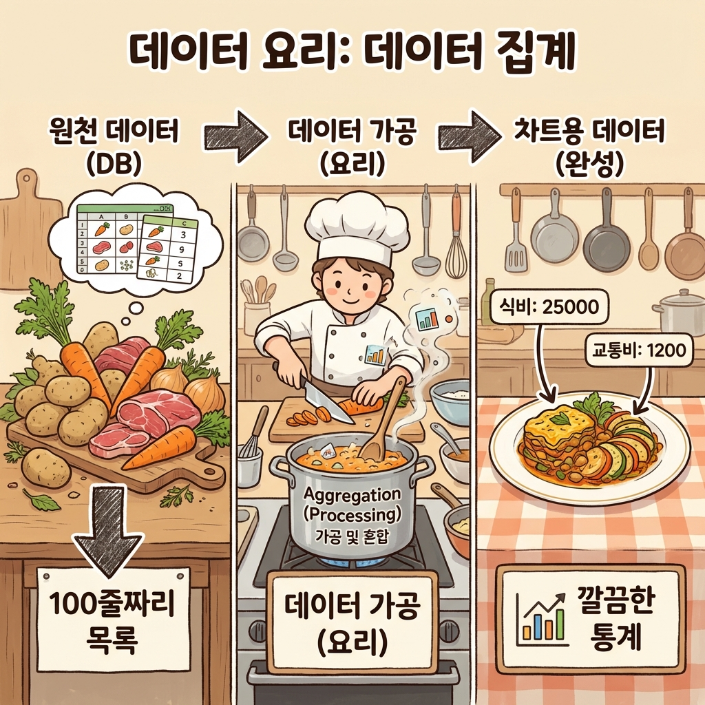

> "지출 내역이 100개가 넘어가니까 목록만 봐선 모르겠어.
> 이번 달에 식비로 얼마나 썼는지 한눈에 보고 싶어."

엑셀을 쓰는 이유도 결국은 **차트** 때문이잖아.
숫자만 나열된 표는 우리 뇌가 처리하기 힘들어.
근데 빨간색 파이 차트가 50%를 차지하고 있다면?
"아, 나 식비 좀 줄여야겠네"라고 1초 만에 깨닫게 되지.

이게 바로 **시각화(Visualization)**의 힘이야.
오늘은 지출 데이터를 예쁜 차트로 바꿔서, 그럴듯한 **대시보드**를 만들어보자.

이 글을 읽고 나면:
- 데이터를 차트로 그리기 위해 **가공(집계)**하는 법을 알게 돼.
- **차트 라이브러리**를 써서 10분 만에 그래프를 그릴 수 있어.
- "이번 달 지출 통계 보여줘"라고 AI에게 시킬 수 있어.

---

## 1. 차트 라이브러리: Recharts

"차트를 그리려면 수학을 잘해야 하냐? 각도 계산하고..."
아니! 우리는 **차트 라이브러리**를 쓸 거야.
데이터만 던져주면 알아서 그림을 그려주는 고마운 도구지.

리액트(Next.js) 생태계에서 가장 유명한 **Recharts**를 써볼게.
(개발자들은 바퀴를 다시 발명하지 않아. 잘 만든 바퀴를 가져다 쓰지.)

---

## 2. 데이터 가공: 차트가 좋아하는 밥상

차트를 그리기 전에 가장 중요한 단계가 있어.
바로 **데이터 가공(Aggregation)**이야.

**회사에서 지출 결의서 올릴 때를 생각해봐.**
- 1. 영수증 100장을 낱장으로 가져오면(원천 데이터) 팀장님이 싫어하잖아?
- 2. A4 용지에 **'날짜별'** 또는 **'항목별'**로 풀칠해서 붙여야 해. (데이터 가공)
- 3. 그래야 "이번 달 식비가 얼마네" 하고 한눈에 보이니까. (시각화)

차트도 똑같아. 영수증더미(DB 데이터)를 그대로 주면 못 그려.
풀칠해서 정리된 표를 줘야 해.

우리가 가진 데이터(DB)는 이래:
```json
[
  { "내역": "햄버거", "금액": 5000, "카테고리": "식비" },
  { "내역": "버스", "금액": 1200, "카테고리": "교통" },
  { "내역": "치킨", "금액": 20000, "카테고리": "식비" }
]
```

근데 차트(파이 차트)가 원하는 포맷은 이래:
```json
[
  { "name": "식비", "value": 25000 },
  { "name": "교통", "value": 1200 }
]
```

원재료(목록)를 요리(집계)해서 차트가 먹기 좋게 만들어줘야 해.
이 '요리' 과정을 AI에게 시켜볼게.



---

## 3. 실전: 내 지출 통계 차트 그리기 (상황극)

AI(프론트엔드 전문가)에게 주문을 넣어보자.

┌───────────────────────────────────────────────────────────────┐
│  1단계: 데이터 가공 요청                                        │
├───────────────────────────────────────────────────────────────┤
│                                                               │
│  나: "지금 `expenses` 배열에 지출 내역들이 쫙 들어있어.           │
│      이걸 **카테고리별로 합계(sum)**를 구해서 묶어줘.              │
│      Recharts의 PieChart에 넣을 거야."                           │
│                                                               │
│  AI: "`reduce` 함수를 써서 카테고리별로 금액을 더할게.            │
│      결과는 `{ name: '식비', value: 25000 }` 형태로 만들게."     │
│                                                               │
└───────────────────────────────────────────────────────────────┘

┌───────────────────────────────────────────────────────────────┐
│  2단계: 차트 그리기                                             │
├───────────────────────────────────────────────────────────────┤
│                                                               │
│  나: "좋아. 이제 그 데이터로 **도넛 모양 차트**를 그려줘.          │
│      마우스를 올리면 금액이 뜨게(Tooltip) 해주고.                 │
│      색깔은 파스텔 톤으로 예쁘게!"                                │
│                                                               │
│  AI: "알겠어. `PieChart`, `Pie`, `Tooltip` 컴포넌트를 써서       │
│      구현할게. `innerRadius`를 주면 도넛 모양이 돼."              │
│                                                               │
│  (잠시 후 화면에 예쁜 차트가 뜸)                                  │
│                                                               │
│  나: "그럴듯한데? 진짜 앱 같다!"                                  │
│                                                               │
└───────────────────────────────────────────────────────────────┘

---

## 4. 데이터의 거짓말

차트는 강력한데, 때론 거짓말을 하기도 해.
AI가 그려준 차트를 그대로 쓰기 전에, 사람의 눈으로 점검해야 해.

- **색상:** '식비'와 '쇼핑' 색깔이 비슷하면 구분하기 힘들잖아?
- **범례:** 어떤 색이 뭔지 설명(Legend)이 없으면 암호문이 돼.
- **예외:** "지출이 0원인 카테고리"가 차트에 나오면 지저분해 보여. (필터링 필요)

"이 차트, 사장님이 딱 봐도 이해할까?"
이 질문을 던지는 건 결국 사람의 몫이야.

---

## 오늘의 핵심 정리

✅ **시각화**는 데이터를 정보로 바꾸는 가장 빠른 방법이야.
✅ **차트 라이브러리(Recharts)**를 쓰면 복잡한 수학 없이 구현할 수 있어.
✅ 데이터를 차트용 포맷으로 **가공(집계)**하는 과정이 필수야.

✅ **AI한테 요청할 때:**
   "지출 데이터를 카테고리별로 합쳐서, Recharts 파이 차트용 포맷으로 바꿔줘. 그리고 도넛 차트로 그려줘."
