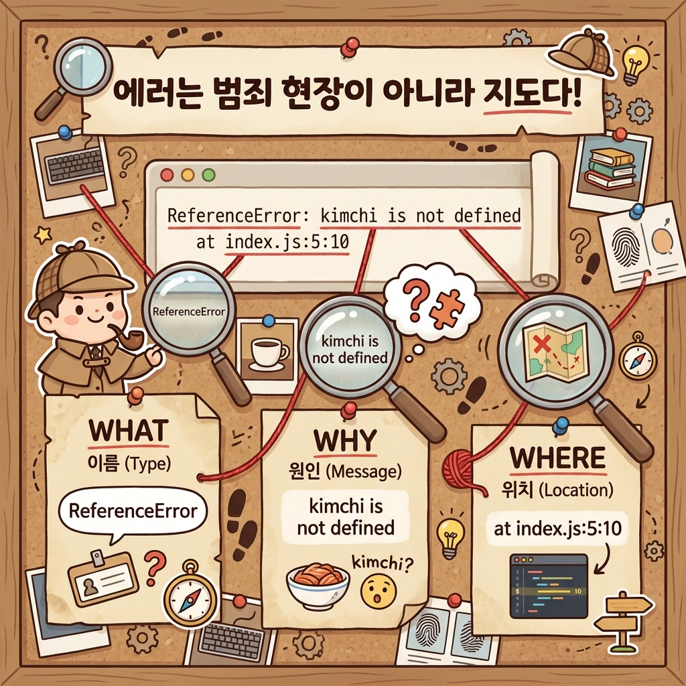

> 터미널에 빨간 글씨가 촥 뜨면 심장이 덜컥 내려앉아?
> "아, 또 망했네. AI한테 고쳐달라고 해야지." 하고
> 읽지도 않고 바로 복사해?

개발자들도 에러를 매일 만나. 대처법이 다를 뿐이야.
초보자는 에러를 **"실패 성적표"**라고 생각하고 두려워하는데,
개발자는 에러를 **"친절한 안내판"**이라고 생각해.

"야, 너 15번째 줄에서 오타 냈어."
이걸 알려주는 거거든. 고마운 거야.

이 글을 읽고 나면:
- 빨간 글씨가 떠도 당황하지 않고 "어디 보자" 할 수 있어.
- **에러 메시지의 3요소**를 찾을 수 있어.
- **스택 트레이스**라는 복잡한 지도를 읽는 법을 알게 돼.

---

## 1. 에러 해부학: 3가지만 찾아라

에러 메시지가 영어로 길게 나와도 쫄지 마.
우리는 딱 3가지만 찾으면 돼.

1.  **WHAT (뭐가 문제야?):** 에러의 이름 (Error Type)
2.  **WHY (왜 문제야?):** 상세 설명 (Message)
3.  **WHERE (어디가 문제야?):** 파일 위치와 줄 번호 (Stack Trace)



### 예시 상황
```
ReferenceError: 'kimchi' is not defined
    at makeStew (index.js:5:10)
    at main (index.js:10:5)
```

- **WHAT:** `ReferenceError` (참조 에러)
- **WHY:** `'kimchi' is not defined` (kimchi라는 변수가 없어)
- **WHERE:** `index.js:5:10` (index.js 파일의 5번째 줄, 10번째 칸)

해석: "5번째 줄에서 'kimchi'를 쓰려고 했는데, 선언된 적이 없어서 못 찾겠어."
→ **해결:** 5번째 줄 위에 `const kimchi = ...` 가 있는지 확인해봐.

---

## 2. 자주 만나는 에러 친구들

개발하다 보면 맨날 보는 녀석들이 있어.
이름만 알아도 반은 해결한 거야.

### ① ReferenceError (이름표가 없어)
> "너 아까 '철수'한테 돈 주라며? 근데 철수가 누군데?"
- **원인:** 변수 선언(const/let)을 안 했거나, 오타가 났을 때.
- **해결:** 오타 확인하기 (`usre` -> `user`), 선언 확인하기.

### ② SyntaxError (문법이 틀렸어)
> "아버지 가방에 들어가신다."
- **원인:** 괄호`()`나 중괄호`{}`를 안 닫았을 때, 오타가 났을 때.
- **특징:** 코드가 아예 실행조차 안 돼.
- **해결:** 빨간 줄 그어진 곳 앞뒤로 괄호 짝 맞추기.

### ③ TypeError (그건 그렇게 쓰는 거 아냐)
> "냉장고한테 '달려'라고 명령하지 마."
- **원인:** 숫자를 함수처럼 호출했거나, `null` 값에서 속성을 찾으려 할 때.
- **예:** `undefined.map is not a function` (빈 데이터 가지고 반복문 돌리지 마)

---

## 3. 스택 트레이스(Stack Trace): 범인의 발자국

에러 메시지 밑에 `at ...` 하면서 줄줄이 나오는 거 있지?
이게 바로 **범인의 발자국(Stack Trace)**이야. 탐정처럼 발자국을 역추적해야 해.

```
Error: Something went wrong
    at thirdFunction (app.js:30)  <-- 사고 현장 (가장 중요!)
    at secondFunction (app.js:20) <-- 발자국 2 (여기서 불렀고)
    at firstFunction (app.js:10)  <-- 발자국 1 (여기서 시작됨)
```

1.  **제일 윗줄**이 사고가 난 **'진짜 현장'**이야.
2.  밑으로 갈수록 시간 역순으로 "누가 얘를 불렀는지" 보여줘.

**수사 팁:**
`node_modules/...` 라고 적힌 줄은 **무시해.**
그건 우리가 짠 코드가 아니라 외부 라이브러리(남의 코드)야.
거긴 죄가 없어. **내 파일 이름(`app.js`, `page.tsx`)**이 나올 때까지 눈을 크게 뜨고 찾아.

---

## 4. 실전: 에러 읽기 연습 (상황극)

AI한테 무조건 "고쳐줘" 하기 전에,
먼저 읽어보고 "아, 이거구나" 한 뒤에 시켜봐.

┌───────────────────────────────────────────────────────────────┐
│  상황: 코드를 돌렸는데 이런 게 떴어.                            │
│  `TypeError: Cannot read properties of null (reading 'name')` │
│     `at Dashboard (page.tsx:15:20)`                          │
├───────────────────────────────────────────────────────────────┤
│                                                               │
│  [초보자 반응]                                                 │
│  "으악! 영어다! 망했다! AI야 도와줘!"                            │
│                                                               │
│  [Vibe Coder 반응]                                            │
│  1. **WHAT:** TypeError네.                                    │
│  2. **WHERE:** `page.tsx` 15번째 줄이네.                       │
│  3. **WHY:** `null`의 `name`을 읽으려 했대.                    │
│     (아, 데이터가 아직 안 왔는데 화면에 이름을 찍으려 했구나!)    │
│                                                               │
│  나: (AI에게) "야, page.tsx 15번째 줄에서 에러 났어.              │
│      데이터 로딩 중일 때는 로딩 표시(Spinner) 보여주게 고쳐줘."     │
│                                                               │
└───────────────────────────────────────────────────────────────┘

너가 이렇게 **원인을 짚어서** 말해주면,
AI는 훨씬 정확한 코드를 줘.

---

## 오늘의 핵심 정리

✅ 에러 메시지는 실패가 아니라 **친절한 안내판**이야.
✅ 3가지만 찾자: **무엇이(Type), 왜(Message), 어디서(Location)**.
✅ **스택 트레이스**의 맨 윗줄(내 파일)이 범인이야.

✅ **AI한테 요청할 때:**
   (무지성 복붙 대신) "ReferenceError가 났어. 변수 이름 오타인 것 같은데 찾아줄래?"
