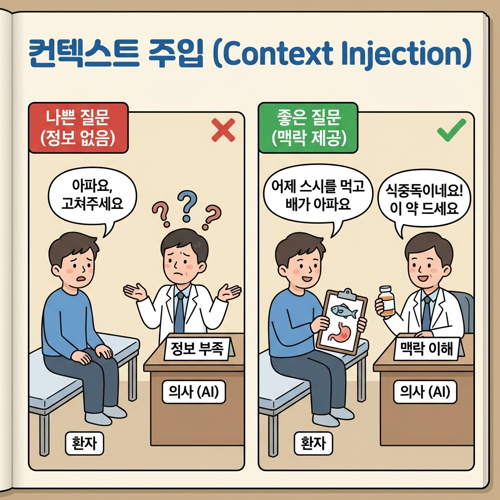

> 개발자 A: "이거 안 돼. 고쳐줘." (AI: 엉뚱한 답을 줌)
> 개발자 B: "A 파일 15번째 줄에서 에러가 났어. B 파일이랑 연관된 것 같은데 확인해줄래?" (AI: 완벽한 정답을 줌)

똑같은 AI를 쓰는데, 왜 누구는 칼퇴하고 누구는 야근할까?
차이는 **질문하는 능력(Prompt Engineering)**에 있어.

AI는 점쟁이가 아니야.
너가 상황(Context)을 자세히 설명해줄수록, 더 똑똑해지는 비서야.
오늘은 AI를 200% 활용해서 버그를 때려잡는 법을 배울 거야.

이 글을 읽고 나면:
- "고쳐줘" 한 마디보다 100배 효과적인 질문법을 알게 돼.
- AI에게 **맥락(Context)**을 제공하는 노하우를 익힐 수 있어.
- 더 이상 에러 앞에서 혼자 끙끙대지 않게 돼.

---

## 1. 질문의 3박자: 코드, 에러, 의도

AI한테 질문할 때 꼭 들어가야 할 3가지가 있어.
이 중 하나라도 빠지면 AI는 소설을 쓰기 시작해.

1.  **관련 코드 (Code):** 문제가 발생한 파일의 내용 (전체 말고 관련 부분만)
2.  **에러 메시지 (Error):** 아까 배운 WHAT, WHY, WHERE
3.  **나의 의도 (Intent):** "나는 원래 ~하려고 했어"

> **나쁜 질문:** "에러 났어. 고쳐줘." (정보량 0)
>
> **좋은 질문:**
> 1. `page.tsx`랑 `api/route.ts` 코드 보여주면서
> 2. "500 Internal Server Error가 떴어."
> 3. "나는 버튼 누르면 DB에 저장되게 하고 싶었어."

---

## 2. 실전: 맥락(Context) 주입하기

AI는 너의 컴퓨터를 볼 수 없어.
**의사 선생님과 환자** 사이와 같아.

### 실패하는 대화 (나쁜 환자)
**나:** "선생님, 아파요. 고쳐주세요."
**의사(AI):** "어디가 아프신가요? 머리? 배? 알 수가 없네요."
**(나의 속마음: 아니, 의사가 그것도 몰라?)**

### 성공하는 대화 (좋은 환자)
**나:** "선생님, 어제 생선회를 먹었는데 오늘 아침부터 배가 아프고 열이 나요."
**의사(AI):** "아하, 식중독 같네요. 약 처방해드릴게요."

개발도 똑같아. "안 돼"라고만 하면 AI도 몰라.
"내가 `login.tsx`에서..." 하고 구구절절 설명해야 해.

**실전 예시:**
**나:** "내가 지금 `login.tsx`에서 로그인하고 `dashboard.tsx`로 이동했어.
근데 `dashboard.tsx` 10번째 줄에서 `user is null` 에러가 나.
로그인 상태 관리는 `auth-context.tsx`에서 하고 있어.
이 파일 3개 내용 참고해서 원인 찾아줘."

**(관련 파일 3개 코드 복붙)**

**AI:** "아! `auth-context.tsx`를 보니까, 페이지 이동할 때 상태 업데이트가 느려.
`dashboard.tsx`에서 데이터를 읽기 전에 '로딩 중' 체크를 안 해서 그래."

---

## 3. "잠깐, 왜?" 라고 물어보기

AI가 코드를 줬다고 넙죽 받아서 복사하면 안 돼.
그 코드가 또 다른 버그를 만들 수도 있거든.

코드를 받기 전에, 혹은 받은 후에 꼭 물어봐.
**"왜 그렇게 고쳐야 해?"**

> **AI:** "이 줄을 지우고 저렇게 바꿔."
> **나:** "왜? 원래 코드는 뭐가 문제였어?"
> **AI:** "원래 코드는 비동기(async) 처리를 안 기다리고 넘어가서..."

이 대화 과정이 진짜 공부야.
AI는 가끔 대충 둘러대기도 하는데, 우리가 "왜?"라고 파고들면
"아, 다시 생각해보니..." 하면서 더 정확한 답을 내놓기도 해.

---

## 4. AI랑 짝 코딩(Pair Programming) 하기

디버깅은 범인을 찾는 추리 게임이야.
탐정(나)과 조수(AI)가 되어 수사를 진행해봐.

1.  **단서 수집:** 에러 로그, 이상한 동작 캡처
2.  **용의자 지목:** "내 생각엔 DB 연결 쪽 문제 같은데, 넌 어떻게 생각해?"
3.  **검증:** "그럼 로그를 찍어볼까? 어디에 `console.log` 넣으면 좋을까?"

나도 개발하다 막히면 AI한테 이렇게 말해.
**"나 지금 길을 잃었어. 처음부터 다시 차근차근 점검해볼까? 체크리스트 만들어줘."**
그러면 AI가 아주 훌륭한 디버깅 파트너가 돼줘.

---

## 오늘의 핵심 정리

✅ AI는 점쟁이가 아니야. **코드, 에러, 의도**를 다 줘야 해.
✅ **맥락(Context)**이 없으면 엉뚱한 답이 나와. (관련 파일 다 보여주기)
✅ 정답만 베끼지 말고 **"왜?"**라고 물어봐야 내 실력이 돼.

✅ **AI한테 요청할 때:**
   "이 파일(A, B)을 참고해. 내가 버튼을 눌렀는데 이런 에러(로그)가 떴어. 나는 DB에 저장되길 원했어. 원인이 뭘까?"
