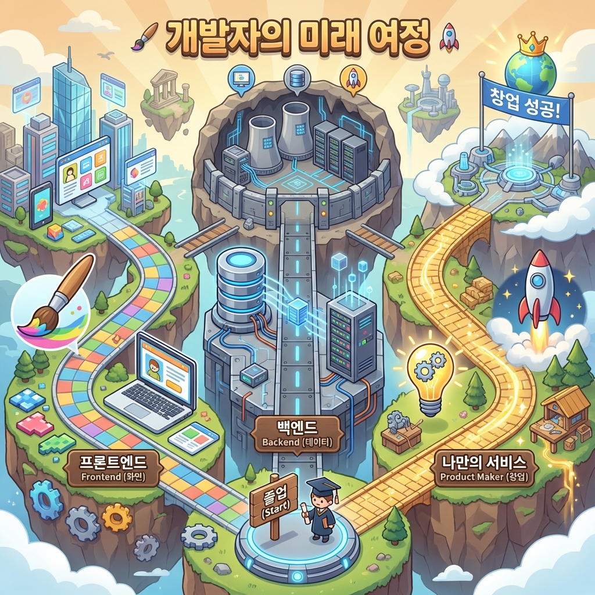

> "AI가 코딩해준다길래 쉬운 줄 알았는데, 생각보다 공부할 게 많네."
> "근데 이제 '어떻게 시작하지?'라는 두려움은 사라졌어."

1편에서 내가 했던 말, 기억나?
**"AI는 너의 유능한 신입사원이야."**

처음엔 그 신입사원에게 말 거는 것조차 어색했잖아.
근데 이제 너는:
1.  **웹 서비스**를 기획해서 배포하고 (Todo List)
2.  **자동화 봇**을 만들어 매일 아침 뉴스를 받고 (Slack Bot)
3.  **데이터 서비스**로 나만의 가계부를 만들고 (Dashboard)
4.  **에러**가 터져도 당황하지 않고 해결하는 (Debugging)

어엿한 **Technical Manager**가 된 거야.
이 시리즈의 마지막 글에서는, 우리가 걸어온 길을 정리하고
앞으로 너가 혼자 걸어갈 길을 비춰줄게.

---

## 1. 우리가 배운 것들 (Vibe Coding 로드맵)

우리는 단순히 문법(Syntax)을 배운 게 아니야.
**문제를 해결하는 흐름(Flow)**을 배웠어.

- **Part 1~2:** 컴퓨터와 대화하는 법 (용어, 개발 환경)
- **Part 3~5:** 웹 서비스의 A to Z (DB - API - UI - 배포)
- **Part 6:** 내 시간을 아껴주는 자동화 (Cron, Webhook)
- **Part 7:** 데이터의 가치를 높이는 시각화 (1:N 관계, Chart)
- **Part 8:** AI와 함께 성장하는 법 (에러 핸들링, 질문법)

이 흐름만 알고 있으면, 언어가 바뀌어도(파이썬, 자바 등) 두렵지 않을 거야.

---

## 2. 너는 이제 '초보'가 아니야

개발자가 된다는 건, 모든 문법을 외우고 있다는 뜻이 아니야.
**"모르는 게 나왔을 때, 어디를 찾아봐야 하는지 아는 사람"**이 개발자야.

너한테는 이제 강력한 무기가 3개나 있어.
1.  **AI (Copilot):** 언제든 내 코드의 맥락을 이해하고 답해주는 동료
2.  **공식 문서 (Docs):** 가장 정확한 정보를 담고 있는 교과서
3.  **커뮤니티 (StackOverflow):** 나보다 먼저 같은 고민을 했던 선배들

이제 "이 기능 구현할 수 있을까?"라고 묻지 마.
**"AI야, 이 기능 구현하려면 어떤 키워드로 검색해야 해?"** 라고 물어봐.
그게 바로 고수의 태도야.

---

## 3. 앞으로의 여정 (Next Step)

"그럼 이제 뭐 공부해?"
너의 흥미에 따라 3가지 길을 추천할게.

### 트랙 1: "난 화면 깎는 게 재밌어" (프론트엔드 심화)
- **Typescript:** 자바스크립트에 '엄격함'을 더해서 에러를 미리 잡아.
- **Tailwind CSS:** CSS를 더 빠르고 예쁘게 짤 수 있어.
- **Animation:** Framer Motion 등으로 인터랙티브한 웹을 만들어.

### 트랙 2: "난 데이터 다루는 게 멋져" (백엔드 심화)
- **SQL Deep Dive:** 더 복잡한 데이터를 효율적으로 뽑아내는 법을 배워.
- **Python:** 엑셀 자동화, 주식 분석 등 데이터 분석에 최강이야.
- **Serverless:** AWS Lambda 같은 걸 써서 더 큰 서비스를 다뤄봐.

### 트랙 3: "난 내 아이디어를 실현하고 싶어" (프로덕트 메이커)
- 지금 당장 **너의 아이디어**를 만들어.
- 공부를 위한 공부 말고, **"이거 불편한데 앱으로 만들어볼까?"** 에서 시작해.
- 그 과정에서 부딪히는 문제들이 너를 가장 빠르게 성장시킬 거야.

---

## 4. 마지막으로 하고 싶은 말

코딩은 피아노와 같아.
악보(문법)를 보는 법을 배웠다고 해서 바로 쇼팽을 칠 수 있는 건 아니지.

**비유하자면 너는 이제 막 '운전면허'를 딴 거야.**
면허증 잉크도 안 말랐는데 바로 고속도로(대규모 트래픽)를 달릴 순 없겠지?
근데 괜찮아. 우리에겐 **AI라는 훌륭한 네비게이션**이 있으니까.

하루에 30분이라도 좋아. 네비게이션을 켜고 동네 한 바퀴(작은 프로젝트)부터 돌아봐.
그러다 보면 어느새 베스트 드라이버가 되어 있을 거야.

**너의 첫 번째 Vibe Coding은 끝났지만,**
**너의 개발자 인생은 이제 막 시작됐어.**

그동안 따라오느라 고생 많았어.
세상에 없던 무언가를 만들어낼 너를 진심으로 응원해!

**- 바이브 코딩 (Vibe Coding) 완결 -**
