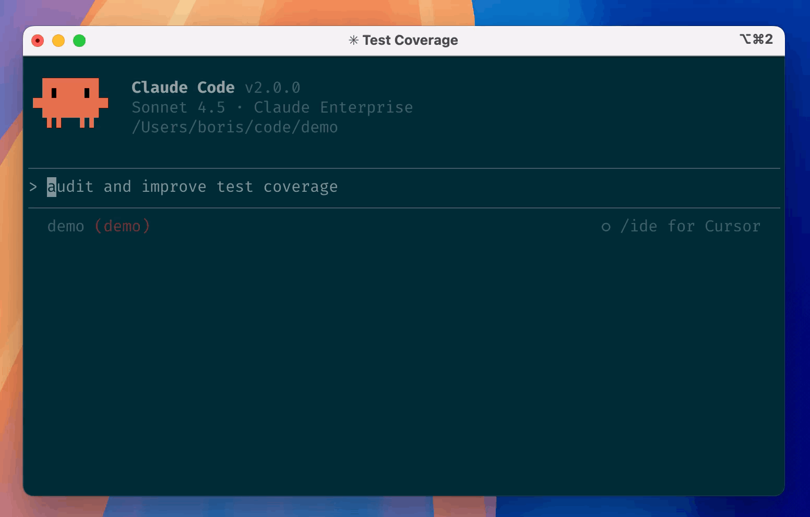

**Claude Code에게 "이 주제로 영상 대본 써줘" 하면 진짜 써줘.**

대본 쓰고, YAML 씬 스펙으로 바꾸고, TTS 생성하고, Remotion으로 렌더링하고, 유튜브에 올리는 것까지 — 이 파이프라인은 Claude Code 커맨드 몇 번으로 돌아가.

실제 이 시리즈에서 쓰는 캐릭터들이야.

| 강의자 (instructor) | 질문자 (student) |
|---|---|
|  |  |
| ElevenLabs TTS | Fish Audio TTS |

---

## 전체 흐름이 어떻게 되냐

:::canvas-flow
{
  "nodes": [
    {"id": "write",    "label": "/write\n대본 작성",         "col": 0, "row": 0, "type": "default"},
    {"id": "scene",    "label": "/scene\nYAML 씬 스펙",      "col": 1, "row": 0, "type": "default"},
    {"id": "tts",      "label": "TTS 생성\nElevenLabs+Fish", "col": 2, "row": 0, "type": "process"},
    {"id": "polish",   "label": "오디오 후처리\n배속+정규화",  "col": 3, "row": 0, "type": "process"},
    {"id": "timeline", "label": "타임라인 빌드\nYAML→JSON",  "col": 4, "row": 0, "type": "process"},
    {"id": "render",   "label": "Remotion\n렌더링",          "col": 5, "row": 0, "type": "success"},
    {"id": "youtube",  "label": "YouTube\n업로드",           "col": 6, "row": 0, "type": "success"}
  ],
  "edges": [
    {"from": "write",    "to": "scene"},
    {"from": "scene",    "to": "tts"},
    {"from": "tts",      "to": "polish"},
    {"from": "polish",   "to": "timeline"},
    {"from": "timeline", "to": "render"},
    {"from": "render",   "to": "youtube", "label": "선택"}
  ],
  "direction": "LR",
  "cols": 7,
  "rows": 1
}
:::

Claude Code가 앞 두 단계(대본 → 씬 스펙)를 처리하고, 나머지는 npm 스크립트가 자동으로 돌아가.

---

## Claude Code가 대본을 어떻게 써주냐

`/write` 커맨드로 에피소드 대본을 요청해.

```bash:Claude Code
/write ep01-ai-coding-map
/write "Cursor vs Claude Code"
```

에피소드 번호나 주제를 주면 Claude가 알아서 처리해.

:::steps

### 콘텐츠 수집

로컬 문서(`contents/`) + 웹 리서치로 주제 소스를 모아.
`learner-state.json`을 읽어서 질문자의 현재 지식 수준도 파악해.

### 대본 집필

강의자/질문자 2인 대화 형식으로 대본을 작성해.
TTS가 읽는 `tts` 필드는 한글 발음으로, 화면 자막 `display_text`는 원문으로 따로 써.

### 퇴고

TTS 발음 검수(숫자/영어 → 한글 변환), 톤 검수, 이미지 소싱까지 자동으로 돌아가.

:::

```
📝 대본 완성!

파일: scripts/part1/ep01-ai-coding-map.md
분량: 2,847자 (약 12분)
이미지: 4개 소싱됨
TTS 위반: 0건
```

퇴고만 따로 돌리고 싶으면:

```bash:Claude Code
/proofread ep01-ai-coding-map
```

---

## 씬 스펙은 어떻게 만드냐

`/scene` 커맨드로 대본을 YAML 씬 스펙으로 변환해.

```bash:Claude Code
/scene ep01-ai-coding-map
```

각 대사와 화면이 씬 단위로 정의돼.

```yaml:video/scenes/ep01-ai-coding-map.yaml
meta:
  id: "EP01"
  slug: "ep01-ai-coding-map"
  title: "2026 AI 코딩 지도"

youtube:
  tags: ["AI코딩", "Claude Code", "바이브코딩"]
  description: |
    AI 코딩 도구의 큰 그림을 잡아드립니다.
  thumbnail_text: "AI 입문"
  thumbnail_sub: '"해줘"라고 하면 진짜 해줘요'

bgm:
  - section: "인트로"
    src: "audio/bgm/upbeat-tech.mp3"
    volume: 0.25
    fade_in_sec: 0.5
    duration_sec: 20    # 인사 구간만 깔리고 빠짐

scenes:
  - id: "video-call-1"
    type: "video-call"
    speaker: "instructor"
    tts: "오, 접속했네요! 안녕하세요~"
    display_text: "오, 접속했네요! 안녕하세요~"

  - id: "stats-1"
    type: "stats"
    speaker: "instructor"
    tts: "작년 에이아이 코딩 시장이 팔조 원을 넘었어요."
    display_text: "작년 AI 코딩 시장이 8조 원을 넘었어요."
    stat: "8조 원"
    detail: "AI 코딩 시장 규모 (2025)"
```

씬 타입은 13종이야.

| 타입 | 용도 |
|------|------|
| `narration` | 자막 슬라이드 (가장 많이 씀) |
| `stats` | 수치/통계 강조 |
| `comparison` | 도구 비교표 |
| `flow` | 단계별 흐름도 |
| `quote` | 인용구, 핵심 문장 |
| `screenshot` | 실제 화면 캡처 |
| `diagram` | 개념 다이어그램 |
| `chart` | IR 스타일 차트 |
| `code` | 코드 블록 |
| `greeting` | 캐릭터 인사 (립싱크 영상 지원) |
| `video-call` | 화상통화 UI |
| `kling` | Kling AI 시네마틱 영상 (인트로/아웃트로) |
| `stage-clear` | 스테이지 클리어 이펙트 |

썸네일도 `/thumbnail` 커맨드로 씬 스펙에서 뽑아.

```bash:Claude Code
/thumbnail ep01-ai-coding-map
```

```bash:터미널
npx remotion still thumb-ep01-ai-coding-map out/thumb-ep01.png
```

---

## TTS는 어떻게 생성하냐

강의자와 질문자가 다른 TTS 서비스를 써.

```
instructor (강의자) → ElevenLabs   : 고품질, 주력 음성
student   (질문자) → Fish Audio    : 저렴, 짧은 대사에 충분
```

YAML `speaker` 필드만 지정하면 자동으로 분기돼.

:::steps

### 비용 먼저 확인

```bash:터미널
npm run tts:dry ep01-ai-coding-map
```

API 한 번도 안 부르고 비용만 계산해줘.

```
📄 Loaded: video/scenes/ep01-ai-coding-map.yaml
   Instructor (ElevenLabs): 52씬, 3,200자
   Student (Fish Audio): 16씬, 260자

💰 예상 비용:
   ElevenLabs (강의자): ~$0.534
   Fish Audio (질문자): ~$0.012
   합계: ~$0.546
```

### 실제 생성

```bash:터미널
npm run tts ep01-ai-coding-map
```

강의자/질문자 MP3가 씬별로 생성되고 `_manifest.json`에 메타가 기록돼.

```
public/audio/ep01-ai-coding-map/
├── opening-01.mp3    ← 강의자 (ElevenLabs)
├── opening-05.mp3    ← 질문자 (Fish Audio)
├── ...
└── _manifest.json    ← 씬별 오디오 길이
```

:::

:::warning
**비용 확인 없이 바로 실행하면 안 돼.**
`tts:dry`로 금액 먼저 확인하고, 괜찮으면 `tts` 실행해.
10분짜리 에피소드 기준 합계 ~$0.55 수준이야.
:::

---

## tts랑 display_text가 왜 다르냐

화면에 보이는 자막과 TTS 엔진에 넘기는 텍스트를 구분해야 해.
TTS 엔진이 영어, 숫자, 기호를 이상하게 읽거든.

```yaml:씬 텍스트 설정 예시
# ❌ TTS가 "에이아이", "삼 가지"를 어색하게 읽어
tts: "AI로 자동화할 수 있는 3가지 방법이 있어요."

# ✅ TTS는 한글 발음으로, 자막은 원문 그대로
tts: "에이아이로 자동화할 수 있는 세가지 방법이 있어요."
display_text: "AI로 자동화할 수 있는 3가지 방법"
highlight: "AI 자동화"
```

숫자와 단위는 붙여서 한글로.

```yaml:숫자/기호 변환 규칙
tts: "삼개월"    # ✅
tts: "삼 개월"   # ❌ (띄어쓰면 어색하게 읽힘)

tts: "삼십구퍼센트"   # 39%
tts: "십오달러"       # $15
```

> [!TIP]
> `src/data/term-map.json`에 AI 도구 발음 매핑이 정리돼 있어.
> ChatGPT→챗지피티, Claude→클로드, GitHub→깃허브 등. 새 용어 쓸 때 여기 먼저 등록해.

---

## 오디오 후처리 왜 해야 하냐

TTS 생성 후 반드시 `audio:polish`를 돌려야 해.

```bash:터미널
npm run audio:polish ep01-ai-coding-map
```

:::steps

### Phase 1 — 1.1배속 + 무음 트리밍

TTS 엔진은 앞뒤에 침묵 구간을 붙이는 경우가 많아.
그리고 기본 속도가 유튜브 강의 기준으로 살짝 느려.

- 1.1배속 (atempo 필터, 음정 유지)
- 앞뒤 -35dB 이하 구간 자동 제거
- 끝에 0.03초 여백만 남김

### Phase 2 — CPS 정규화

CPS(Characters Per Second, 초당 발화 글자 수)가 씬마다 다르면 리듬이 끊겨.
어떤 씬은 천천히, 어떤 씬은 빠르게 말하면 시청자가 불편해.

- 목표 CPS: **9.8** (글자/초)
- 9.0 미만인 씬은 추가 배속 (최대 1.3x)
- 강의자 씬만 적용

### Phase 3 — 매니페스트 업데이트

각 씬의 실제 오디오 길이(`actual_sec`)를 측정해서 `_manifest.json`에 저장해.
이 정보가 있어야 다음 단계에서 프레임 타이밍을 정확하게 계산할 수 있어.

:::

---

## 타임라인은 어떻게 만들어지냐

Remotion이 읽는 건 JSON이야.
빌드 스크립트가 YAML + 오디오 매니페스트를 합쳐서 JSON으로 변환해줘.

```bash:터미널
npm run timeline ep01-ai-coding-map
```

이 단계에서 씬마다 `startFrame`과 `durationFrames`가 계산돼.

```
FPS: 30
TTS 씬:      actual_sec + 0.15초 패딩
비-TTS 씬:   YAML duration_sec 사용
```

씬 사이에 자연스러운 호흡 여유도 자동으로 들어가.

```
강의자 → 강의자: 0.35초  // 자연스러운 호흡
강의자 → 질문자: 0.45초  // 질문 전 살짝 더 여유
질문자 → 강의자: 0.30초  // 답변은 약간 빠르게 시작
```

캡컷에서 이걸 하려면 클립 사이 간격을 하나씩 드래그해서 맞춰야 해.
여기선 오디오 실제 길이를 재고 자동으로 계산돼.

---

## 강의자랑 질문자는 어떻게 나뉘냐

강의자 슬라이드 위에 질문자 말풍선을 오버레이로 올리는 구조야.

:::canvas-flow
{
  "nodes": [
    {"id": "inst",   "label": "강의자 씬\n(슬라이드 배경)",   "col": 0, "row": 0, "type": "default"},
    {"id": "stu",    "label": "질문자 씬\n(말풍선 오버레이)", "col": 0, "row": 1, "type": "process"},
    {"id": "merge",  "label": "합성",                        "col": 1, "row": 0, "type": "default"},
    {"id": "bgm",    "label": "BGM + TTS\n오디오 믹스",      "col": 1, "row": 1, "type": "process"},
    {"id": "frame",  "label": "최종 프레임",                  "col": 2, "row": 0, "type": "success"}
  ],
  "edges": [
    {"from": "inst",  "to": "merge"},
    {"from": "stu",   "to": "merge"},
    {"from": "merge", "to": "frame"},
    {"from": "bgm",   "to": "frame"}
  ],
  "direction": "LR",
  "cols": 3,
  "rows": 2
}
:::

강의자 씬은 **다음 강의자 씬이 시작할 때까지 화면을 고정**해.
질문자가 말하는 동안 강의 자료가 그대로 보이는 이유야.

```
시간 흐름 →

강의자 씬 A ─────────────────────────── 강의자 씬 B
                 질문자 말풍선
                  ┌──────┐
                  └──────┘
결과: A 배경 위에 말풍선 표시 → B 배경으로 자연 전환
```

화면이 덜 바뀌니까 시청자가 집중할 수 있어.

---

## Remotion이 어떻게 영상을 만드냐

`useCurrentFrame()`으로 현재 프레임 번호를 읽어서 애니메이션을 만들어.

실제 이 시리즈에서 Claude Code를 소개하는 씬은 이런 스크린샷을 쓰고 있어.



이걸 씬에 넣으면 YAML에서는 이렇게 쓰고:

```yaml:씬 스펙 예시
- id: "demo-claude-code"
  type: "screenshot"
  speaker: "instructor"
  tts: "이렇게 터미널에 명령을 주면 직접 파일을 만들어줘요."
  display_text: "Claude Code 실행 화면"
  image: "assets/screenshots/claude-code-terminal.png"
```

React 컴포넌트에서는 이렇게 렌더링돼.

```tsx:src/scenes/NarrationScene.tsx
import { useCurrentFrame, interpolate, AbsoluteFill } from "remotion";

export const NarrationScene: React.FC<{ scene: TimelineScene }> = ({ scene }) => {
  const frame = useCurrentFrame();

  // 첫 15프레임(0.5초)에 opacity 0→1 페이드인
  const opacity = interpolate(frame, [0, 15], [0, 1], {
    extrapolateRight: "clamp",
  });

  return (
    <AbsoluteFill style={{ opacity }}>
      <p>{scene.displayText}</p>
    </AbsoluteFill>
  );
};
```

메인 컴포지션에서 `Sequence`로 각 씬을 타임라인에 배치해.

```tsx:src/compositions/EpisodeVideo.tsx
{instructorScenes.map((scene, idx) => (
  <Sequence
    key={scene.id}
    from={scene.startFrame}
    durationInFrames={getExtendedDuration(scene, idx)}
  >
    {renderScene(scene)}

    {scene.audioSrc && (
      <Audio src={staticFile(scene.audioSrc)} volume={1.0} />
    )}
  </Sequence>
))}
```

영상 편집 툴의 타임라인 레이어를 코드로 표현한 거야.
드래그 없이 숫자로 관리하니까 씬 순서 바꾸거나 추가해도 자동으로 다 맞아.

---

## 어떻게 렌더링하냐

:::steps

### Remotion Studio로 미리보기

```bash:터미널
npm run start
```

`localhost:3700`에서 프레임 단위 슬라이더로 오디오/자막이 정확히 맞는지 바로 확인할 수 있어.

### 최종 MP4 렌더링

```bash:터미널
npm run build
```

`out/ep01-ai-coding-map.mp4` 생성돼. 10분짜리 기준 5~10분 수준이야.

### SRT 자막 생성

```bash:터미널
npm run srt ep01-ai-coding-map
```

TTS 대사 기반으로 자막 파일이 만들어져.
한글 발음으로 썼던 `tts` 필드를 원문으로 자동 복원해줘 (에이아이→AI, 챗지피티→ChatGPT 등).
`out/ep01-ai-coding-map.srt` + `.vtt` 두 형식으로 뽑혀.

:::

> [!TIP]
> 특정 구간만 먼저 확인하고 싶으면 프레임 범위를 지정할 수 있어.
> ```bash
> npx remotion render EpisodeVideo out/preview.mp4 --frames=0-2100
> ```
> 앞 70초만 뽑아보는 거야. 전체 렌더링 전에 틀린 거 빠르게 체크할 때 유용해.

---

## YouTube에 어떻게 올리냐

`/scene`이 YAML `youtube` 섹션에 메타데이터를 미리 써줘.
YouTube Data API OAuth 설정만 해두면 자동 업로드가 가능해.

```bash:.env 설정
YOUTUBE_API_KEY=...
YOUTUBE_CHANNEL_ID=...
YOUTUBE_CLIENT_ID=...
YOUTUBE_CLIENT_SECRET=...
YOUTUBE_ACCESS_TOKEN=...
YOUTUBE_REFRESH_TOKEN=...
```

YAML에 써둔 메타데이터가 자동으로 업로드에 쓰여.

```yaml:video/scenes/{slug}.yaml의 youtube 섹션
youtube:
  tags: ["AI코딩", "Claude Code", "바이브코딩", "vibe coding"]
  description: |
    AI 코딩 도구의 큰 그림을 잡아드립니다.
    바이브코딩 입문 시리즈 1편.
  thumbnail_text: "AI 입문"
  thumbnail_sub: '"해줘"라고 하면 진짜 해줘요'
```

썸네일 이미지도 Remotion Still로 뽑은 다음 YouTube API로 함께 올릴 수 있어.

---

## 수정하면 얼마나 달라지냐

캡컷이나 프리미어였으면:

```
대사 한 줄 수정
  → 그 씬 다시 녹음
  → 오디오 파일 교체
  → 타임라인에서 클립 찾아서 교체
  → 앞뒤 클립 타이밍 재조정
  → 자막 텍스트도 따로 수정
  → 렌더링 (시간 오래 걸림)

총 소요: 30분~1시간
```

여기서는:

```bash:터미널
# YAML에서 tts 텍스트 한 줄 수정 후
npm run tts ep01-ai-coding-map --only=scene-id   # 그 씬 음성만 재생성
npm run audio:polish ep01-ai-coding-map
npm run timeline ep01-ai-coding-map
npm run build

# 총 소요: 5~10분 (대부분 자동)
```

대본 수준 수정이면 Claude Code에게 맡겨.

```bash:Claude Code
/write ep01-ai-coding-map --edit 인트로   # 특정 섹션만 다시 써
/scene ep01-ai-coding-map --edit 인트로   # 해당 씬 스펙만 재생성
```

---

## 한 줄 정리

| 단계 | 커맨드 | 비용 |
|------|--------|------|
| 대본 작성 | `/write` (Claude Code) | 무료 |
| 씬 스펙 변환 | `/scene` (Claude Code) | 무료 |
| TTS 생성 | `npm run tts` | ~$0.55/편 |
| 오디오 후처리 | `npm run audio:polish` | 무료 |
| 타임라인 빌드 | `npm run timeline` | 무료 |
| Remotion 렌더링 | `npm run build` | 무료 |
| SRT 자막 | `npm run srt` | 무료 |
| YouTube 업로드 | YouTube Data API | 무료 |

영상을 코드로 찍는 거야. Claude Code가 기획부터 씬 스펙까지 써주고, 나머지는 스크립트가 전부 처리해.
