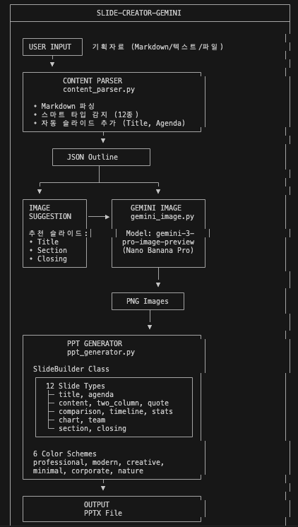
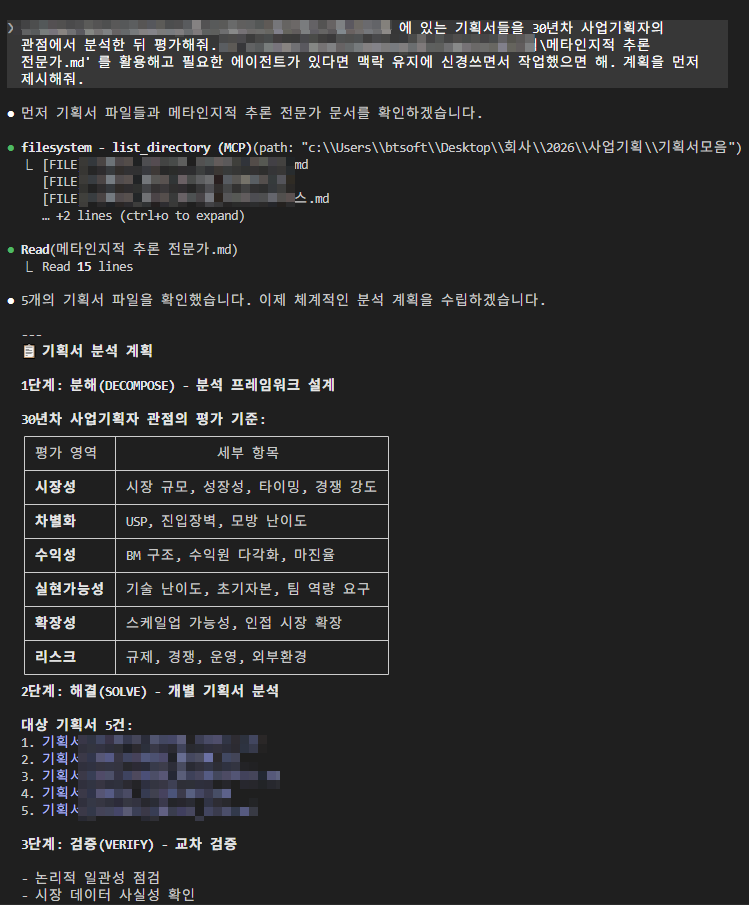
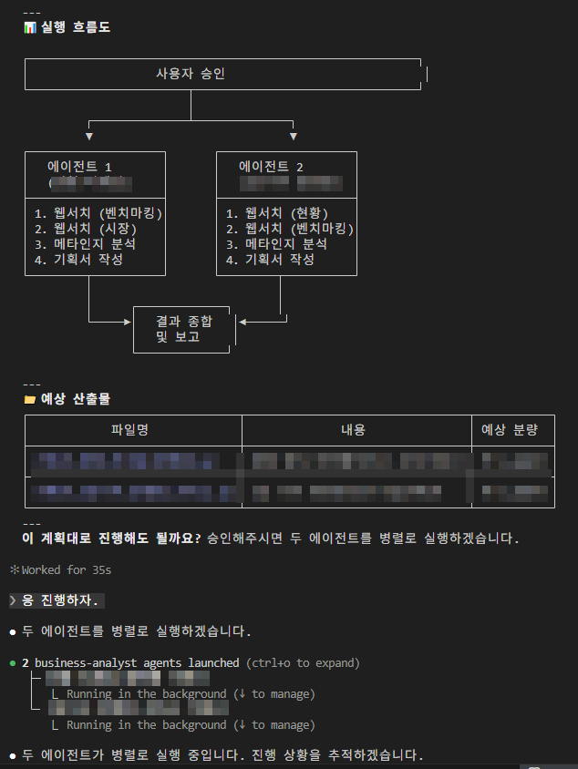

## AI한테 글 시켜본 적 있어?

ChatGPT든 Claude든, "블로그 글 써줘" 해봤을 거야.

```
"AI 사이드프로젝트에 대한 블로그 글 써줘."
```

결과? **읽을 수는 있는데, 내 글 같진 않아.**

- 말투가 내 거랑 다르고
- 너무 교과서적이고
- 경험이 안 담겨 있어

---

## 규칙을 알려주면 달라져

```
블로그 글 써줘.
- 반말로
- 문장 15자 이내로 짧게
- 내 경험 기반으로
- "~합니다" 금지
```

이러면 확실히 나아져.
**근데 매번 이걸 복붙해야 해?**

---

## 매뉴얼 파일을 만들자

`블로그 포스팅매뉴얼.md` 파일을 하나 만들어:

```markdown
# 블로그 포스팅 매뉴얼

## 톤앤매너
- 반말 (친구한테 말하듯)
- 문장 15자 이내
- "~합니다" 금지
- 과장 OK ("진짜 대박", "미쳤다")

## 타겟 독자
- AI로 사이드 프로젝트 시작하려는 직장인
- 코딩은 모르지만 뭔가 만들어보고 싶은 사람

## 글 구조
- 제목: 궁금증 유발 (숫자 or 질문형)
- 서론: 공감 → 문제 제기 (3줄 이내)
- 본문: 핵심 3가지 (소제목 필수)
- 결론: 한 줄 요약 + CTA
```

이걸 GPT에 파일로 첨부해.
**한 번 올려두면 매번 복붙 안 해도 돼.**

---

## 규칙이 많아지면 파일을 나눠

매뉴얼 하나에 다 넣으면 너무 길어져.
역할별로 파일을 나눠서 GPT에 같이 첨부해:

```
블로그 포스팅매뉴얼.md     ← 전체 규칙 (톤, 타겟, 구조)
블로그 레퍼런스.md         ← 잘 쓴 글 예시 모음
블로그 키워드전략.md       ← 주제/키워드 방향
```

---

## 근데 여기서 문제가 생겨

글을 하나 쓰려면 이런 과정이 필요해:

```
1. 주제 리서치
2. 규칙 파일 다 읽기
3. 초안 작성
4. 퇴고 (문체 맞나? 분량 맞나?)
5. 최종 정리
```

이걸 AI한테 한 번에 시키면?

```
"규칙 파일 다 읽고, 리서치하고, 글 쓰고, 퇴고까지 해줘"
```

**대화가 길어질수록 AI가 앞에서 읽은 걸 잊어버려.**
규칙을 대충 읽거나, 중간에 빠뜨려.

---

## 해결책: 담당자를 나누자

회사에서도 한 사람한테 다 시키면 퀄리티가 떨어지잖아.

```
❌ 한 명한테: "리서치하고, 기획하고, 글 쓰고, 교정까지 다 해"
✅ 역할 분리: 리서처 / 작가 / 편집자
```

AI도 똑같아. **서브 에이전트**라는 걸 쓰면 돼.

---

## 서브 에이전트란?

| 개념 | 설명 |
|------|------|
| **마스터 에이전트** | 전체 흐름 관리. 우리랑 대화하는 Claude |
| **서브 에이전트** | 특정 작업만 담당. 매번 새로 시작해서 기억이 깨끗 |

```
마스터: "블로그 글 하나 써야 해"
  ↓
서브 에이전트 1 (리서처): 키워드 조사 → 결과 전달
  ↓
서브 에이전트 2 (작가): 규칙 읽고 → 초안 작성
  ↓
서브 에이전트 3 (편집자): 규칙 대로 퇴고 → 최종본
  ↓
완성
```

**서브 에이전트는 매번 새로 시작해.**
그래서 규칙을 처음부터 꼼꼼히 읽어. "이미 읽었으니까 대충" 이 없어.

이 흐름을 **멀티 에이전트 워크플로우**라고 해.

---

## 이걸 명령어로 만들면

매번 "리서치 해줘... 이제 글 써줘... 이제 퇴고해줘..."
이렇게 하나씩 시키기 귀찮잖아.

Claude Code에서는 **커스텀 커맨드**로 만들 수 있어:

```markdown
# /write-post - 블로그 글 작성

사용법: /write-post [주제]

## 실행 방법
Task 도구로 서브 에이전트를 호출해.

### 서브 에이전트 1: 리서처
1. 주제 관련 트렌드 조사
2. 키워드 추천

### 서브 에이전트 2: 작가
1. 공용 매뉴얼 파일 참조 (톤, 구조, 타겟)
2. 리서처 결과 참고
3. 블로그 글 초안 작성 (1500~2000자)

### 서브 에이전트 3: 편집자
1. 공용 매뉴얼 기준으로 검수
2. 톤앤매너 확인
3. 최종본 저장
```

이제 `/write-post "AI 사이드프로젝트"` 한 줄이면 끝.

---

## 정리: 멀티 에이전트 워크플로우

```
지침 파일 (블로그 포스팅매뉴얼.md)
    +
명령어 (커스텀 커맨드)
    +
서브 에이전트 (역할별 분리)
    =
한 줄 명령으로 콘텐츠 완성
```

---

## 워크플로우 사례 1: 슬라이드 자동 생성

기획 자료를 넣으면 PPT가 나오는 파이프라인이야.



```
[입력] 기획자료 (Markdown/텍스트/파일)
    ↓
[에이전트 1: 콘텐츠 파서]
  Markdown 파싱 → 슬라이드 타입 자동 감지 (12종)
  → JSON Outline 생성
    ↓
[에이전트 2: 이미지 생성]
  추천 슬라이드 (Title, Section, Closing)
  → Gemini 이미지 모델로 PNG 생성
    ↓
[에이전트 3: PPT 생성]
  12종 슬라이드 타입 × 6종 컬러 스킴
  → PPTX 파일 출력
```

**기획안 Markdown 하나 넣으면 → 완성된 PPT가 나와.**
디자인, 레이아웃, 이미지까지 전부 자동.

---

## 워크플로우 사례 2: 기획서 분석 에이전트

"30년차 사업기획자" 페르소나를 가진 에이전트가 기획서를 평가해.



```
[입력] 기획서 5건 + 메타인지적 추론 전문가.md
    ↓
[1단계: 분해 (DECOMPOSE)]
  분석 프레임워크 설계
  → 시장성 / 차별화 / 수익성 / 실현가능성 / 확장성 / 리스크
    ↓
[2단계: 해결 (SOLVE)]
  에이전트 2개가 병렬로 실행
  → 각각 웹서치 + 벤치마킹 + 메타인지 분석 + 기획서 작성
    ↓
[3단계: 검증 (VERIFY)]
  교차 검증 → 결과 종합 및 보고
```



**핵심: 에이전트가 병렬로 돌아.**
하나가 시장 분석하는 동안, 다른 하나가 벤치마킹해.
사람이 하면 며칠 걸릴 분석을 에이전트가 동시에 처리.

---

## 이게 다 같은 구조야

슬라이드 자동 생성도, 기획서 분석도, 콘텐츠 자동화도:

```
지침 파일 (매뉴얼/페르소나)
    +
단계별 분리 (파싱 → 생성 → 검증)
    +
서브 에이전트 (역할별 담당)
    =
멀티 에이전트 워크플로우
```

**패턴은 똑같아. 뭘 할당하느냐만 다를 뿐.**

---

